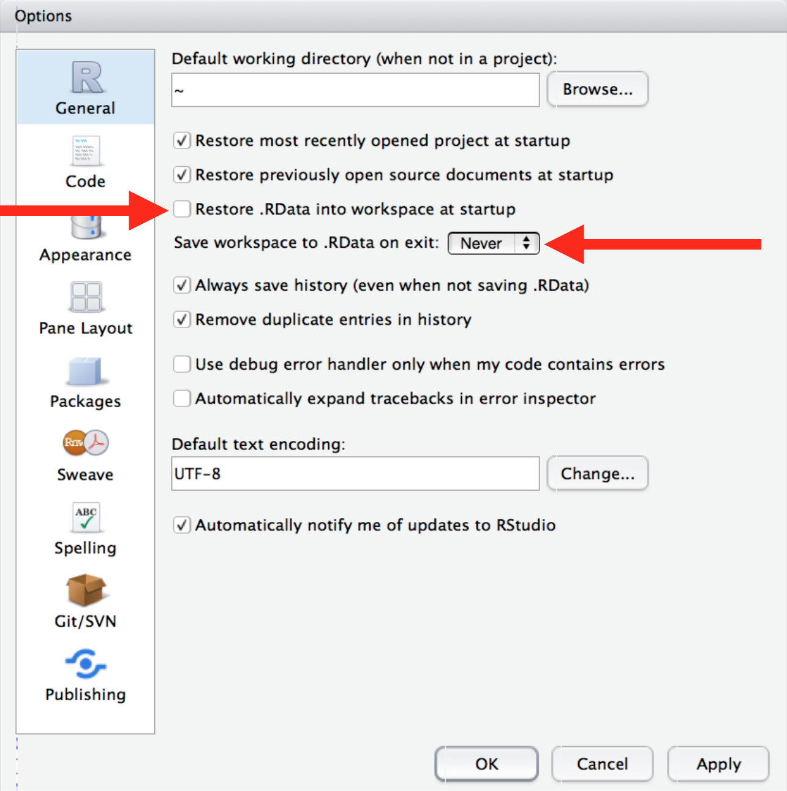

--- 
title: "PLSC 31101: Introduction To Computational Tools And Techniques For Social Science"
author: "Rochelle Terman"
date: "Fall 2019"
site: bookdown::bookdown_site
url: https\://rochelleterman.github.io/plsc-31101/
github-repo: "rochelleterman/plsc-31101"
documentclass: book
bibliography: [book.bib, packages.bib]
biblio-style: apalike
link-citations: yes
description: "This book contains course notes and other materials for PLSC 31101."
---
```{r include=FALSE, cache=FALSE}
# before chapter script
rm(list = ls())

set.seed(1014)
options(digits = 3)

knitr::opts_chunk$set(
  comment = "#>",
  collapse = TRUE,
  cache = TRUE,
  out.width = "70%",
  fig.align = 'center',
  fig.width = 6,
  fig.asp = 0.618,  # 1 / phi
  fig.show = "hold"
)

options(dplyr.print_min = 6, dplyr.print_max = 6)
```

# (PART) Before Class {-}

# Syllabus

* Instructor: [Rochelle Terman](http://rochelleterman.com/), rterman@uchicago.edu

* TA: Pete Cuppernull, pcuppernull@uchicago.edu

* Time: Tuesdays and Thursdays, 12:30 pm – 1:50 pm

* Place: Cobb Hall 303

* Office hours:
	* Rochelle Terman: Tuesdays, 2:30-4:30, Pick Hall 411
	* Pete Cuppernull: Mondays, 2:00-4:00, 

## Course Description

The purpose of this course is to provide graduate students with the critical computing skills necessary to conduct research in quantitative / computational social science. This course is not an introduction to statistics, computer science, or specialized social science methods. Rather, the focus will be on practical skills necessary to be successful in further methods work. The first portion of the class introduces students to basic computer literacy, terminologies, and the R programming language. The second part of the course provides students the opportunity to use the skills they learned in part 1 towards practical applications such as webscraping, data collection through APIs, automated text analysis, etc. We will assume no prior experience with programming or computer science.

#### Objectives {-}

By the end of the course, students should be able to:

* Understand basic programming terminologies, structures, and conventions.
* Write, execute, and debug R code.
* Produce reproducible analyses using R Markdown.
* Clean, transform, and wrangle data using the `tidyverse` packages.
* Scrape data from websites and APIs.
* Parse and analyze text documents.
* Be familiar with the concepts and tools of a variety of computational social science applications.
* Master basic Git and GitHub workflows
* Learn independently and train themselves in a variety of computational applications and tasks through online documentation.

## Who should take this course

This course is designed for Political Science Graduate students, but any graduate student is welcome. We will not presume any prior programming or computer science experience.

## Requirements and Evaluation

#### Final Grades {-}

This is a graded class based on the following:

* Completion of assigned homework (50%)
* Participation (25%)
* Final project (25%)

#### Assignments {-}

Assignments will be assigned at the end of every Thursday session. They will be due one week later, unless otherwise noted. The assignments are intended to expand upon the lecture material and to help students develop the actual skills that will be useful for applied work. The assignments will be frequent but each of them should be fairly short.

You are encouraged to work in groups, but the work you turn in must be your own. Group submission of homework, or turning in copies of the same code or output, is not acceptable. While you are encouraged to use the internet to help you debug, but do not copy and paste large chunks of code that you do not understand. Remember, the only way you actually learn how to write code is to write code!

Portions of the homework in `R` should be completed using [R markdown](https://rmarkdown.rstudio.com/), a markup language for producing well-formatted documents with embedded R code and outputs. To submit your homework, knit the R Markdown file to HTML, and then submit the HTML file through Canvas.

#### Class Participation {-}

The class participation portion of the grade can be satisfied in one or more of the following ways:

- attending the lectures
- asking and answering questions in class
- attending office hours
- contributing to class discussion through the Canvas site, and/or
- collaborating with the computing community, either by attending a workshop or meetup, submitting a pull request to a github repository (including the class repository), answering a question on StackExchange, or other involvement in the social computing / digital humanities community. 

#### Final Project {-}

Students have two options for class projects:

1. __Data project__: Use the tools we learned in class on your own data of interest. Collect and/or clean the data, perform some analysis, and visualize the results. Post your reproducible code on Github.

2. __Tool project__: Create a tutorial on a tool we didn't cover in class. Ideas include: bash, LaTex, pandoc, quanteda, tidytext, etc. Post it on github.

Students are required to write a short proposal by __November 7__ (no more than 2 paragraphs) in order to get approval / feedback from the instructors. 

On __December 10__ we will have a **lightning talk session** where students can present their projects in a maximum 5 minute talk.

#### Late Policy and Incompletes {-}
All deadlines are strict. Late assignments will be dropped a full letter grade for each 24 hours past the deadline. Exceptions will be made for students with a documented emergency or illness.

I will only consider granting incompletes to students under extreme personal/family duress.

#### Academic Integrity {-}
I follow a zero-tolerance policy on all forms of academic dishonesty. All students are responsible for familiarizing themselves with, and following, university policies regarding proper student conduct. Being found guilty of academic dishonesty is a serious offense and may result in a failing grade for the assignment in question, and possibtire course.

## Activities and Materials

#### Course Structure {-}

Classes will follow a "workshop" style, combining lecture, demonstration, and coding exercises. We envision the class to be as interactive / hands on as possible, with students programming every session. **You must bring a laptop to class.** 

It is important that students __complete the requisite reading__ before class. I anticipate spending 1/2 the class lecturing, and 1/2 practicing with code challenges. 

#### Course Website {-}

All course notes will be posted on https://rochelleterman.github.io/plsc-31101/, including class notes, code demonstrations, sample data, and assignments. Students will be assigned reading from these notes before every class.

Students are encouraged to submit pull requests to the [website repository](https://github.com/rochelleterman/plsc-31101), for example if they find a typo, or if they found a particularly helpful resource that would aid other students. 

Students projects will also be shared on the course website. 

#### Canvas {-}

We will use Canvas for communication (announcements and questions) and turning in assignments. 

You should ask questions about class material and assignments through the Canvas website so that everyone can benefit from the discussion. We encourage you to respond to each other’s questions as well. Questions of a personal nature can be emailed to us directly.

#### Computer Requirements and Software {-}

By the end of the first week, you should install the following software on your computer:

* Access to the UNIX command line (e.g., a Mac laptop, a Bash wrapper on Windows)
* Git
* R and RStudio (latest versions)

This requires a computer that can handle all this software. Almost any Mac will do the job. Most Windows machines are fine too if they have enough space and memory.

See [Install Page](installation) for more information. We will be having an **InstallFest on Wednesday, Oct 2 from 10am to 12pm**. for those students experiencing difficulties downloading and installing the requisite software. 


## Curriculum Outline / Schedule

1. **Oct 1** - Introduction 
	* course objectives, logistics, overview of programming and reproducible research.

2. **Oct 3** - R Tools 
    * R Studio, R Markdown, packages, help.

3. **Oct 8** - R Syntax
     * basic syntax, variables, functions, data types.

4. **Oct 10** - Data Structures
    * vectors, lists, factors, matrices, data frames.

5. **Oct 15** - Indexing and Subsetting
    * subsetting formats, operators, boolean conditionals, sub-assignment,  applications. 

6. **Oct 17** - Introduction to Data
    * common terms, formats, tidy data, storage, import/export, exploratory data analysis.

7. **Oct 22** - Manipulating data with `dplyr`
    * importing data, subsetting, summarizing, and conducting calculations across groups, piping.

8. **Oct 24** - Tidying data with `tidyr`
    * tidy data principles, gather, spread, separate, unite
    
9. **Oct 29** - Merging and Linking Data 
    * relational data, keys, joins, missing values.
    
10. **Oct 31** - Visualization
    * base plotting, ggplot, grammar of graphics, writing images.

11. **Nov 5** - Hypothesis testing and regressions
    * models, model objects, stargazer. 

12, **Nov 7** - Strings and Regex

13. **Nov 12** - R programming 1
    * conditional flow, functions.
    
14. **Nov 14**  - R Programming 2
    * iterations, map.

15. **Nov 19**  - Collecting data with APIs
    * requests, RESTful APIs, queries, API libraries.
   
16. **Nov 21** - Webscraping
     * HTML, CSS, In-Browser tools, scraping tools.

17. **Nov 26** - Text analysis 1
    * supervised vs. unsupervised learning, Vector-space models, topic models.

18. **Nov 28** - Text analysis 2
    * supervised vs. unsupervised learning, Vector-space models, topic models.

19. **Dec 3** - Git / Github

20. **Dec 5** - TBD

21. **Dec 10, 1:30-3:30pm** - Final project lightning talks

<!--chapter:end:index.Rmd-->

---
title: "R Basics"
author: "PLSC 31101"
date: "Fall 2019"
output: html_document
---
```{r include=FALSE, cache=FALSE}
# before chapter script
rm(list = ls())

set.seed(1014)
options(digits = 3)

knitr::opts_chunk$set(
  comment = "#>",
  collapse = TRUE,
  cache = TRUE,
  out.width = "70%",
  fig.align = 'center',
  fig.width = 6,
  fig.asp = 0.618,  # 1 / phi
  fig.show = "hold"
)

options(dplyr.print_min = 6, dplyr.print_max = 6)
```

# Installation

To participate in PLSC 31101, you will need access to the software described below. 

Once you've installed all of the software below, test your installation by following the instructions at the bottom on this page.

##  R

[R](http://www.r-project.org/) is a programming language that is especially powerful for data exploration, visualization, and statistical analysis. 

To download R, go to [CRAN](https://cran.r-project.org/) (the **C**omprehensive **R** **A**rchive **N**etwork).

A new major version of R comes out once a year, and there are 2-3 minor releases each year. It’s a good idea to update regularly. Upgrading can be a bit of a hassle, especially for major versions, which require you to reinstall all your packages, but putting it off only makes it worse.

## R Studio

To interact with R, we use RStudio. Please install the latest desktop version of [RStudio IDE](http://www.rstudio.com/ide/download/desktop). We will not support RStudio cloud.

## R Packages

You’ll also need to install some R packages. An R package is a collection of functions, data, and documentation that extends the capabilities of base R. Using packages is key to the successful use of R. 

Many of the packages that you will learn in this class are part of the so-called `tidyverse`. The packages in the `tidyverse` share a common philosophy of data and R programming, and are designed to work together naturally.

You can install the complete tidyverse with a single line of code in R Studio:

```{r eval = F}
install.packages("tidyverse")
```

On your own computer, type that line of code in the RStudio console, and then press enter to run it. R will download the packages from CRAN and install them on to your computer. If you have problems installing, make sure that you are connected to the internet, and that https://cloud.r-project.org/ isn’t blocked by your firewall or proxy.

We will also be requiring a few other important packages. Run the following line of code to download all of them at once:

```{r eval = F}
install.packages("rmarkdown", "knitr", "gapminder", "stargazer", "rtweet", "jsonlite", "httr", "rvest")
```

## The Bash Shell

Bash is a commonly-used shell that gives you the power to do simple tasks more quickly.

#### Windows {-}

Install Git for Windows by downloading and running the [installer](http://msysgit.github.io/). This will provide you with both Git and Bash in the Git Bash program. **NOTE**: on the ~6th step of installation, you will need to select the option "Use Windows' default console window" rather than the default of "Use MinTTY" in order for nano to work correctly.

After the installer does its thing, it leaves the window open, so that you can play with the "Git Bash".

Chances are that you want to have an easy way to restart that Git Bash. You can install shortcuts in the start menu, on the desktop or in the QuickStart bar by calling the script /share/msysGit/add-shortcut.tcl (call it without parameters to see a short help text).

#### Mac OS X {-}

The default shell in all versions of Mac OS X is bash, so no need to install anything. You access bash from the Terminal (found in `/Applications/Utilities`). You may want to keep Terminal in your dock for this class.

#### Linux {-}

The default shell is usually Bash, but if your machine is set up differently you can run it by opening a terminal and typing bash. There is no need to install anything.

## Git

Git is a version control system that lets you track who made changes to what when and has options for easily updating a shared or public version of your code on github.com. You will need a supported web browser (current versions of Chrome, Firefox or Safari, or Internet Explorer version 9 or above).

#### Windows {-}

Git should be installed on your computer as part of your Bash install (described above).

#### Mac OS X {-}

**For OS X 10.9 and higher**, install Git for Mac by downloading and running the most recent "mavericks" installer from [this list](http://sourceforge.net/projects/git-osx-installer/files/). After installing Git, there will not be anything in your `/Applications` folder, as Git is a command line program. **For older versions of OS X (10.5-10.8)** use the most recent available installer labelled "snow-leopard" available [here](http://sourceforge.net/projects/git-osx-installer/files/).

#### Linux {-}

If Git is not already available on your machine you can try to install it via your distro's package manager. For Debian/Ubuntu run sudo apt-get install git and for Fedora run sudo yum install git.

## Other helpful tools

While not required, I recommend you install the following tools:

1. [Google Chrome](https://www.google.com/chrome/) is an up-to-date web browser. 

2. [Sublime Text](https://www.sublimetext.com/3) is a free, advanced text editor. 

## Testing your installation

If you have trouble with installation, please come to the Installfest on **Wed Oct 2, 10-12 in Pick 411**.

Open a command line window ('terminal' or, on windows, 'git bash'), and enter the following commands (without the $ sign): 

```bash
$ R --version
$ git --version
```

If everything has been installed correctly, those commands *should* print output version information. 

**NB**: If you're using git bash, the `R --version` command may not work. In this case, just make sure you can open up RStudio.

Software Carpentry maintains a list of common issues that occur during installation may be useful for our class here: [Configuration Problems and Solutions wiki page.](https://github.com/swcarpentry/workshop-template/wiki/Configuration-Problems-and-Solutions)

Credit: Thanks to [Software Carpentry](http://software-carpentry.org/workshops/) for providing installation guidelines.


<!--chapter:end:00-Pre-class/00-1_Installation.Rmd-->

---
title: "Introduction"
author: "PLSC 31101"
date: "Fall 2019"
output: html_document
---
```{r include=FALSE, cache=FALSE}
# before chapter script
rm(list = ls())

set.seed(1014)
options(digits = 3)

knitr::opts_chunk$set(
  comment = "#>",
  collapse = TRUE,
  cache = TRUE,
  out.width = "70%",
  fig.align = 'center',
  fig.width = 6,
  fig.asp = 0.618,  # 1 / phi
  fig.show = "hold"
)

options(dplyr.print_min = 6, dplyr.print_max = 6)
```
# (PART) Course Notes {-}

# Introduction

## The Motivation

__Here's the dream:__

```{r}
if (knitr:::is_latex_output()) {
  knitr::asis_output('\\url{....}')
} else {
  
}

#knitr::include_graphics(path = "img/tony_stark.gif")
```

> Computers have revolutionized research, and that revolution is only 
> beginning. Every day, social scientists and humanists all over the world 
> use them to study things that are too big, too small, too fast, too slow,
> too expensive, too dangerous, or just too hard to study any other way.

__Now here's the reality__

```{r}
#knitr::include_graphics(path = "img/mulder.gif")
```

> Every day, scholars all over the world waste time wrestling with 
> computers. Tasks that should take a few moments take hours or days, 
> and many things never work at all. When scholars try to get help, 
> they are inundated with unhelpful information, and give up.

This sorry state of affairs persists for three reasons:

1.   __No room, no time.__
    Everybody's schedule is full —- there's simply not space to add more
    about computing without dropping something else.

2.   __The blind leading the blind.__
    The infrastructure doesn't exist to help scholars develop the skills they need. Senior researchers can't teach the next generation how to do things
    that they don't know how to do themselves. 

3.   __Autodidact Chauvinism.__
    Since there are no classrooms, scholars are pressured to teach themselves. But self-learning is time consuming and nearly impossible without a base level of knowledge.

Despite these challenges, there are great reasons to learn how to program:

__1. Practical Efficiency__

Even though it takes some time at first, learning how to program can save you an enormous amount of time doing basic tasks that you would otherwise do by hand, once you get the hang of it.

__2. New Tools__

Some things are impossible, or nearly impossible to do by hand. Computers open the door for new tools and methods, but many require programming skills.

__3. New Data__

The Internet is a wealth of data, waiting to be analyzed! Whether its collecting Twitter data, working with the Congress API, or scraping websites, programming knowledge is a must.

__4. Better Scholarship__

(Quality) programming can open the door to better transparency, reproducibility, and collaboration in the Social Sciences and the Humanities.


#### Goal of the Class: Learn to Learn {-}

> The basic learning objective of this course is to leave here with the 
> knowledge and skills required to learn on your own, whether that's through 
> programming documentation, StackExchange and other online fora, courses or 
> D-Lab workshops.

By the end of the course, students should be able to:

* Understand basic programming terminologies, structures, and conventions.
* Write, execute, and debug R code.
* Produce reproducible analyses using R Markdown.
* Clean, transform, and wrangle data using the `tidyverse` packages.
* Scrape data from websites and APIs.
* Parse and analyze text documents.
* Be familiar with the concepts and tools of a variety of computational social science applications.
* Master basic Git and GitHub workflows
* **Learn independently and train themselves in a variety of computational applications and tasks through online documentation.**

This Course will not... 

* teach you to be a professional programmer or software developer
* teach you statistics, computer science, or specialized social science / digital humanities methods

#### Why not just take a Computer Science course? {-}

Computer science courses don't anticipate the types of questions social scientists might ask, and therefore they 
- introduce many unnecessary concepts
- do a poor job of explaining how computer programming tools might be used by social scientists
- are too resource intensive for the average social scientist

Programming is not just use useful for computer scientists, methodologists, or people who work with "big data."

#### A Practical example {-}

To illustrate, here's a practical example that comes out of my own research:

#### Task 1 (by hand) {-}

**Topic**: International Human Rights "Naming and Shaming"

**Question**: Who Shames Whom on What?

**Data**: UN Human Rights Committee's Universal Periodic Review

From Antigua & Barbuda 2011 review:

```{r echo = F}
knitr::include_graphics(path = "img/upr-text.png")
```

**The Task**: Parse a bunch of reports (PDFs) into a dataset (CSV). Add metadata for issue, action, sentiment.

```{r echo = F}
knitr::include_graphics(path = "img/upr-table.png")
```

How much time will it take?

**By hand**: 40,000 recommendations x 3 min per recommendation x 8-hour days x 5-day weeks = **12 months**

#### Task 2 (by hand) {-}

What if we wanted to extend this research?

**Question**: How does UPR shaming compare to actual human rights abuses?

**Data**: Amnesty International's Urgent Actions

**Task**: Collect all of Amnesty International's Urgent Actions, add metadata for issue, country.

```{r echo = F}
knitr::include_graphics(path = "img/amnesty.png")
```

How much time will it take?

**By hand**: 25,000 recommendations x 3 min per recommendation x 8-hour days x 5-day weeks **= 7.5 months**

#### Tasks 1 & 2 (with a computer) {-}

With a computer, we can write a program that:

1. Parses recommendations into a CSV.
2. Codes recommendations by issue, action, sentiment using computational text analysis tools.
3. Uses webscraping to collect all of Amnesty International's urgent actions.
4. Run simple regression models with R to correlate Amnesty reports with UPR shaming.

Total time: 2 months

**Time Saved: 1.5 years**

## About This Class

#### About Me {-}

My name is Rochelle Terman and I'm a faculty member in Political Science. 

* A few years ago, I didn't know how to program. Now I program almost every day. 
* I program mostly in Python and R. I have a special interest in text analysis and webscraping.
* My substantive research is on international norms and human rights. 
* I won't be able to answer all your questions.
* No one will.
* But especially me.

#### Course Structure {-}

The course is divided into two main sections: 

**1. Skills**

Basic computer literacy, terminologies, and programming languages:

* Base R: objects and data structures.
* `tidyverse` for data analysis.
* Modeling and visualization.
* Key programming concepts (iteration, functions, conditional flow, etc).

We're using `R` because it's the common programming language among Political Scientists. But if you understand the *concepts*, you should able to pick up Python and other languages pretty easily.

**2. Applications**

Use the skills they learned in part 1 towards practical applications:

* Webscraping.
* APIs.
* Computational Text Analysis.
* Version control and communication.

The goal is to **introduce** the students to a medley of common applications so that they can discover which avenue to pursue in their own research, and what such training would entail.


#### Class Activities {-}

Classes will follow a "workshop" style, combining lecture, demonstration, and coding exercises. We envision the class to be as interactive / hands on as possible, with students programming every session. **You must bring a laptop to class.** 

It is important that students __complete the requisite reading__ before class. I anticipate spending 1/2 the class lecturing, and 1/2 practicing with code challenges. 

#### Course Websites {-}

Class notes and other materials are available here:
https://rochelleterman.github.io/plsc-31101/

We will also be using Canvas to distribute/accept assignments, and for discussion. Please use the discussion forums liberally.

#### Evaluation {-}

This is a graded class based on the following:
  - Completion of assigned homework (50%)
  - Participation (25%)
  - Final project (25%)

If you want to audit, please let me know ASAP.

__Assignments__

* In general, assignments are assigned at the end of lecture, and due the following week.
* Exceptions will be noted.
* The first assignment is due next week, before class on Thursday Oct 10. It is on Canvas.
* Turn in assignments on Canvas.
* Work in groups, but submit your own.

__Participation__

The class participation portion of the grade can be satisfied in one or more of the following ways:

- attending the lectures,
- asking and answering questions in class,
- attending office hours,
- contributing to class discussion through the Canvas site,
- collaborating with the computing community.

__Final Project__

Students have two options for class projects:

1. _Data project_: Using the tools we learned in class on your own data of interest.

2. _Tutorial project_: Create a tutorial on a tool we didn't cover in class. 

Both options require an R markdown file narrating the project.

Students are required to write a short proposal by __November 7__ (no more than 2 paragraphs) in order to get approval / feedback from the instructors. 

On __December 10__ we will have a **lightning talk session** where students can present their projects in a maximum 5 minute talk.

#### Software {-}

* Installation instructions are onthe website.
* Get started **EARLY**.
* Then go to the Installfest to double check your installation.
* If you have computer troubles, post the problem on the discussion forums, with as much detail as possible.

## Learning How to Program

Before we talk about what it takes to learn how to program, let's first review what programming is.

#### What is Programming? {-}

A _program_ is a sequence of instructions that specifies how to perform a computation. Most programs are written in a human-readable _programming language_ (or "source code") and then executed with the help of a _compiler_ or _interpreter_.

A few basic instructions appear in just about every language:

1. __input__: Get data from the keyboard, a file, the network, or some other device.
2. __output__: Display data on the screen, save it in a file, send it over the network, etc.
3. __math__: Perform basic mathematical operations like addition and multiplication.
4. __conditional execution__: Only perform tasks if certain conditions are met.
5. __iteration__: Do the same task over and over again on different inputs.

That being said, programming languages differ from one another in the following ways:

1. **Syntax**: whether to add a semicolon at the end of each line, etc.
2. **Usage**: JavaScript is for building websites, R is for statistics, Python is general purpose, etc.
3. **Level**: how close you are to the hardware. 'C' is often considered to be the lowest (or one of the lowest) level languages.
4. **Object-oriented:** "objects" are data + functions. Some programming languages are object-oriented (e.g. Python) and some aren't (e.g. C).
5. **Many more**: Here's a [list](https://en.wikipedia.org/wiki/List_of_programming_languages_by_type) of all the types of programming languages out there.

#### What Language Should You Learn? {-}

Most programmers can program in more than one language. That's because they know *how to program* generally, as opposed to "knowing" Python, R, Ruby, or whatever. 

So what should your first programming language be? That is, what programming language should you use to learn *how to program*? At the end of the day, the answer depends on what you want to get out of programming. Many people recommend Python because it's fun, easy, and multi-purpose. Here's an [article](http://lifehacker.com/which-programming-language-should-i-learn-first-1477153665) that can offer more advice.

In this class, we'll be using R because it's the most popular language in our disciplnary community (of Political Scientists.)

Regardless of what you choose, you will probably grow comfortable in one language while learning the basic concepts and skills that allow you to 'hack' your way into other languages. That's because __programming is an extendible skill.__

Thus "knowing how to program" means learning how to *think* like a programmer, not necessarily knowing all the language-specific commands off the top of your head. **Don't learn specific programming languages; learn how to program.**

#### What Programming is Really Like {-}

```{r echo = F}
knitr::include_graphics(path = "img/xkcd.png")
```

Here's the sad reality: When you're programming, 80% or more of your time will be spent debugging, looking stuff up (like program-specific syntax, documentation for packages, useful functions, etc.), or testing. This does not just apply to beginner or intermediate programmers, although you will grow more "fluent" over time.

> Google software engineers write an average of 10-20 lines of code per day.
> **The Lesson**: Programming is a slow activity, especially in the beginning.

If you're a good programmer, you're a good detective!

#### How to Learn {-}

Here are some tips on how to learn computer programming:

1. Learning to program is 5% intelligence, 95% endurance.

2. Like learning to play an instrument or speak a foreign language, it takes practice, practice, practice.

3. Program a little bit every day.

4. Program with others. Do the problem sets in pairs or groups.

5. It's better to type than to copy and paste. 

6. Most "programming" is actually researching, experimenting, thinking.

7. Stay organized.

#### The 15 minute rule {-}

<blockquote class="twitter-tweet"><p lang="en" dir="ltr">15 min rule: when stuck, you HAVE to try on your own for 15 min; after 15 min, you HAVE to ask for help.- Brain AMA <a href="https://t.co/MS7FnjXoGH">pic.twitter.com/MS7FnjXoGH</a></p>&mdash; Rachel Thomas (@math_rachel) <a href="https://twitter.com/math_rachel/status/764931533383749632?ref_src=twsrc%5Etfw">August 14, 2016</a></blockquote> <script async src="https://platform.twitter.com/widgets.js" charset="utf-8"></script>


We will follow the **15 minute rule** in this class. If you encounter a problem in your assignments, spend 15 minutes troubleshooting the problem on your own. After 15 minutes, if you still cannot solve the problem, **ask for help**. 

(Hat tip to [Computing for Social Sciences](https://cfss.uchicago.edu/faq/asking-questions/))

#### Debugging {-}

Those first 15 minutes should be spent trying to debug your code. Here are some tips:

- Read the errors!
- Read the documentation
- Make it smaller
- Figure out what changed
- Check your syntax
- Print statements are your friend

#### Using the Internet {-}

You should also make use of [Google](https://www.google.com) and [StackOverflow](http://stackoverflow.com/) to resolve the error. Here's some tips for how to google errors:

- google: name-of-program + text in error message.
- Remove user- and data-specific information first!
- See if you can find examples that do and don't produce the error. Try other people's code, but don't fall into the copy-paste trap.

#### Asking for Help {-}

We will use Canvas for class-related questions and discussion. You are highly encouraged to ask questions, and answer one another's questions.

1. Include a brief, informative title.
2. Explain what you're trying to do, and how it failed.
3. Include a reproducible example.

Here are some helpful guidelines on how to properly ask programming questions:

1. ["How to Ask Programming Questions," ProPublica](https://www.propublica.org/nerds/how-to-ask-programming-questions)
2. ["How do I ask a good question?" StackOverflow](https://stackoverflow.com/help/how-to-ask)
3. ["How to properly ask for help" Computing for Social Science](https://cfss.uchicago.edu/faq/asking-questions/)

<!--chapter:end:01_Intro/01-Intro.Rmd-->

---
title: "R Basics"
author: "PLSC 31101"
date: "Fall 2019"
output: html_document
---
```{r include=FALSE, cache=FALSE}
# before chapter script
rm(list = ls())

set.seed(1014)
options(digits = 3)

knitr::opts_chunk$set(
  comment = "#>",
  collapse = TRUE,
  cache = TRUE,
  out.width = "70%",
  fig.align = 'center',
  fig.width = 6,
  fig.asp = 0.618,  # 1 / phi
  fig.show = "hold"
)

options(dplyr.print_min = 6, dplyr.print_max = 6)
```

# R Basics

This unit introduces you to the R programming language, and the tools we use to program in R. We will explore:

1. **[What is R?]**, a brief introduction to the R language;
2. **[R Studio]**, a tour of the Interactive Development Environment RStudio;
4. **[R Markdown]**, a type of R script file we'll be working with in this class.
5. **[R Packages]**, extra tools and functionalities;


## What is R?

R is a versatile, open source programming and scripting language that's useful both for statistics and data science. It's inspired by the programming language [`S`][S]. Some of its __best features__ are:

* It's free, open source, and available on every major platform. As a result, if you do your analysis in R, most people can easily replicate it.

* It contains massive set of packages for statistical modelling, machine learning, visualisation, and importing and manipulating data. Over 14,000 packages are available as of August 2019. Whatever model or graphic you're trying to do, chances are that someone has already tried to do it (and a package for it exists). 

* It's designed for statistics and data analysis, but also general-purpose programming. 

* It's an [Interactive Development Environment](http://www.rstudio.com/ide/) tailored to the needs of interactive data analysis and statistical programming.

* It has powerful tools for communicating your results. R packages make it easy to produce html or pdf [reports](http://yihui.name/knitr/), or create [interactive websites](http://www.rstudio.com/shiny/).

* A large and growing community of peers.

R also has a number of __shortcomings__:

* It has a steeper learning curve than SPSS or Stata.

* R is not a particularly fast programming language, and poorly written R code can be terribly slow. R is also a profligate user of memory.

* Much of the R code you'll see in the wild is written in haste to solve a pressing problem. As a result, code is not very elegant, fast, or easy to understand. Most users do not revise their code to address these shortcomings.

* Inconsistency is rife across contributed packages, even within base R. You are confronted with over 20 years of evolution every time you use R. Learning R can be tough because there are many special cases to remember.

[S]: https://en.wikipedia.org/wiki/S_(programming_language)


<!--chapter:end:02-R-Tools/02-1-R-Basics.Rmd-->

---
title: "R Studio"
author: "PLSC 31101"
date: "Fall 2019"
output: html_document
---
```{r include=FALSE, cache=FALSE}
# before chapter script
rm(list = ls())

set.seed(1014)
options(digits = 3)

knitr::opts_chunk$set(
  comment = "#>",
  collapse = TRUE,
  cache = TRUE,
  out.width = "70%",
  fig.align = 'center',
  fig.width = 6,
  fig.asp = 0.618,  # 1 / phi
  fig.show = "hold"
)

options(dplyr.print_min = 6, dplyr.print_max = 6)
```

## R Studio 

We can use R in a number of ways. For example, we can write R code in a plain text editor (like `textedit` or `notepad`), and then execute the sript using the shell (e.g. `terminal` in Mac).

But, this isn't exactly ideal for several reasons. We can't easily write and edit scripts as we go, it's not very pretty, there are no debugging tools, etc. That's why most people who use R (or Python, etc) use an "integrated development environment" or "interactive development environment" (IDE).

An IDE is a software application that provides comprehensive facilities to computer programmers for software development. An IDE normally consists of a source code editor, build automation tools and a debugger. Some of them come with package managers and other features, too.

The most popular IDE for R is [RStudio](https://www.rstudio.com/products/rstudio/). It includes a console, syntax-highlighting editor that supports direct code execution, as well as tools for plotting, history, debugging and workspace management. It's also free and open-source. Yay!

### Console

There are two main ways of interacting with R: using the __console__ or by using the __script editor__.

The console window (in RStudio, the bottom left panel) is the place where R is waiting for you to tell it what to do, and where it will show the results of a command.  

You can type commands directly into the console, but they will be forgotten when you close the session. Try it out now.

```{r eval = F}
> 2 + 2
```

If R is ready to accept commands, the R console shows a `>` prompt. If it receives a command (by typing, copy-pasting or sent from the script editor using `Ctrl-Enter`), R will try to execute it, and when ready, show the results and come back with a new `>`-prompt to wait for new commands.

If R is still waiting for you to enter more data because it isn't complete yet, the console will show a `+` prompt. It means that you haven't finished entering a complete command. This happens when you have not 'closed' a parenthesis or quotation. If you're in RStudio and this happens, click inside the console window and press `Esc`; this should help get you out of trouble.

```{r eval = F}
> "This is an incomplete quote
+
```

#### More Console Features {-}

1. Retrieving previous commands: As you work with R you'll often want to re-execute a command which you previously entered. Recall previous commands using the up and down arrow keys.

2. Console title bar: This screenshot illustrates a few additional capabilities provided by the Console title bar:

    * Display of the current working directory.
    * The ability to interrupt R during a long computation.
    * Minimizing and maximizing the Console in relation to the Source pane (using the buttons at the top-right or by double-clicking the title bar).

```{r echo = F}
knitr::include_graphics(path = "img/using_console_title_bar.png")
```

### Scripts

It's better practice to enter commands in the script editor, and save the script. This way, you have a complete record of what you did, you can easily show others how you did it and you can do it again later on if needed. Open it up either by clicking the *File* menu, and selecting *New File*, then R script, or using the keyboard shortcut Cmd/Ctrl + Shift + N. Now you’ll see four panes.

```{r echo = F}
knitr::include_graphics(path = "./img/4-panes.png")
```

The script editor is a great place to put code you care about. Keep experimenting in the console, but once you have written code that works and does what you want, put it in the script editor. 

RStudio will automatically save the contents of the editor when you quit RStudio, and will automatically load it when you re-open. Nevertheless, it’s a good idea to save your scripts regularly and to back them up.

### Running code

While you certainly can copy-paste code you'd like to run from the editor into the console, this workflow is pretty inefficient. The key to using the script editor effectively is to memorize one of the most important keyboard shortcuts in RStudio: __`Cmd/Ctrl + Enter`__. This executes the current R expression from the script editor in the console.

For example, take the code below. If your cursor is somewhere on the first line, pressing `Cmd/Ctrl + Enter` will run the complete command that generates `dems`. It will also move the cursor to the next statement (beginning with `reps`). That makes it easy to run your complete script by repeatedly pressing `Cmd/Ctrl + Enter`.

```{r}
dems <- (55 + 70) * 1.3

reps <- (20 - 1) / 2
```

Instead of running expression-by-expression, you can also execute the complete script in one step: `Cmd/Ctrl + Shift + S`. Doing this regularly is a great way to check that you’ve captured all the important parts of your code in the script.

### Comments

Use `#` signs to add comments within your code chunks, and you are encouraged to regularly comment within your code. Anything to the right of a `#` is ignored by R. Each line of a comment needs to begin with a #.

```{r}
# This is a comment.
# This is another line of comments.
```

### Diagnostics and errors

The script editor will also highlight syntax errors with a red squiggly line and a cross in the sidebar:

```{r echo = F}
knitr::include_graphics(path = "img/rstudio-diagnostic.png")
```

You can hover over the cross to see what the problem is:

```{r echo = F}
knitr::include_graphics(path = "img/rstudio-diagnostic-tip.png")
```

If you try to execute the code, you'll see an error in the console.

```{r echo = F}
knitr::include_graphics(path = "img/error.png")
```

When errors happen, your code is haulted -- meaning it's never executed. Errors can be frustrating in R, but with practice you'll be able to debug your code quickly.

###  R Environment

Turn your attention to the upper right pane. This pane displays your "global environment", and it contains the data objects you have saved in your current session. Notice that we have the two objects created earlier, `dems`, and `reps`, along with their values.

You can list all objects in your current environment by running:

```{r}
ls()
```

Sometimes we want to remove objects that we no longer need.

```{r}
x <- 5
rm(x)
```

If you want to remove all objects from your current environment, you can run:

```{r}
rm(list = ls())
```

####  Acknowledgments {-}

This page is in part derived from the following sources:

1. [R Studio Support](https://support.rstudio.com/hc/en-us/articles/200484448).

2. [Advanced R](https://adv-r.hadley.nz/), licensed under the [Creative Commons Attribution-NonCommercial-ShareAlike 4.0 International Public License](https://creativecommons.org/licenses/by-nc-sa/4.0/)

3. [R for Data Science](https://r4ds.had.co.nz) licensed under [Creative Commons Attribution-NonCommercial-NoDerivs 3.0](https://creativecommons.org/licenses/by-nc-nd/3.0/us/)

<!--chapter:end:02-R-Tools/02-2-R-Studio.Rmd-->

---
title: "R Markdown"
author: "PLSC 31101"
date: "Fall 2019"
output: html_document
---
```{r include=FALSE, cache=FALSE}
# before chapter script
rm(list = ls())

set.seed(1014)
options(digits = 3)

knitr::opts_chunk$set(
  comment = "#>",
  collapse = TRUE,
  cache = TRUE,
  out.width = "70%",
  fig.align = 'center',
  fig.width = 6,
  fig.asp = 0.618,  # 1 / phi
  fig.show = "hold"
)

options(dplyr.print_min = 6, dplyr.print_max = 6)
```

## R Markdown

Throughout this course, we'll be using [R Markdown](http://rmarkdown.rstudio.com>) for lecture notes and homework assignments. R Markdown documents combine executable code, results, and prose commentary into one document. Think of an R Markdown files as a modern day lab notebook, where you can capture not only what you did, but also what you were thinking.

The filename of an R Markdown document should end in `.Rmd` or `.rmd`. They can also be converted to an output format, like PDF, HTML, slideshows, Word files, and more. 

R Markdown documents contain three important types of content:

1. An (optional) YAML header surrounded by `---`s.
2. Chunks of R code surrounded by ` ``` `.
3. Text mixed with simple text formatting like `# heading` and `_italics_`.

### YAML header

YAML stands for "yet another markup language". R Markdown uses it to control many details of the output.

```{md}
---
title: "Homework 1"
author: "Rochelle Terman"
date: "Fall 2019"
output: html_document
---
```

In this example, we specified the document's title, author, and date; we also specified that we want it to eventually convert it into an HTML document.

### Markdown

Prose in `.Rmd` files is written in Markdown, a lightweight set of conventions for formatting plain text files. Markdown is designed to be easy to read and easy to write. It is also very easy to learn. The guide below shows how to use Pandoc’s Markdown, a slightly extended version of Markdown that R Markdown understands.

```{md}
Text formatting 
------------------------------------------------------------

*italic*  or _italic_
**bold**   __bold__
`code`
superscript^2^ and subscript~2~

Headings
------------------------------------------------------------

# 1st Level Header

## 2nd Level Header

### 3rd Level Header

Lists
------------------------------------------------------------

*   Bulleted list item 1

*   Item 2

    * Item 2a

    * Item 2b

1.  Numbered list item 1

1.  Item 2. The numbers are incremented automatically in the output.

Links and images
------------------------------------------------------------

<http://example.com>

[linked phrase](http://example.com)


Tables 
------------------------------------------------------------

First Header  | Second Header
------------- | -------------
Content Cell  | Content Cell
Content Cell  | Content Cell
```

The best way to learn these is simply to try them out. It will take a few days, but soon they will become second nature, and you won’t need to think about them. If you forget, you can get to a handy reference sheet with Help > Markdown Quick Reference.

### Code Chunks

To run code inside an R Markdown document, you do it inside a "chunk". Think of a chunk like a function. A chunk should be relatively self-contained, and focused around a single task.

Chunks begin with a header which consists of ` ```{r,` followed by an optional chunk name, followed by comma separated options, followed by `}`. Next comes your R code and the chunk end is indicated by a final ` ```.`

You can continue to run the code using the keyboard shortcut that we learned earlier: `Cmd/Ctrl + Enter`. You can also run the entire chunk by clicking the Run icon (it looks like a play button at the top of the chunk), or by pressing `Cmd/Ctrl + Shift + Enter`.

RStudio executes the code and displays the results inline with the code:


### Knitting

To produce a complete report containing all text, code, and results, click the "Knit" button at the top of the script editor (looks like a ball of yarn) or press `Cmd/Ctrl + Shift + K`. This will display the report in the viewer pane, and create a self-contained HTML file that you can share with others. The `.html` file is written in the same directory as your `.Rmd` file.

### Cheatsheets and Other Resources

When working in RStudio, you can find an R Markdown cheatsheet by going to Help > Cheatsheets > R Markdown Cheat Sheet. 

A helpful overview of R Markdown can also be found in [R for Data Science](https://r4ds.had.co.nz/r-markdown.html)

A deep dive into R Markdown can be found [here](https://bookdown.org/yihui/rmarkdown/)

### Challenges

#### Challenge 1. Create a new R Markdown document with *File > New File > R Markdown...* Read the instructions. Practice running the chunks. Verify that you can modify the code, re-run it, and see modified output. {-}

#### Challenge 2. Knit the document into an html file. Verify that you can modify the input and see the output update. {-}

#### Acknowledgments {-}

This page is in part derived from the following sources:

1. [R for Data Science](https://r4ds.had.co.nz) licensed under [Creative Commons Attribution-NonCommercial-NoDerivs 3.0](https://creativecommons.org/licenses/by-nc-nd/3.0/us/)


<!--chapter:end:02-R-Tools/02-3_R-Markdown.Rmd-->

---
title: "R Packages"
author: "PLSC 31101"
date: "Fall 2019"
output: html_document
---
```{r include=FALSE, cache=FALSE}
# before chapter script
rm(list = ls())

set.seed(1014)
options(digits = 3)

knitr::opts_chunk$set(
  comment = "#>",
  collapse = TRUE,
  cache = TRUE,
  out.width = "70%",
  fig.align = 'center',
  fig.width = 6,
  fig.asp = 0.618,  # 1 / phi
  fig.show = "hold"
)

options(dplyr.print_min = 6, dplyr.print_max = 6)
```

## R Packages

The best part about R are its user-contributed packages (also called "libraries"). A _library_ is a collection of functions (and sometimes data) that can be used by other programers. A library's contents are supposed to be related, but this isn't always the case as there is no enforcement on the issue.

### Installing Packages

Using packages requires two steps.

First, we download the package from one of the CRAN mirrors onto our computer. For this we use  `install.packages("package-name")`. If you have not set a preferred CRAN mirror in your `options()`, a menu will pop up asking you to choose a location. 

Let's download the package `dplyr`.

```{r eval=F}
install.packages("dplyr")
```

If you run into errors later in the course about a function or package not being found, run the `install.packages` function to make sure the package is actually installed. 

**Important**: Once we download the package, we never need to run `install.packages` again (unless we get a new computer.)

### Loading Packages

Once we download the package, we need to load it into our session to use it. This is required at the beginning of each R session. This step is necessary because if we automatically loaded every package we have ever downloaded, our computer would fry.

```{r, eval = FALSE}
library(dplyr)
```

The message tells you which functions from dplyr conflict with functions in base R (or from other packages you might have loaded).

### Challenges

Let's go ahead and download some core, important packages we'll use for the rest of the course. Download and load the following packages:

* tidyverse
* rmarkdown
* knitr
* gapminder
* devtools

#### Acknowledgments{-}

This page is in part derived from the following sources:

1. [R Studio Support](https://support.rstudio.com/hc/en-us/articles/200484448).

2. [Advanced R](https://adv-r.hadley.nz/), licensed under the [Creative Commons Attribution-NonCommercial-ShareAlike 4.0 International Public License](https://creativecommons.org/licenses/by-nc-sa/4.0/)

3. [R for Data Science](https://r4ds.had.co.nz) licensed under [Creative Commons Attribution-NonCommercial-NoDerivs 3.0](https://creativecommons.org/licenses/by-nc-nd/3.0/us/)

<!--chapter:end:02-R-Tools/02-4_R-Packages.Rmd-->

---
title: "Basic Syntax"
author: "PLSC 31101"
date: "Fall 2019"
output: html_document
---
```{r include=FALSE, cache=FALSE}
# before chapter script
rm(list = ls())

set.seed(1014)
options(digits = 3)

knitr::opts_chunk$set(
  comment = "#>",
  collapse = TRUE,
  cache = TRUE,
  out.width = "70%",
  fig.align = 'center',
  fig.width = 6,
  fig.asp = 0.618,  # 1 / phi
  fig.show = "hold"
)

options(dplyr.print_min = 6, dplyr.print_max = 6)
```

# R Syntax

Frustration is natural when you start programming in R. R is a stickler for punctuation, and even one character out of place will cause it to complain. But while you should expect to be a little frustrated, take comfort in that it’s both typical and temporary: it happens to everyone, and the only way to get over it is to keep trying.

> To understand computations in R, two slogans are helpful:
  - Everything that exists is an object.
  - Everything that happens is a function call.
  
> __John Chambers__

## Variables

### Arithmetic

In its most basic form, R can be used as a simple calculator. Consider the following arithmetic operators:

- Addition: `+`
- Subtraction: `-`
- Multiplication: `*`
- Division: `/`
- Exponentiation: `^`
- Modulo (remainder): `%%`

```{r}
1 / 200 * 30
(59 + 73 + 2) / 3
5 %% 2
```

But when we do this, none of our results are saved for later use.

### Assigning Variables

An essential part of programming is creating objects (or variables)^[Technically, objects and variables are different things, but we'll use the two interchangeably for now.] Variables are names for values. 

A variable is created when a value is assigned to it. We do that with `<-`.

```{r}
x <- 3
```

`<-` is the called the *assignment operator.* It assigns values on the right to objects on the left, like this:

```{r eval = F}
object_name <- value
```

So, after executing `x <- 3`, the value of `x` is `3`. The arrow can be read as 3 goes into `x`. 

*Note:* Don't use `=` for assignments. It will work in some contexts, but will cause confusion later. 

We can use variables in calculations just as if they were values.

```{r}
x <- 3
x + 5
``` 

#### Inspect objects to display values. {-}

In R, the contents of an object can be printed by simply executing the object name.

```{r}
x <- 3
x
```

#### Whitespace makes code easier to read. {-}

Notice that we surrounded `<-` with spaces. In `R`, white space is ignored (unlike Python). It is good practice to use spaces, because it makes code easier to read.

```{r}
experiment<-"current vs. voltage"   # this is bad
experiment <- "current vs. voltage" # this is better
```

### Variable Names

Object names can only contain letters, numbers, `_` and `.`. 

You want your object names to be descriptive. `x` is not a good variable name (sorry!). You’ll also need a convention for multiple words. I recommend *snake_case* where you separate lowercase words with `_`.

```{r eval = F}
i_use_snake_case
otherPeopleUseCamelCase
some.people.use.periods
And_aFew.People_RENOUNCEconvention
```

Let's make an assignment using snake_case:

```{r}
r_rocks <- 2 ^ 3
```

And let's try to inspect it:

```{r, error = TRUE}
r_rock
R_rocks
```

R is case-sensitive!

#### Use the TAB key to autocomplete. {-}

Because typos are the absolute worst, we can use R Studio to help us type. Let's inspect `r_rocks` using RStudio’s tab completion facility. Type "r_", press TAB, add characters until you have a unique prefix, then press return.

```{r}
r_rocks
```

### Challenges

#### Challenge 1: Making and Printing Variables. {-}

Make 3 variables: name (with your full name), city (where you were born) and year (when you were born.)

```{r}
name <- "Pete"
city <- "Syracuse"
year <- "1992"
```


#### Challenge 2: Swapping Values {-}

Draw a table showing the values of the variables in this program after each statement is executed.

In simple terms, what do the last three lines of this program do?

```{r}
lowest = 1.0
highest = 3.0
temp = lowest
lowest = highest
highest = temp
```

The last three lines set temp equal to the value of lowest (1.0),  set lowest equal to the value of highest (3.0), and set highest equal to temp (1.0). 

#### Challenge 3: Predicting Values {-}

What is the final value of `position` in the program below? Try to predict the value without running the program, then check your prediction.

```{r}
initial = "left"
position = initial
initial = "right"
```

#### Challenge 4: Syntax {-}

Why does the following code fail?

```{r eval = F}
age == 31
```

The object `age` has not been created yet.

and the following?

```{r eval = F}
31 <-  age
```

Object names cannot start with a number and "age" would have to be in quotations. In general, you would probably want to assign the number 31 to the object `age`:

```{r}
age <- 31
```


<!--chapter:end:03-R-Syntax/03-1_R-Variables.Rmd-->

---
title: "Basic Syntax"
author: "PLSC 31101"
date: "Fall 2019"
output: html_document
---
```{r include=FALSE, cache=FALSE}
# before chapter script
rm(list = ls())

set.seed(1014)
options(digits = 3)

knitr::opts_chunk$set(
  comment = "#>",
  collapse = TRUE,
  cache = TRUE,
  out.width = "70%",
  fig.align = 'center',
  fig.width = 6,
  fig.asp = 0.618,  # 1 / phi
  fig.show = "hold"
)

options(dplyr.print_min = 6, dplyr.print_max = 6)
```

## Functions

R has a large collection of built-in functions that helps us do things. When we use a function, we say we're _calling_ a function.

```{r eval=F}
function_name(arg1 = val1, arg2 = val2, ...)
```

Here are some helpful built-in functions:

```{r}
my_var <- c(1, 5, 2, 4, 5)

sum(my_var)
length(my_var)
min(my_var)
max(my_var)
unique(my_var)
```

### Arguments

An *argument* is a value that is *passed* into a function. Every function returns a **result**.

Let’s try using `seq()`, which makes regular sequences of numbers. While we’re at it, we'll learn more helpful features of RStudio. 

Type `se` and hit TAB. A popup shows you possible completions. Specify `seq()` by typing more (a "q") to disambiguate, or by using ↑/↓ arrows to select. Notice the floating tooltip that pops up, reminding you of the function’s arguments and purpose. 

Press TAB once more when you’ve selected the function you want. RStudio will add matching opening (`(`) and closing (`)`) parentheses for you. Type the arguments `1, 10` and hit return.

```{r}
seq(1, 10)
```

How many arguments did we pass into the `seq` function?

### Store Function Output

Notice, when we called the `seq` function, nothing changed in our environment. That's because we didn't save our results to an object. Let's try it again by assigning a variable.

```{r}
y <- seq(1, 10)
y
```

### Argument Restrictions and Defaults

Let's use another function, called `round`:

```{r}
round(60.123)
```

`round` must be given at least one argument. And it must be given things that can be meaningful rounded.

```{r eval = F}
round()
round('a')
```

Functions may have __default__ values for some arguments.{-}

By default, `round` will round off any number to zero decimal places. But we can specify the number of decimal places we want.

```{r}
round(60.123)
round(60.123, digits = 2)
round(60.123, 2)
```

### Documentation and Help Files

How do we know what kinds of arguments to pass into a function? Every built-in function comes with ___documentation__.

* `?` + object opens a help page for that specific object
* `??` + object searches help pages containing the name of the object

```{r, eval = FALSE}
?mean
??mean
```

All help files are structured the same way. The section __Arguments__ tells us exactly what kind of information we can pass into a function. The __Value__ section explains what the output of the function is. The __Examples__ contain real examples of the function in use.

### Challenges

#### Challenge 1: What Happens When {-}

Explain, in simple terms, the order of operations in the following program: when does the addition happen, when does the subtraction happen, when is each function called, etc.

What is the final value of `radiance`?

```{r}
radiance = 1.0
radiance = max(2.1, 2.0 + min(radiance, 1.1 * radiance - 0.5))
```

Order of operations:
1. radiance - 0.5
2. 1.1 * (radiance - 0.5)
3. Determine the minimum between Step 2 and radiance.
4. Add 2.0 to Step 3.
5. Find the maximum between Step 4 and 2.1
6. Assign the value of Step 5 to radiance.

Final value = 2.6

#### Challenge 2: Why? {-}

Run the following code.

```{r eval = F}
rich = "gold"
poor = "tin"
max(rich, poor)
```

Using the help files for `max`, explain why it returns the result it does.

Character strings are sorted lexicographically: since "tin" begins with a letter later in the alphabet than "gold", it is seen as larger.

<!--chapter:end:03-R-Syntax/03-2_R-Functions.Rmd-->

---
title: "Basic Syntax"
author: "PLSC 31101"
date: "Fall 2019"
output: html_document
---
```{r include=FALSE, cache=FALSE}
# before chapter script
rm(list = ls())

set.seed(1014)
options(digits = 3)

knitr::opts_chunk$set(
  comment = "#>",
  collapse = TRUE,
  cache = TRUE,
  out.width = "70%",
  fig.align = 'center',
  fig.width = 6,
  fig.asp = 0.618,  # 1 / phi
  fig.show = "hold"
)

options(dplyr.print_min = 6, dplyr.print_max = 6)
```

## Data Types

Every value in a program has a specific __type__. In R, those types are called "classes", and there are 4 of them:

* character (text or "string")
* numeric (integer or decimal)
* integer (just integer)
* logical (TRUE or FALSE booleans)

| Example | Type |
| ------- | ---- |
| "a", "swc" | character |
| 2, 15.5 | numeric | 
| 2 (Must add a `L` at end to denote integer) | integer |
| `TRUE`, `FALSE` | logical |

### What's that Type?

R is dynamically typed, meaning that it "guesses" what class a value is. 

Use the built-in function```class()``` to find out what type a value has.

```{r}
class(3)
class(3L)
class("Three")
class(T)
```

This works on variables as well. But remember: the _value_ has the type --- the _variable_ is just a label.

```{r}
three <- 3
class(three)

three <- "three"
class(three)
```

A value's class determines what the program can do to it.

```{r eval = F}
3 - 1
3 - "1"
```

### Coercion

We just learned we cannot subtract numbers and strings. Instead, use  `as..` + name of class as functions to convert a value to that type.

```{r eval = F}
3 - as.numeric("1")
```

This is called `coercion`. Here's another example:

```{r}
my_var <- "FALSE"
my_var
as.logical(my_var)
```

What difference did you notice?

### Other Objects

There are a few other "odd ball" types in R:

#### `NA` are missing values {-}

Missing values are specified with `NA`. `NA` will always be coerced to the correct type if used inside `c()`

```{r}
x <- c(NA, 1)
x
typeof(NA)
typeof(x)
```

#### `Inf` is infinity. {-}

You can have either positive or negative infinity.

```{r, eval = TRUE}
1/0
1/Inf
```

#### `NaN` means "Not a number". It's an undefined value. {-}

```{r, eval = TRUE}
0/0
```


### Challenges

#### Challenge 1: Making and Coercing Variables {-}

1. Make a variable `year` and assign it as the year you were born.
2. Coerce that variable to a string, and assign it to a new variable `year_string`.
3. Someone in your class says they were born in 2001. Really? Really. Find out what your age difference is, using only `year_string`

```{r}
year <- 1992
year_string <- as.character(year)
2001 - as.numeric(year_string)
```


#### Challenge 2: Fix the Code {-}

Change the following code to make the output TRUE.

```{r}
val_1 = F
val_2 = "F"

class(val_1) == class(val_2)
```

Solution:
```{r}
val_1 = F
val_2 = "F"

class(as.character(val_1)) == class(val_2)
```


<!--chapter:end:03-R-Syntax/03-3_R-Types.Rmd-->

---
title: "Classes"
author: "PLSC 31101"
date: "Fall 2019"
output: html_document
---
```{r include=FALSE, cache=FALSE}
# before chapter script
rm(list = ls())

set.seed(1014)
options(digits = 3)

knitr::opts_chunk$set(
  comment = "#>",
  collapse = TRUE,
  cache = TRUE,
  out.width = "70%",
  fig.align = 'center',
  fig.width = 6,
  fig.asp = 0.618,  # 1 / phi
  fig.show = "hold"
)

options(dplyr.print_min = 6, dplyr.print_max = 6)
```

# Data Classes and Structures

To make the best use of the R language, you'll need a strong understanding of basic data structures, and how to operate on them. 

This is **critical** to understand because these are the objects you will manipulate on a day-to-day basis in R. But they are not always as easy to work with as they seem at the outset. Dealing with object types and conversions is one of the most common sources of frustration for beginners.

R's base data structures can be organised by their dimensionality (1d, 2d, or nd) and whether they're homogeneous (all contents must be of the same type) or heterogeneous (the contents can be of different types). This gives rise to the five data types most often used in data analysis: 

|    | Homogeneous   | Heterogeneous |
|----|---------------|---------------|
| 1d | Atomic vector | List          |
| 2d | Matrix        | Dataframe    |
| nd | Array         |               |

Each data structure has its own specifications and behavior. In the rest of this chapter, we will cover the types of data objects that exist in R and their attributes.

1. [Vectors]
2. [Lists]
3. [Factors]
4. [Matrices]
5. [Dataframes]


<!--chapter:end:04_R-Objects/04-0_Intro.Rmd-->

---
title: "One-Dimensional Data in R"
author: "PLSC 31101"
date: "Fall 2019"
output: html_document
---
```{r include=FALSE, cache=FALSE}
# before chapter script
rm(list = ls())

set.seed(1014)
options(digits = 3)

knitr::opts_chunk$set(
  comment = "#>",
  collapse = TRUE,
  cache = TRUE,
  out.width = "70%",
  fig.align = 'center',
  fig.width = 6,
  fig.asp = 0.618,  # 1 / phi
  fig.show = "hold"
)

options(dplyr.print_min = 6, dplyr.print_max = 6)
```

## Vectors 

Let's start with one-dimensional (1d) objects. There are two kinds:

1. **Atomic vectors** - also called, simply, **vectors**. 
2. **Lists**: Lists are distinct from atomic vectors because lists can contain other lists.

We'll discuss **atomic vectors** first. 

### Creating Vectors

Vectors are 1-dimensional chains of values. We call each value an _element_ of a vector. 

Atomic vectors are usually created with `c()`, which is short for 'combine':

```{r}
x <- c(1, 2, 3)
x
length(x)
```

We can also add elements to the end of a vector by passing the original vector into the `c` function, like so:

```{r}
z <- c("Beyonce", "Kelly", "Michelle", "LeToya")
z <- c(z, "Farrah")
z
```

Notice that vectors are always flat, even if you nest `c()`'s:

```{r}
# these are equivalent
c(1, c(2, c(3, 4)))
c(1, 2, 3, 4)
```

### Naming a Vector

We can also attach names to our vector. This helps us understand what each element refers to.

You can give a name to the elements of a vector with the `names()` function. Have a look at this example:

```{r}
days_month <- c(31, 28, 31, 30, 31, 30, 31, 31, 30, 31, 30, 31)
names(days_month) <- c("Jan", "Feb", "Mar", "Apr", "May", "Jun", "Jul", "Aug", "Sep", "Oct", "Nov", "Dec")

days_month
```

You can name a vector when you create it:

```{r}
some_vector <- c(name = "Rochelle Terman", profession = "Professor Extraordinaire")
some_vector
```

Notice that in the first case, we surrounded each name with quotation marks. But we don't have to do this when creating a named vector. 

Names don't have to be unique, and not all values need to have a name associated. However, names are most useful for subsetting, described in the next chapter. When subsetting, it is most useful when the names are unique. 

### Calculations on Vectors

One of the most powerful things about vectors is that we can perform arithmetic calculations on them.

For example, we can sum up all the values in a numerical vector using __sum__:

```{r}
a <- c(1, -2, 3)
sum(a)
```

We can also sum two vectors. It is important to know that if you __sum__ two vectors in R, it takes the element-wise sum. For example, the following three statements are completely equivalent:

```{r eval = F}
c(1, 2, 3) + c(4, 5, 6)
c(1 + 4, 2 + 5, 3 + 6)
c(5, 7, 9)
```

### Types of Vectors

So there are there are four common types of vectors, depending on the class: 
* `logical` 
* `integer` 
* `numeric` (same as `double`)
* `character`.

#### Logical Vectors {-}

Logical vectors take on one of three possible values:

1. `TRUE`
2. `FALSE`
3. `NA` (missing value)

```{r}
c(TRUE, TRUE, FALSE, NA)
```

#### Numeric Vectors {-}

Numeric vectors contain numbers. They can be stored as *integers* (whole numbers) or *doubles* (numbers with decimal points). In practice, you rarely need to concern yourself with this difference, but just know that they are different but related things.

```{r}
c(1, 2, 335)
c(4.2, 4, 6, 53.2)
```

#### Character Vectors {-}

Character vectors contain character (or 'string') values. Note that each value has to be surrounded by quotation marks *before* the comma.

```{r}
c("Beyonce", "Kelly", "Michelle", "LeToya")
```

### Coercion

We can change or convert a vector's type using `as....`.

```{r}
num_var <- c(1, 2.5, 4.5)
class(num_var)
as.character(num_var)
```

Remember that all elements of a vector must be the same type. So when you attempt to combine different types, they will be __coerced__ to the most "flexible" type. 

For example, combining a character and an integer yields a character:

```{r}
c("a", 1)
```

Guess what the following do without running them first:

```{r eval = F}
c(1.7, "a") 
c(TRUE, 2) 
c("a", TRUE) 
```

#### TRUE == 1 and FALSE == 0. {-}

Notice that when a logical vector is coerced to an integer or double, `TRUE` becomes 1 and `FALSE` becomes 0. This is very useful in conjunction with `sum()` and `mean()`

```{r}
x <- c(FALSE, FALSE, TRUE)
as.numeric(x)

# Total number of TRUEs
sum(x)

# Proportion that are TRUE
mean(x)
```

#### Coercion often happens automatically. {-}

This is called _implicit coercion_. Most mathematical functions (`+`, `log`, `abs`, etc.) will coerce to a double or integer, and most logical operations (`&`, `|`, `any`, etc) will coerce to a logical. You will usually get a warning message if the coercion might lose information. 

```{r}
1 < "2"
"1" > 2
```

Sometimes coercions, especially nonsensical ones, won’t work.

```{r}
x <- c("a", "b", "c")
as.numeric(x)
as.logical(x)
```

### Challenges

#### Challenge 1: Create and examine your vector {-}

Create a character vector called `fruit` that contain 4 of your favorite fruits. Then evaluate its structure using the commands below.

```{r, eval = FALSE}

# First create your fruit vector 
# YOUR CODE HERE


# Examine your vector
length(fruit)
class(fruit)
str(fruit)
```

#### Challenge 2: Coercion {-}

```{r, eval=FALSE}

# 1. Create a vector of a sequence of numbers between 1 to 10.

# 2. Coerce that vector into a character vector

# 3. Add the element "11" to the end of the vector

# 4. Coerce it back to a numeric vector.
```

Solution:

```{r}
# 1. Create a vector of a sequence of numbers between 1 to 10.
numbers <- c(1:10)
# 2. Coerce that vector into a character vector
numbers_char <- as.character(numbers)
# 3. Add the element "11" to the end of the vector
numbers_char <- c(numbers_char, 11)
# 4. Coerce it back to a numeric vector.
numbers_num <- as.numeric(numbers_char)
```

#### Challenge 3: Calculations on Vectors{-}

Create a vector of the numbers 11-20, and multiply it by the original vector from Challenge 2.

```{r}
numbers2 <- c(11:20)
numbers * numbers2
```


<!--chapter:end:04_R-Objects/04-1_Vectors.Rmd-->

---
title: "One-Dimensional Data in R"
author: "PLSC 31101"
date: "Fall 2019"
output: html_document
---
```{r include=FALSE, cache=FALSE}
# before chapter script
rm(list = ls())

set.seed(1014)
options(digits = 3)

knitr::opts_chunk$set(
  comment = "#>",
  collapse = TRUE,
  cache = TRUE,
  out.width = "70%",
  fig.align = 'center',
  fig.width = 6,
  fig.asp = 0.618,  # 1 / phi
  fig.show = "hold"
)

options(dplyr.print_min = 6, dplyr.print_max = 6)
```

## Lists

Lists are different from vectors because their elements can be of __any type__. Lists are sometimes called recursive vectors, because a list can contain other lists. This makes them fundamentally different from vectors. 

### Creating Lists

You construct lists by using `list()` instead of `c()`: 

```{r}
x <- list(1, "a", TRUE, c(4, 5, 6))
x
```

### Naming Lists

As with vectors, we can attach names to each element on our list:

```{r eval = F}
my_list <- list(name1 = elem1, 
                name2 = elem2)
```

This creates a list with components that are named `name1`, `name2`, and so on. If you want to name your lists after you've created them, you can use the `names()` function as you did with vectors. The following commands are fully equivalent to the assignment above:

```{r eval = F}
my_list <- list(elem1, elem2)
names(my_list) <- c("name1", "name2")
```

### List Structure

A very useful tool for working with lists is `str()` because it focuses on reviewing the structure of a list, not the contents.

```{r}
x <- list(a = c(1, 2, 3),
          b = c("Hello", "there"),
          c = 1:10)
str(x)
```

A list does not print to the console like a vector. Instead, each element of the list starts on a new line.

```{r}
x.vec <- c(1,2,3)
x.list <- list(1,2,3)
x.vec
x.list
```

Lists are used to build up many of the more complicated data structures in R. For example, both data frames and linear models objects (as produced by `lm()`) are lists:

```{r}
head(mtcars)
is.list(mtcars)
mod <- lm(mpg ~ wt, data = mtcars)
is.list(mod)
```

You could say that a list is some kind super data type: you can store practically any piece of information in it!

For this reason, lists are extremely useful inside functions. You can "staple" together lots of different kinds of results into a single object that a function can return.

```{r}
mod <- lm(mpg ~ wt, data = mtcars)
str(mod)
```

### Challenges

#### Challenge 1. What are the four basic types of atomic vectors? How does a list differ from an atomic vector? {-}

Logical, integer, numeric, character. A list can contains elements of multiple classes, while all the elements of a vector must be of the same class.

#### Challenge 2. Why is `1 == "1"` true? Why is `-1 < FALSE` true? Why is `"one" < 2` false? {-}

Vectors are coerced to their most flexible type. So, `1 == "1"` evaluates both as characters, and so they are equal. FALSE coerces to 0, which is greater than -1. 

#### Challenge 3. Create three vectors and combine them into a list. Assign them names. {-}

```{r}
v1 <- c("Saturday", "Sunday")
v2 <- c(76, 58)
v3 <- c(TRUE, FALSE)

weekend <- list(v1, v2, v3)
names(weekend) <- c("Day", "High Temp", "Will I go to the lake?")
```


#### Challenge 4.  If `x` is a list, what is the class of `x[1]`?  How about `x[[1]]`? {-}


<!--chapter:end:04_R-Objects/04-2_Lists.Rmd-->

---
title: "Factors"
author: "PLSC 31101"
date: "Fall 2019"
output: html_document
---
```{r include=FALSE, cache=FALSE}
# before chapter script
rm(list = ls())

set.seed(1014)
options(digits = 3)

knitr::opts_chunk$set(
  comment = "#>",
  collapse = TRUE,
  cache = TRUE,
  out.width = "70%",
  fig.align = 'center',
  fig.width = 6,
  fig.asp = 0.618,  # 1 / phi
  fig.show = "hold"
)

options(dplyr.print_min = 6, dplyr.print_max = 6)
```

## Factors

Factors are special vectors that represent _categorical_ data: variables that have a fixed and known set of possible values. Think: Democrat, Republican, Independent; Male, Female, Other; etc.

It is important that R knows whether it is dealing with a continuous or a categorical variable, as the statistical models you will develop in the future treat both types differently. 

Historically, factors were much easier to work with than characters. As a result, many of the functions in base R automatically convert characters to factors. This means that factors often pop up in places where they’re not actually helpful.

### Creating Factors

To create factors in R, you use the function `factor()`. The first thing that you have to do is create a vector that contains all the observations that belong to a limited number of categories. For example, `party_vector` contains the partyID of 5 different individuals:

```{r}
party_vector <- c("Rep", "Rep", "Dem", "Rep", "Dem")
```

It is clear that there are two categories, or in R-terms __factor levels__, at work here: `Dem` and `Rep`.

The function `factor()` will encode the vector as a factor:

```{r}
party_factor <- factor(party_vector)
party_vector
party_factor
```

### Summarizing a Factor

One of your favorite functions in R will be `summary()`. This will give you a quick overview of the contents of a variable. Let's compare using `summary()` on both the character vector and the factor:

```{r eval = F}
summary(party_vector)
summary(party_factor)
```

### Changing Factor Levels

When you create the factor, the factor levels are set to specific values. We can access those values with the `levels()` function. 

```{r}
levels(party_factor)
```

Any values _not_ in the set of levels will be silently converted to `NA`. Let's say we want to add an Independent to our sample:

```{r}
party_factor[5] <- "Ind"
party_factor
```

We first need to add "Ind" to our factor levels. This will allow us to add Independents to our sample:

```{r}
levels(party_factor)
levels(party_factor) <- c("Dem", "Rep", "Ind")

party_factor[5] <- "Ind"
party_factor
```

### Factors are Integers

Factors are pretty much integers that have labels on them. Underneath, it's really numbers (1, 2, 3...). 

```{r}
str(party_factor)
```

They are better than using simple integer labels because factors are self-describing. For example, `democrat` and `republican` are more descriptive than `1`s and `2`s. 

However, **factors are NOT characters!!**

While factors look (and often behave) like character vectors, they are actually integers. Be careful when treating them like strings. 

```{r}
x <- c("a", "b", "b", "a")
x <- as.factor(x)
c(x, "c")
```

For this reason, it's usually best to explicitly **convert** factors to character vectors if you need string-like behaviour. 

```{r}
x <- c("a", "b", "b", "a")
x <- as.factor(x)
x <- as.character(x)
c(x, "c'")
```

### Challenges

#### Challenge 1.  What happens to a factor when you modify its levels? {-}
    
```{r, results = "none"}
f1 <- factor(letters)
levels(f1) <- rev(levels(f1))
f1
```

The vector is ordered in reverse, but the factor assignments per letter stay the same.

#### Challenge 2.  What does this code do? How do `f2` and `f3` differ from `f1`? {-}

```{r, results = "none"}
f2 <- rev(factor(letters))
f3 <- factor(letters, levels = rev(letters))
```
f2 reverses the vector and assigns the factors in the same order is f1 -- z is assigned to a, etc, by reversing the order of the vector.

f3 similarly assigns z to a, etc, but does so by reversing the order of the factor levels.

<!--chapter:end:04_R-Objects/04-3_Factors.Rmd-->

---
title: "Two-Dimensional Data in R"
author: "PLSC 31101"
date: "Fall 2019"
output: html_document
---
```{r include=FALSE, cache=FALSE}
# before chapter script
rm(list = ls())

set.seed(1014)
options(digits = 3)

knitr::opts_chunk$set(
  comment = "#>",
  collapse = TRUE,
  cache = TRUE,
  out.width = "70%",
  fig.align = 'center',
  fig.width = 6,
  fig.asp = 0.618,  # 1 / phi
  fig.show = "hold"
)

options(dplyr.print_min = 6, dplyr.print_max = 6)
```

## Matrices

Matrices are 2-d vectors. That is, they are a collection of elements of the same data type (numeric, character, or logical), arranged into a fixed number of rows and columns. 

By definition, if you want to combine different types of data (one column numbers, another column characters), you want a **dataframe**, not a matrix. 

### Creating Matrices

We can create a matrix using the `matrix()` function. In this function, we assign dimensions to a vector, like this:

```{r}
m <- matrix(1:6, nrow = 2, ncol = 3)
m
```

Notice that matrices fill column-wise. We can change this using the `byrow` argument:

```{r}
m <- matrix(1:6, byrow = T, nrow = 2, ncol = 3)
m
```

Another way to create matrices is to bind columns or rows using `cbind()` and `rbind()`.

```{r}
x <- 1:3
y <- 10:12
cbind(x, y)
# or 
rbind(x, y)
```

### Matrix Dimensions

Use `dim()` to find out how many rows or columns are in a matrix (or dataframe)

```{r}
dim(m)
```

We can transpose a matrix (or dataframe) with `t()`

```{r}
m <- matrix(1:6, nrow = 2, ncol = 3)
m
t(m)
```

### Matrix Names

Just like vectors or lists, we can give matrices names that describe the rows and columns

```{r}
m <- matrix(1:6, nrow = 2, ncol = 3)

rownames(m) <- c("row1", "row2")
colnames(m) <- c("A", "B", "C")

m
```

### Challenge

Take a look at the vector I've created about box office sales for the first three Harry Potter movies:

```{r}
# Box office sales (in millions!)
philosophers_stone <- c(66.1, 317.6, 657.2)
chamber_secrets <- c(54.7, 261.9, 616.9)
prisoner_azkaban <- c(45.6, 249.5, 547.1)

# Vectors region and titles, used for naming
region <- c("UK", "US", "Other")
titles <- c("Philosopher's Stone", "Chamber of Secrets", "Prisoner of Azkaban")
```

Your challenge is to:

1. Combine the first three vectors into a matrix
2. Add names for the matrix's rows (`titles`) and columns (`region`)
3. Use `rowSums()` to find the total Worldwide Box Office sales for each movie.

Solution
```{r}
movie_matrix <- rbind(philosophers_stone, chamber_secrets, prisoner_azkaban)
rownames(movie_matrix) <- titles
colnames(movie_matrix) <- region
rowSums(movie_matrix)
```


<!--chapter:end:04_R-Objects/04-4_Matrices.Rmd-->

---
title: "Two-Dimensional Data in R"
author: "PLSC 31101"
date: "Fall 2019"
output: html_document
---
```{r include=FALSE, cache=FALSE}
# before chapter script
rm(list = ls())

set.seed(1014)
options(digits = 3)

knitr::opts_chunk$set(
  comment = "#>",
  collapse = TRUE,
  cache = TRUE,
  out.width = "70%",
  fig.align = 'center',
  fig.width = 6,
  fig.asp = 0.618,  # 1 / phi
  fig.show = "hold"
)

options(dplyr.print_min = 6, dplyr.print_max = 6)
```

## Dataframes

A dataframe is a very important data type in R. It's pretty much the *de facto* data structure for most tabular data and it's also what we use for statistics. 

Let's say we're working with the following survey data:

* 'Are you married?' or 'yes/no' questions (logical`)
* 'How old are you?' (`numeric`)
* 'What is your opinion on Trump?' or other 'open-ended' questions (`character`)
* ...

A matrix won't work here because the dataset contains different data types. 

A dataframe is a 2-dimentional data structure containing heterogeneous data types. Each column is a variable of a dataset, and the rows are observations.

> NB: You might have heard of "tibbles," used in the `tidyverse` suite of packages. Tibbles are like dataframes 2.0, tweaking some of the behavior of dataframes to make life easier for data anlysis. For now, just think of tibbles and dataframes as the same thing and don't worry about the difference. 

### Creating Dataframes

R contains a number of built-in datasets that are stored as dataframes. For example, the `mtcars` dataset contains information on automobile design and performance for 32 automobiles:

```{r}
class(mtcars)
head(mtcars)
```

We also create dataframes when we import data through `read.csv` or other data file input. We'll talk more about importing data later in the class.

We can create a dataframe from scratch using `data.frame()`.  This function takes vectors as input:

```{r}
# Definition of vectors
name <- c("Mercury", "Venus", "Earth", "Mars", "Jupiter", "Saturn", "Uranus", "Neptune")
type <- c("Terrestrial planet", "Terrestrial planet", "Terrestrial planet", "Terrestrial planet", "Gas giant", "Gas giant", "Gas giant", "Gas giant")
diameter <- c(0.382, 0.949, 1, 0.532, 11.209, 9.449, 4.007, 3.883)
rings <- c(FALSE, FALSE, FALSE, FALSE, TRUE, TRUE, TRUE, TRUE)

planets <- data.frame(name, type, diameter, rings)
planets
```

Beware: `data.frame()`'s default behaviour turns strings into factors. Use `stringAsFactors = FALSE` to suppress this behaviour as needed:

```{r}
planets <- data.frame(name, type, diameter, rings, stringsAsFactors = F)
planets
```

### The Structure of Dataframes

Under the hood, a dataframe is a list of equal-length vectors. This makes it a 2-dimensional structure, so it shares properties of both the matrix and the list. 

```{r}
vec1 <- 1:3
vec2 <- c("a", "b", "c")
df <- data.frame(vec1, vec2)

str(df)
```

The `length()` of a dataframe is the length of the underlying list and so is the same as `ncol()`; `nrow()` gives the number of rows. 

```{r}
vec1 <- 1:3
vec2 <- c("a", "b", "c")
df <- data.frame(vec1, vec2)

# these two are equivalent - number of columns
length(df)
ncol(df)

# get number of rows
nrow(df)

# get number of both columns and rows
dim(df)
```

### Naming Dataframes

Like matrices, dataframes have `colnames()`, and `rownames()`. However, since dataframes are really lists (of vectors) under the hood  `names()` and `colnames()` are the same thing. 

```{r}
vec1 <- 1:3
vec2 <- c("a", "b", "c")
df <- data.frame(vec1, vec2)

# these two are equivalent
names(df)
colnames(df)

# change the colnames
colnames(df) <- c("Number", "Character")
df

names(df) <- c("Number", "Character")
df

# change the rownames
rownames(df) 
rownames(df) <- c("donut", "pickle", "pretzel")
df
```

### Coercing Dataframes

Coerce an object to a dataframe with `as.data.frame()`:

* A vector will create a one-column dataframe.

* A list will create one column for each element; it's an error if they're 
  not all the same length.
  
* A matrix will create a data frame with the same number of columns and rows as the matrix.

### Challenges

#### Challenge 1.  Create a 3x2 data frame called `basket`. The first column should contain the names of 3 fruits. The second column should contain the price of those fruits.  {-}

```{r eval = FALSE}

fruit = c("apples", "orange", "bananas")
price = c(.89, .99, 1.00)

basket <- data.frame(_____, ______) # add your vectors here
class(basket)

data.frame(fruit = c("apples", "orange", "bananas"), price = c(.89, .99, 1.00))

basket

names(basket)
colnames(basket)
```

#### Challenge 2. Now give your dataframe appropriate column and row names. {-}

```{r eval = FALSE}
names(basket) <- c("name", "price")
names(basket)

```

#### Challenge 3. Add a third column called `color`, that tells me what color each fruit is. {-}

```{r eval = FALSE}

color = c("_______", "_______", "_______")

data.frame(basket, color)

cbind(basket, color)

```

### Quiz

You can check your answers in [answers](#data-structure-answers).

1. How is a list different from an vector? 

2. What are the four common types of vectors? 

3. What are names? How do you get them and set them?

4. How is a matrix different from a data frame?

### Answers {#data-structure-answers}

1.  The elements of a list can be any type (even a list); the elements of 
    an atomic vector are all of the same type. 
   
2.  The four common types of  vector are logical, integer, double 
    (sometimes called numeric), and character. 
    
3.  Names allow you to attach labels to values. You can get and set individual names 
    with `names(x)` and `names(x) <- c("x", "y", ...)`.

4.  Every element of a matrix must be the same type; in a data frame, the different 
    columns can have different types.

<!--chapter:end:04_R-Objects/04-5_Data-frames.Rmd-->

---
title: "Classes"
author: "PLSC 31101"
date: "Fall 2019"
output: html_document
---
```{r include=FALSE, cache=FALSE}
# before chapter script
rm(list = ls())

set.seed(1014)
options(digits = 3)

knitr::opts_chunk$set(
  comment = "#>",
  collapse = TRUE,
  cache = TRUE,
  out.width = "70%",
  fig.align = 'center',
  fig.width = 6,
  fig.asp = 0.618,  # 1 / phi
  fig.show = "hold"
)

options(dplyr.print_min = 6, dplyr.print_max = 6)
```

# Subsetting

When working with data, you'll need to subset objects early and often. Luckily, R's subsetting operators are powerful and fast. Mastery of subsetting allows you to succinctly express complex operations in a way that few other languages can match. Subsetting is hard to learn because you need to master a number of interrelated concepts:

* The three subsetting operators: `[`, `[[`, and `$`.

* The four types of subsetting.

* The important differences in behaviour for different objects (e.g., vectors, lists, factors, matrices, and data frames).

* The use of subsetting in conjunction with assignment.

This unit helps you master subsetting by starting with the simplest type of subsetting: subsetting an atomic vector with `[`. It then gradually extends your knowledge, first to more complicated data types (like dataframes and lists), and then to the other subsetting operators, `[[` and `$`. You'll then learn how subsetting and assignment can be combined to modify parts of an object, and, finally, you'll see a large number of useful applications.

## Subsetting Vectors

It's easiest to learn how subsetting works for vectors, and then how it generalises to higher dimensions and other more complicated objects. We'll start with `[`, the most commonly used operator.

### Subsetting Types

Let's explore the different types of subsetting with a simple vector, `x`. 

```{r}
x <- c(2.1, 4.2, 3.3, 5.4)
```

Note that the number after the decimal point gives the original position in the vector.

There are four things you can use to subset a vector: 

#### 1.   __Positive integers__ return elements at the specified positions: {-}

```{r}
(x <- c(2.1, 4.2, 3.3, 5.4))
x[1]
```

We can also index multiple values by passing a vector of integers:

```{r}
(x <- c(2.1, 4.2, 3.3, 5.4))
x[c(3, 1)]

# Duplicated indices yield duplicated values
x[c(1, 1)]
```

Note that you *have* to use `c` inside the `[` for this to work!

More examples:

```{r}
# `order(x)` gives the index positions of smallest to largest values.
(x <- c(2.1, 4.2, 3.3, 5.4))
order(x)

# use this to order values.
x[order(x)]
x[c(1, 3, 2, 4)]
```

#### 2.   __Negative integers__ omit elements at the specified positions: {-}

```{r}
x <- c(2.1, 4.2, 3.3, 5.4)
x[-1]
x[-c(3, 1)]
```

You can't mix positive and negative integers in a single subset:

```{r, error = TRUE}
x <- c(2.1, 4.2, 3.3, 5.4)
x[c(-1, 2)]
```

#### 3. __Character vectors__ return elements with matching names. This only works if the vector is named. {-}
 
```{r}
x <- c(2.1, 4.2, 3.3, 5.4)

# apply names
names(x) <- c("a", "b", "c", "d")

# subset using names
x[c("d", "c", "a")]

# Like integer indices, you can repeat indices
x[c("a", "a", "a")]

# Careful! Names are always matched exactly
x <- c(abc = 1, def = 2)
x[c("a", "d")]
```

#### 4.   __Logical vectors__ select elements where the corresponding logical value is `TRUE`. {-}

```{r}
x <- c(2.1, 4.2, 3.3, 5.4)
x[c(TRUE, TRUE, FALSE, FALSE)]
```

### Conditional Subsetting

Logical subsetting is the most useful type of subsetting, because you use it to subset based on __conditional__ or __comparative__ statements.

The (logical) comparison operators known to R are:

- `<` for less than
- `>` for greater than
- `<=` for less than or equal to
- `>=` for greater than or equal to
- `==` for equal to each other
- `!=` not equal to each other

The nice thing about R is that you can use these comparison operators also on vectors. For example:

```{r}
x <- c(2.1, 4.2, 3.3, 5.4)
x > 3
```

This command tests for every element of the vector if the condition stated by the comparison operator is `TRUE` or `FALSE`. And it returns a logical vector! 

We can now pass this statement between the square brackets that follow `x` to subset only those items that match `TRUE`:

```{r}
x[x > 3]
```

You can combine conditional statements with `&` (and), `|` (or), and `!` (not)

```{r}
x <- c(2.1, 4.2, 3.3, 5.4)

# combing two conditional statements with &
x > 3 & x < 5
x[x > 3 & x < 5]

# combing two conditional statements with |
x < 3 | x > 5 
x[x < 3 | x > 5]

# combining conditional statements with !
!x > 5 
x[!x > 5]
```

Another way to generate implicit conditional statements is using the `%in%` operator, which tests whether an item is in a set: 

```{r}
x <- c(2.1, 4.2, 3.3, 5.4)

# generate implicit logical vectors through the %in% operator
x %in% c(3.3, 4.2)
x[x %in% c(3.3, 4.2)]
```

### Challenge

Subset `country.vector` below to return every value EXCEPT "Canada" and "Brazil" {-}

```{r}
country.vector<-c("Afghanistan", "Canada", "Sierra Leone", "Denmark", "Japan", "Brazil")

# Do it using positive integers

# Do it using negative integers

# Do it using a logical vector

# Do it using a conditional statement (and an implicit logical vector)

```

Solution:

```{r eval = FALSE}
country.vector<-c("Afghanistan", "Canada", "Sierra Leone", "Denmark", "Japan", "Brazil")

# Do it using positive integers
country.vector[c(1, 3, 4, 5)]

# Do it using negative integers
country.vector[-c(2, 6)]

# Do it using a logical vector
country.vector[c(TRUE, FALSE, TRUE, TRUE, TRUE, FALSE)]

# Do it using a conditional statement (and an implicit logical vector)
country.vector[!country.vector %in% c("Canada", "Brazil")]

```

<!--chapter:end:05_Subsetting/05-1_Substetting-Types.Rmd-->

---
title: "Subsetting"
author: "PLSC 31101"
date: "Fall 2019"
output: html_document
---
```{r include=FALSE, cache=FALSE}
# before chapter script
rm(list = ls())

set.seed(1014)
options(digits = 3)

knitr::opts_chunk$set(
  comment = "#>",
  collapse = TRUE,
  cache = TRUE,
  out.width = "70%",
  fig.align = 'center',
  fig.width = 6,
  fig.asp = 0.618,  # 1 / phi
  fig.show = "hold"
)

options(dplyr.print_min = 6, dplyr.print_max = 6)
```

```{r include = F}
library(kableExtra)
```

## Subsetting Lists 

Subsetting a list works in the same way as subsetting an atomic vector. However, there's one important difference: `[` will always return a list. `[[` and `$`, as described below, let you pull out the components of the list.

Let's illustrate with the following list `my_list`:

```{r}
my_list <- list(a = 1:3, b = "a string", c = pi, d = list(-1, -5))
```

### With `[`

`[` extracts a sub-list where the result will always be a list. Like with vectors, you can subset with a logical, integer, or character vector.


```{r}
my_list[1:2]
str(my_list[1:2])

my_list[4]
str(my_list[4])

my_list["a"]
str(my_list["a"])
```

### With `[[`

`[[` extracts a single _component_ from a list. In other words, it removes that hierarchy and returns whatever object is stored inside.

```{r}
my_list[[1]]
str(my_list[[1]])

# compare to
my_list[1]
str(my_list[1])
```
The distinction between `[` and `[[` is really important for lists, because `[[` drills down into the list while `[` returns a new, smaller list. 

>  "If list `x` is a train carrying objects, then `x[[5]]` is
> the object in car 5; `x[4:6]` is a train of cars 4-6." 
>
> --- @RLangTip


### with `$`

`$` is a shorthand for extracting named elements of a list. It works similarly to `[[` except that you don’t need to use quotes.

```{r}
my_list$a

# same as
my_list[["a"]]
```

The `$` operator becomes especially helpful when applied to dataframes, explained more below.

### Challenge

Take a look at the linear model below:

```{r}
mod <- lm(mpg ~ wt, data = mtcars)
summary(mod)
```

Extract the R squared from the model summary.

Solution:
```{r}
mod.sum <- summary(mod)
mod.sum$r.squared
```

## Subsetting Matrices

Similar to vectors, you can use the square brackets `[ ]` to select one or multiple elements from a matrix. But whereas vectors have one dimension, matrices have two dimensions. We therefore have to use two subsetting vectors -- one for rows to select, another for columns -- separated by a comma.

Check out the following matrix:

```{r}
a <- matrix(1:9, nrow = 3)
colnames(a) <- c("A", "B", "C")
a
```

We can subset this matrix by passing two subsetting vectors: one to select rows, another to select columns: 

```{r}
# selects the value at the first row and second column
a[1, 2] 

# selects first row, and the first and third columns
a[1, -2] 

# selects first two rows, and the first and third columns
a[c(1,2), c(1, 3)] 
```

Blank subsetting is also useful because it lets you keep all rows or all columns.

```{r}
a[c(1, 2), ] # selects first two rows and all columns
```


<!--chapter:end:05_Subsetting/05-2_Lists-Matrices.Rmd-->

---
title: "Subsetting"
author: "PLSC 31101"
date: "Fall 2019"
output: html_document
---
```{r include=FALSE, cache=FALSE}
# before chapter script
rm(list = ls())

set.seed(1014)
options(digits = 3)

knitr::opts_chunk$set(
  comment = "#>",
  collapse = TRUE,
  cache = TRUE,
  out.width = "70%",
  fig.align = 'center',
  fig.width = 6,
  fig.asp = 0.618,  # 1 / phi
  fig.show = "hold"
)

options(dplyr.print_min = 6, dplyr.print_max = 6)
```

```{r include = F}
library(kableExtra)
```

## Subsetting Dataframes

Data from data frames can be addressed like matrices, using two vectors separated by a comma.

```{r}
# Definition of vectors
name <- c("Mercury", "Venus", "Earth", "Mars", "Jupiter", "Saturn", "Uranus", "Neptune")
type <- c("Terrestrial planet", "Terrestrial planet", "Terrestrial planet", "Terrestrial planet", "Gas giant", "Gas giant", "Gas giant", "Gas giant")
diameter <- c(0.382, 0.949, 1, 0.532, 11.209, 9.449, 4.007, 3.883)
rings <- c(FALSE, FALSE, FALSE, FALSE, TRUE, TRUE, TRUE, TRUE)

planets <- data.frame(name, type, diameter, rings, stringsAsFactors = F)
planets
```

Let's try some subsetting now. 

```{r}
# Print out diameter of Mercury (row 1, column 3)
planets[1, 3]

# Print out data for Mars (entire fourth row)
planets[4, ]

# Print first two rows of the first two columns
planets[1:2, 1:2]
```

### Subsetting Names and `$`

Instead of using numerics to select elements of a data frame, you can also use the variable names to select columns of a data frame.

Suppose you want to select the first three elements of the type column. One way to do this is

```{r}
planets[1:3, 2]
```

A possible disadvantage of this approach is that you have to know (or look up) the column number of type, which gets hard if you have a lot of variables. It is often easier to just make use of the variable name:

```{r}
planets[1:3, "type"]
```

You will often want to select an entire column, namely one specific variable from a data frame. If you want to select all elements of the variable "diameter", for example, both of these will do the trick:

```{r}
planets[,3]
planets[,"diameter"]
```

However, there is a short-cut. If your columns have names, you can use the `$` sign:

```{r}
planets$diameter
```

Remember that datasets are really lists of vectors (one vector per column). Just as `list$name` selects the `name` element from the list, `df$name` selects the `name` column (vector) from the dataframe.

### Conditional Subsetting

What if we want to subset the dataset based on some condition? Let's say we want to extract all the planets with a diameter greater than 3? We could inspect the dataset and record all the observations that fit that description, but that's tedious and error prone.

There's a better way! We can combine two powerful subsetting tools: the `$` operator and conditional subsetting.

First, we extract the `diameter` column.

```{r}
diameters <- planets$diameter
```

Then, we find the elements that are greater than 3.

```{r}
diameters > 3
```

It's a boolean vector! We can now use this inside `[ , ]` to extract all plantes with `diameter > 3`. 

Think: Are we subsettings row or columns here?

```{r}
planets[diameters > 3, ]

# same as
# planets[planets$diameter > 3, ]
```

Because it allows you to easily combine conditions from multiple columns, logical subsetting is probably the most commonly used technique for extracting rows out of a data frame. 

### List-Like and Matrix-Like Subsetting

Data frames possess the characteristics of both lists and matrices: if you subset with a single vector, they behave like lists, and return only the columns.

```{r}
df <- data.frame(x = 4:6, y = 3:1, z = letters[1:3])

# Like a list:
df[c("x", "z")]

# Like a matrix
df[, c("x", "z")]
```

But there’s an important difference when you select a single column: matrix subsetting simplifies by default, list subsetting does not.

```{r}
df <- data.frame(x = 4:6, y = 3:1, z = letters[1:3])

# like a list
df["x"]
class(df["x"])

# like a matrix
df[, "x"]
class(df[, "x"])
```

### Challenges

#### Challenge 1. Fix each of the following common data frame subsetting errors: {-}

```{r eval = F}
# check out what we're dealing with
mtcars

# fix
mtcars[mtcars$cyl = 4, ]
mtcars[-1:4, ]
mtcars[mtcars$cyl <= 5]
mtcars[mtcars$cyl == 4 | 6, ]

```

Solution:
```{r}
mtcars[mtcars$cyl == 4, ]
mtcars[-c(1:4), ]
mtcars[mtcars$cyl <= 5,]
mtcars[mtcars$cyl == 4 | mtcars$cyl == 6, ]
```

#### Challenge 2. Why does `mtcars[1:20]` return an error? How does it differ from the similar `mtcars[1:20, ]`? {-}

<!--chapter:end:05_Subsetting/05-3_Dataframes.Rmd-->

---
title: "Classes"
author: "PLSC 31101"
date: "Fall 2019"
output: html_document
---
```{r include=FALSE, cache=FALSE}
# before chapter script
rm(list = ls())

set.seed(1014)
options(digits = 3)

knitr::opts_chunk$set(
  comment = "#>",
  collapse = TRUE,
  cache = TRUE,
  out.width = "70%",
  fig.align = 'center',
  fig.width = 6,
  fig.asp = 0.618,  # 1 / phi
  fig.show = "hold"
)

options(dplyr.print_min = 6, dplyr.print_max = 6)
```


## Sub-assignment

### Basics of Sub-assignment

All subsetting operators can be combined with assignment to modify selected values of the input vector.

```{r, error = TRUE}
x <- 1:5
x[c(1, 2)] <- 2:3
x
```

This is especially useful when conditionally modifying vectors. For example, let's say we wanted to replace all values less than 3 with NA.

```{r}
x <- 1:5
x[x < 3] <- NA
x
```

This also works on dataframes. Let's say we wanted to modify our `planets` dataframe. 

```{r}
# Definition of vectors
name <- c("Mercury", "Venus", "Earth", "Mars", "Jupiter", "Saturn", "Uranus", "Neptune")
type <- c("Terrestrial planet", "Terrestrial planet", "Terrestrial planet", "Terrestrial planet", "Gas giant", "Gas giant", "Gas giant", "Gas giant")
diameter <- c(0.382, 0.949, 1, 0.532, 11.209, 9.449, 4.007, 3.883)
rings <- c(FALSE, FALSE, FALSE, FALSE, TRUE, TRUE, TRUE, TRUE)

planets <- data.frame(name, type, diameter, rings, stringsAsFactors = F)
planets
```

Let's say we want to replace the term "Terrestrial planet" with "TP". First we need to subset `type` for those elements:

```{r}
planets$type == "Terrestrial planet"
```

Now we can re-assign the values of `type`:

```{r}
planets$type[planets$type == "Terrestrial planet"]
planets$type[planets$type == "Terrestrial planet"] <- "TP"
planets
```


### Recycling

When applying an operation to two vectors that requires them to be the same length, R automatically recycles, or repeats, the shorter one, until it is long enough to match the longer one. 

```{r}
df <- data.frame(x = 4:7, y = letters[1:4])

# r recycles values
df$x <- c(1, 2)
df

# sometimes this is helpful if you want to replace an entire vector to one value.
df$x <- df$x + 3
df
```

### Applications

The basic principles described above give rise to a wide variety of useful applications. Some of the most important applications are described below. Many of these basic techniques are wrapped up into more concise functions (e.g., `subset()`, `merge()`, `plyr::arrange()`), but it is useful to understand how they are implemented with basic subsetting. This will allow you to adapt to new situations that are not dealt with by existing functions.

#### Ordering Columns {-}

Consider we have this data frame:

```{r}
df <- data.frame(
  Country = c("Iraq", "China", "Mexico", "Russia", "United Kingdom"),
  Region = c("Middle East", "Asia", "North America", "Eastern Europe", "Western Europe"),
  Language = c("Arabic", "Mandarin", "Spanish", "Russian", "English")
)
df
```

What if we wanted to reorder the columns so that `Region` is first? We can do so using subsetting with the names (or number) of the columns:

```{r}
df <- data.frame(
  Country = c("Iraq", "China", "Mexico", "Russia", "United Kingdom"),
  Region = c("Middle East", "Asia", "North America", "Eastern Europe", "Western Europe"),
  Language = c("Arabic", "Mandarin", "Spanish", "Russian", "English")
)

# reorder columns using names
names(df)
df1 <- df[, c("Region", "Country", "Language")]
df1

# reorder columns using indices
names(df)
df1 <- df[, c(2,1,3)]
df1
```

One helpul function is the `order` function. It takes a vector as input and returns an integer vector describing how the subsetted vector should be ordered:

```{r}
x <- c("b", "c", "a")
order(x)
x[order(x)]
```

Knowing this, we can use `order` to reorder our columns by alphabetical order.

#### Removing (or keeping) columns from data frames. {-}

There are two ways to remove columns from a data frame. You can set individual columns to `NULL`: 

```{r}
df <- data.frame(
  Country = c("Iraq", "China", "Mexico", "Russia", "United Kingdom"),
  Region = c("Middle East", "Asia", "North America", "Eastern Europe", "Western Europe"),
  Language = c("Arabic", "Mandarin", "Spanish", "Russian", "English")
)

df$Language <- NULL
```

Or you can subset to return only the columns you want:

```{r}
df <- data.frame(
  Country = c("Iraq", "China", "Mexico", "Russia", "United Kingdom"),
  Region = c("Middle East", "Asia", "North America", "Eastern Europe", "Western Europe"),
  Language = c("Arabic", "Mandarin", "Spanish", "Russian", "English")
)

df1 <- df[, c("Country", "Region")]
df1

# using negative integers
df2 <- df[, -3]
df2
```


<!--chapter:end:05_Subsetting/05-4_Subassignment.Rmd-->

---
title: "Workflow"
author: "PLSC 31101"
date: "Fall 2019"
output: html_document
---
```{r include=FALSE, cache=FALSE}
# before chapter script
rm(list = ls())

set.seed(1014)
options(digits = 3)

knitr::opts_chunk$set(
  comment = "#>",
  collapse = TRUE,
  cache = TRUE,
  out.width = "70%",
  fig.align = 'center',
  fig.width = 6,
  fig.asp = 0.618,  # 1 / phi
  fig.show = "hold"
)

options(dplyr.print_min = 6, dplyr.print_max = 6)
```

# Working with Data

Insert some introduction here.

## Project Workflow

One day... 

* you will need to quit R, go do something else, and return to your analysis the next day. 
* you will be working on multiple projects simultaneously, and you'll want to keep them separate.
* you will need to bring data from the outside world into R, and send numerical results and figures from R back out into the world. 

This unit teaches these topics.

### Store Analyses in Scripts, Not Workspaces.

R Studio automatically preserves your workspace (environment and command history) when you quit R, and re-loads it the next session. I recommend you turn this behavior off.



This will cause you some short-term pain, because now when you restart RStudio, it will not remember the results of the code that you ran last time. But this short-term pain will save you long-term agony, because it forces you to capture all important interactions in your scripts. 

### Working Directories and Paths

Like many programming languages, R has a powerful notion of the **working directory**. This is where R looks for files that you ask it to load, and where it will put any files that you ask it to save.

RStudio shows your current working directory at the top of the console. You can print this out in R code by running `getwd()`:

```{r}
getwd()
```

I do not recommend it, but you can set the working directory from within R:

```{r eval = F}
setwd("/path/to/my/CoolProject")
```

The command above prints out a **path** to your working directory. Think of a path as an address. Paths are incredibly important in programming, but can be a little tricky. Let's go into a bit more detail. 

#### Absolute Paths {-}

Absolute paths are paths that point to the same place regardless of your current working directory. They always start with the **root directory** that holds everything else on your computer.

* In Windows, absolute paths start with a drive letter (e.g. `C:`) or two backslashes (e.g. `\\servername`). 
* In Mac/Linux they start with a slash `/`. This is the leading slash in `/users/rterman`. 

Inside the root directory are several other directories, which we call **subdirectories**. We know that the directory `/home/rterman` is stored inside `/home` because `/home` is the first part of its name. Similarly, we know that `/home` is stored inside the root directory `/` because its name begins with `/`.

> Notice that there are two meanings for the `/` character.
> When it appears at the front of a file or directory name,
>> it refers to the root directory. When it appears *inside* a name,
>> it's just a separator.

#### Mac/Linux vs. Windows  {-}

There are two basic styles of paths: Mac/Linux and Windows. The main difference is how you separate the components of the path. Mac and Linux use slashes (e.g. `plots/diamonds.pdf`) and Windows uses backslashes (e.g. `plots\diamonds.pdf`). 

R can work with either type, no matter what platform you’re currently using. Unfortunately, backslashes mean something special to R, and to get a single backslash in the path, you need to type two backslashes! That makes life frustrating, so I recommend always using the Linux/Mac style with forward slashes.

#### Home Directory {-}

Sometimes you'll see a `~` character in a path. 
* In Mac/Linux, the `~` is a convenient shortcut to your **home directory** (`/users/rterman`). 
* Windows doesn’t really have the notion of a home directory, so it usually points to your documents directory (`C:\Documents` and `Settings\rterman`)

#### Absolute vs. Relative Paths {-}

You should try not to use absolute paths in your scripts, because they hinder sharing: no one else will have exactly the same directory configuration as you. Another way to direct R to something is to give it a **relative path**.

Relative paths point to something relative to where you are, rather than from the root of the file system. For example, if your current working directory is `/home/rterman`, then the relative path `data/un.csv` directs to the full absolute path: `/home/rterman/data/un.csv`

### R Projects

As a beginning R user, it's OK to let your home directory, documents directory, or any other weird directory on your computer be R's working directory.

But from this point forward, you should be organizing your projects into dedicated subdirectories, containing all the files associated with a project — input data, R scripts, results, figures. 

This is such a common practice that RStudio has built-in support for this via **projects**.

Let's make a project together. Click `File > New Project`, then:

~[](rstudio-project-1.png)

Think carefully about which subdirectory you put the project in. If you don’t store it somewhere sensible, it will be hard to find in the future!

Once this process is complete, you’ll get a new RStudio project. Check that the "home" directory of your project is the current working directory:

```{r}
getwd()
```

Now whenever you refer to a file with a relative path, it will look for it there.

Go ahead and create a new R script and save it inside the project folder. 

Quit RStudio. Inspect the folder associated with your project — notice the .Rproj file. Double-click that file to re-open the project. Notice you get back to where you left off: it’s the same working directory and command history, and all the files you were working on are still open. Because you followed my instructions above, you will, however, have a completely fresh environment, guaranteeing that you’re starting with a clean slate.

### File Organization

You should be saving all your files associated with your project in one directory. Here's a basic organization structure that I recommend:

```{md}
~~~
masters_thesis:
  masters_thesis.Rproj
  01_Clean.R
  02_Model.R
  03_Visualizations.R
  Data/
    raw/
      un-raw.csv
      worldbank-raw.csv
    cleaned/
      country-year.csv
  Results:
    regressions
      h1.txt
      h2.txt
    figures
      bivariate.pdf
      bar_plot.pdf
~~~
```

Here are some important tips:

* read raw data from the `Data` subdirectory. Don't ever change or overwrite the raw data!
* export cleaned and altered data into a separate directory.
* write separate scripts for each stage in the research pipeline. Keep scripts short and focused on one main purpose. If a script gets too long, that might be a sign you need to split it up.
* write scripts that reproduce your results and figures, and write them in the `Results` subdirectory.

#### Acknowledgements {-}

This page is in part derived from the following sources:

1. [R for Data Science](https://r4ds.had.co.nz) licensed under [Creative Commons Attribution-NonCommercial-NoDerivs 3.0](https://creativecommons.org/licenses/by-nc-nd/3.0/us/)

#### More Resources {-}

- [Gentzkow, Matthew and Jesse M. Shapiro. 2014. Code and Data for the Social Sciences: A Practitioner’s Guide.](https://web.stanford.edu/~gentzkow/research/CodeAndData.pdf)

<!--chapter:end:06_Data-Basics/06-0_Workflow.Rmd-->

---
title: "Introduction to Datasets"
author: "PLSC 31101"
date: "Fall 2019"
output: html_document
---
```{r include=FALSE, cache=FALSE}
# before chapter script
rm(list = ls())

set.seed(1014)
options(digits = 3)

knitr::opts_chunk$set(
  comment = "#>",
  collapse = TRUE,
  cache = TRUE,
  out.width = "70%",
  fig.align = 'center',
  fig.width = 6,
  fig.asp = 0.618,  # 1 / phi
  fig.show = "hold"
)

options(dplyr.print_min = 6, dplyr.print_max = 6)
```

## Introduction to Data

The upcoming weeks will be focused on using R for data cleaning and analysis. Let's first get on the same page with some terms:

* A **variable** is a quantity, quality, or property that you can measure.

* An **observation** is a set of measurements for the same unit. An observation will contain several values, each associated with a different variable. I’ll sometimes refer to an observation as a **data point** or an **element**.

* A **value** is the state of a variable for a particular observation. 

* **Tabular data** is a set of values, each associated with a variable and an observation. Tabular data has rows (observations)  and columns (variables). Also called **rectangular** data or **spreadsheets**. 


### Where's my data?

To start, you first need to know where your data lives. Sometimes, the data is stored as a file on your computer, e.g. csv, Excel, SPSS, or some other file type. When the data is on your computer, we say the data is stored **locally**.

Data can also be stored externally on the Internet, in a package, or obtained through other sources. For example, some R packages contain datasets. The `nycflights13` package contains information on flights that departed NYC in 2013.

```{r message=FALSE}
# not run
# install.packages("nycflights13")
library(nycflights13)
data(flights)
names(flights)
rm(flights)
# 
```

Later in this course, we'll discuss how to obtain data from web APIs and websites. For now, the rest of the unit discusses data that is stored **locally**.

### Data Storage

Ideally, your data should be stored in a certain file format. I recommend a `csv` (comma separated value) file, which formats spreadsheet (rectangular) data in a plain-text format. `csv` files are plain-text, and can be read into almost any statistical software program, including R. Try to avoid Excel files if you can. 

Here are some other tips:

* When working with spreadsheets, the first row is usually reserved for the header, while the first column is used to identify the sampling unit (**unique identifier**, see below.)
* Avoid file names and variable names with blank spaces. This can cause errors when reading in data.
* If you want to concatenate words, insert a `.` or `_` in between to words instead of a space;
* Short names are prefered over longer names;
* Try to avoid using names that contain symbols such as `?`, `$`,`%`, `^`, `&`, `*`, `(`, `)`, `-`, `#`, `?`, `,`, `<`, `>`, `/`, `|`, `\`, `[` ,`]`,`{`, and `}`;
* make sure that any missing values in your data set are indicated with `NA` or blank fields (don't use 99 or 77)..

### `tidy` Data

Datasets in the wild can often be messy. For example, check out the following data. 

```{r}
messy <- data.frame(
  county = c(36037, 36038, 36039, 36040, NA , 37001, 37002, 37003),
  state = c('NY', 'NY', 'NY', NA, NA, 'VA', 'VA', 'VA'),
  cnty_pop = c(3817735, 422999, 324920, 143432, NA, 3228290, 449499, 383888),
  state_pop = c(43320903, 43320903, NA, 43320903, 43320903, 7173000, 7173000, 7173000),
  region = c(1, 1, 1, 1, 1, 3, 3, 4)
)
messy

```

What a mess! How can the population of the state of New York be 43 million for one county but "missing" for another? If this is a dataset of counties, what does it mean when the "county" field is missing? If region is something like Census region, how can two counties in the same state be in different regions? And why is it that all the counties whose codes start with 36 are in New York except for one, where the state is unknown?

The goal should be to put our data in a tidy format. The two most important properties of tidy data are:

1. Each variable forms a column.
2. Each observation forms a row.
3. Each type of observational unit forms a table.

If we follow these principles, our data should look like:

```{r}
counties <- data.frame(
  county = c(36037, 36038, 36039, 36040, 37001, 37002, 37003),
  state = c('NY', 'NY', 'NY', 'NY', 'VA', 'VA', 'VA'),
  population = c(3817735, 422999, 324920, 143432, 3228290, 449499, 383888)
)
counties

states <- data.frame(
  state = c("NY", "VA"),
  population = c(43320903, 7173000),
  region = c(1, 3)
)
states
```

Now the ambiguity is gone. Every county has a population and a state. Every state has a population and a region. There are no missing states, no missing counties, and no conflicting definitions. The database is self-documenting. In fact, the database is now so clear that we can forget about names like county_pop and state_pop and just stick to "population." Anyone would know which entity’s population you mean.

We'll talk more about tidying data in later units.

### Relational data

Collectively, multiple tables of data are called **relational data** because it is the relations, not just the individual datasets, that are important. Note that when we say relational database here, we are referring to how the data are structured, not to the use of any fancy software. 

The main principle of relational data is that each table is structured around the same observational unit. 

* counties contains data on counties.
* states contains data on states

County population is a property of a county, so it lives in the county table. State population is a property of a state, so it cannot live in the county table. If we had panel data on counties, we would need separate tables for things that vary at the county level (like state) and things that vary at the county-year level (like population).

### Keys

The variables that connect each pair of tables are called **keys**. A key is a variable (or set of variables) that uniquely identifies an observation. It is also called a *unique identifier*. 

* Keys are complete. They never take on missing values.
* Keys are unique. They are never duplicated across rows of a table.

In simple cases, a single variable is sufficient to identify an observation. In the example above, each county is identified with **county** (a numeric identifier); each state is identified with **state** (a two-letter string).

There are two types of keys:

* A **primary key** uniquely identifies an observation in its own table. For example, `counties$county` is a primary key because it uniquely identifies each county in the counties table.

* A **foreign key** uniquely identifies an observation in another table. For example, `counties$state` is a foreign key because it appears in the counties table where it matches each county to a unique state.

A primary key and the corresponding foreign key in another table form a **relation**.

Sometimes a table doesn’t have an explicit primary key: each row is an observation, but no combination of variables reliably identifies it. If a table lacks a primary key, it's useful to add one.

#### Acknowledgements {-}

This page is in part derived from the following sources:

1. [R for Data Science](https://r4ds.had.co.nz) licensed under [Creative Commons Attribution-NonCommercial-NoDerivs 3.0](https://creativecommons.org/licenses/by-nc-nd/3.0/us/)

2. [Gentzkow, Matthew and Jesse M. Shapiro. 2014. Code and Data for the Social Sciences: A Practitioner’s Guide.](https://web.stanford.edu/~gentzkow/research/CodeAndData.pdf)

<!--chapter:end:06_Data-Basics/06-1_Datasets.Rmd-->

---
title: "Importing Data"
author: "PLSC 31101"
date: "Fall 2019"
output: html_document
---
```{r include=FALSE, cache=FALSE}
# before chapter script
rm(list = ls())

set.seed(1014)
options(digits = 3)

knitr::opts_chunk$set(
  comment = "#>",
  collapse = TRUE,
  cache = TRUE,
  out.width = "70%",
  fig.align = 'center',
  fig.width = 6,
  fig.asp = 0.618,  # 1 / phi
  fig.show = "hold"
)

options(dplyr.print_min = 6, dplyr.print_max = 6)
```

## Importing and Exporting 

### Importing Data

#### Find Paths First {-}

In order to import (or read) data into R, you first have to know where it is, and how to find it.

First, remember that you'll need to know the *current working directory* so that you know where R is looking for files. If you're using R Projects, that working directory will be the top-level directory of the project.

Second, you'll need to know where the data file is, relative to your working directory. If it's stored in the `Data/raw/` folder, the relative path to your file will be `Data/raw/file-name.csv`

#### Reading Tabular Data {-}

The workhorse for reading into a data frame is *read.table()*, which allows any separator (CSV, tab-delimited, etc.). *read.csv()* is a special case of *read.table()* for CSV files.

The basic formula is:

```{r eval=F}
# Basic CSV read: Import data with header row, values separated by ",", decimals as "."
mydataset <- read.csv(file="  ", stringsAsFactors=)
```

Here's a practical example, using the polityVI dataset:

```{r}
#import polity
polity <- read.csv("data/polity.csv", stringsAsFactors = F)
polity[1:5, 1:5]
```

We use `stringsAsFactors = F` in order to treat text columns as character vectors, not as factors. If we don't set this, the default is that all non-numerical columns will be encoded as factors. This behavior usually makes poor sense, and is due to historical reasons. At one point in time, factors were faster than character vectors, so R's `read.table()` set the default to read in text as factors. 

`read.table()` has a number of other options:

```{r eval = F}
# For importing tabular data with maximum customizeability
mydataset <- read.table(file=, header=, sep=, quote=, dec=, fill=, stringsAsFactors=)
```

#### Reading Excel Files {-}

Don't use Microsoft Excel files (.xls or .xlsx). But if you must:

```{r message=F}
# Make sure you have installed the tidyverse suite (only necessary one time)
# install.packages("tidyverse") # Not Run

# Load the "readxl" package (necessary every new R session)
library(readxl)
```

`read_excel()` reads both `xls` and `xlsx` files and detects the format from the extension.

```{r, eval=FALSE}
# Basic call
mydataset <- read_excel(path = , sheet = ")
```

Here's a real example:
```{r}
# Example with .xlsx (single sheet)
air <- read_excel("data/airline_small.xlsx", sheet = 1) 
air[1:5, 1:5]
```

#### Reading Stata (.dta) Files {-}

There are many ways to read `.dta` files into R. I recommend using `haven` because it is part of the `tidyverse.`

```{r}
library(haven)
air.dta <- read_dta("data/airline_small.dta") 
air[1:5, 1:5]
```

#### For Really Big Data {-}

If you have really big data, `read.csv()` will be too slow. In these cases, check out the following options:

1) `read_csv()` in the `readr` package is a faster, more helpful drop-in replacement for `read.csv()` that plays well with tidyverse packages (discussed in future lessons).
2) the `data.table` package is great for reading and manipulating large datasets (orders of gigabytes or 10s of gigabytes)

### Exporting Data

You should never go from raw data to results in one script. Typically, you'll want to import raw data, clean it, and then export that cleaned dataset onto your computer. That cleaned dataset will then be imported into another script for analysis, in a modular fashion.

To export (or write) data from R onto your computer, you can create individual `.csv` files, or export many data objects into an `.RData` object.

#### Writing a `csv` Spreadsheet {-}

To export an individual dataframe as a spreadsheet, use `write.csv()`

```{r eval = F}
# Basic call
write.csv(x = , file = , row.names = , col.names =)
```

Let's write the `air` dataset as a csv.

```{r eval = F}
# Basic call
write.csv(air, "data/airlines.csv", row.names = F)
```

#### Packaging Data into .RData {-}

Sometimes, it's helpful to write several dataframes at once, to be used in later analysis. To do so, we use the `save()` function to create one file containing many R data objects.

```{r eval = F}
# Basic call
save(..., file = )
```

Here's how we can write both `air` and `polity` into one file.

```{r eval = F}
save(air, polity, file = "data/datasets.RData")
```

We can then read these datasets back into R using `load()`

```{r eval = F}
# clear environment
rm(list=ls())

# load datasets
load("data/datasets.RData")
```

<!--chapter:end:06_Data-Basics/06-2_Import-Export.Rmd-->

---
title: "Exploring Data"
author: "PLSC 31101"
date: "Fall 2019"
output: html_document
---
```{r include=FALSE, cache=FALSE}
# before chapter script
rm(list = ls())

set.seed(1014)
options(digits = 3)

knitr::opts_chunk$set(
  comment = "#>",
  collapse = TRUE,
  cache = TRUE,
  out.width = "70%",
  fig.align = 'center',
  fig.width = 6,
  fig.asp = 0.618,  # 1 / phi
  fig.show = "hold"
)

options(dplyr.print_min = 6, dplyr.print_max = 6)
```

## Exploring Data

### The Gapminder Dataset

This lesson discusses how to perform basic exploratory data analysis.

For this unit, we'll be working with the "Gapminder" dataset, which is an excerpt of the data available at Gapminder.org. For each of 142 countries, the data provides values for life expectancy, GDP per capita, and population, every five years, from 1952 to 2007.

```{r}
gap <- read.csv("data/gapminder.csv", stringsAsFactors = F)
```

### Structure and Dimensions

The first things we want to know about a dataset are its dimensions and basic structure. For instance, we can look at the number of rows and columns: 

```{r}
# get number of rows and columns:
dim(gap)
```

We might also want to see the names of the columns:

```{r}
# see column names
names(gap)
```

The `str` function is helpful to see an overview of the data's structure:
```{r}
# see structure of data
str(gap)
```

Finally, I encourage you to actually peak at the data itself. The `head` function displays the first 6 rows of any dataframe.
```{r}
head(gap)
```

### Common Alterations

There are some very common alterations researchers make on their data: changing column names, assigning NA values, and changing column types.

Note that we will cover how to perform these functions using the `tidyverse` later in the course. However, these lines are very common, so it's good to know how they work:

1. change column names
```{r}
names(gap)
names(gap) <- c("country", "year", "pop", "continent", "life.exp", "gdp.percap")
str(gap)
```

2. Change some values to `NA`
```{r}
gap$life.exp[gap$life.exp < 0 ] <- NA
```

3. Coerce columns to a specific type. For instance, let's change `continent` from character to factor.
```{r}
summary(gap$continent)
gap$continent <- as.factor(gap$continent)
summary(gap$continent)
```

### Summary statistics 

We can get quick summary statistics using `summary`. Passing the entire dataframe will summarize all columns:
```{r}
summary(gap)
```

Passing a column with summarize that particular column:
```{r}
summary(gap$year)
```

Sometimes we need to do some basic checking for the number of observations or types of observations in our dataset. To do this quickly and easily, `table()` is our friend. 

Let's look at the number of observations first by region, and then by both region and year.

```{r}
table(gap$continent)

table(gap$continent, gap$year)
```

We can even divide by the total number of rows to get proportion, percent, etc.

```{r}
table(gap$continent)/nrow(gap)
table(gap$continent)/nrow(gap)*100
```

### Review of Subsetting

We learned about subsetting in the previous lesson. Let's do a quick review here:

```{r}
# Extract first 10 rows
gap[1:10, ]

# Extract county year for first 10 rows
gap[1:10, c("country", "year")]

# Extract observations in Africa
africa <- gap[gap$continent=="Africa",]

# Find average life expectancy for observations in Africa
mean(gap$life.exp[gap$continent=="Africa"])
mean(africa$life.exp)
```

### Basic Plotting

We'll go into plotting in greater detail soon, but let's touch on two common graphs. First, a scatterplot:

```{r}
plot(gap$life.exp ~ gap$gdp.percap)
```

Finally, let's quickly take a look at a histogram of the variable `nyt.count`:

```{r}
hist(gap$life.exp, breaks = 100)
```

### Challenges

#### Challenge 1. Read the `polity` dataset. {-}

```{r}
polity <- read.csv("data/polity.csv", stringsAsFactors = F)
```


#### Challenge 2. Report the number and names of each variable in the dataset. {-}

```{r}
dim(polity)
names(polity)
```


#### Challenge 3. Extract the 5th row from the polity dataset. {-}

```{r}
polity[5, ]
```


#### Challenge 4. Extract the last row from the polity dataset. {-}

#### Challenge 5. Count the percentage of observations with a value of `polity2` greater than 8 in the gapminder dataset. {-}
(Hint: if using sum(), read the help file..)

#### Challenge 6. Set all of the values of `democ` and `autac` columns less than -10 to NA. {-}
(Hint: You should first copy the `polity` object and work on the copy so that the original dataset is unchanged (or just read the data into R again afterwards to get a clean copy) 


<!--chapter:end:06_Data-Basics/06-3_Data-Basics.Rmd-->

---
title: "Manipulating Data with `dplyr`"
author: "PLSC 31101"
date: "Fall 2019"
output: html_document
---
```{r include=FALSE, cache=FALSE}
# before chapter script
rm(list = ls())

set.seed(1014)
options(digits = 3)

knitr::opts_chunk$set(
  comment = "#>",
  collapse = TRUE,
  cache = TRUE,
  out.width = "70%",
  fig.align = 'center',
  fig.width = 6,
  fig.asp = 0.618,  # 1 / phi
  fig.show = "hold"
)

options(dplyr.print_min = 6, dplyr.print_max = 6)
```

```{r include=FALSE} 
# include any code here you don't want to show up in the document,
# e.g. package and dataset loading
library(dplyr)
library(tidyr)
library(kableExtra)
```

# Data Transformation

## Introduction 

### `tidyverse`

> It is often said that 80% of data analysis is spent on the process of cleaning and preparing the data. (Dasu and Johnson, 2003)

For most applied researchers, data preparation usually involves 3 main steps.

1. ***Transforming*** data frames, e.g. filtering, summarizing, and conducting calculations across groups.
2. ***Tidying*** data into the appropriate format.
3. ***Merging*** or linking several datasets to create a bigger dataset.

The [`tidyverse`](https://www.tidyverse.org/) is a suite of packages designed specifically to help with these steps. These are by no means the only packages out there for data wrangling, but they are increasingly popular for their readable, straightforward syntax and sensible default behaviors.

In this chapter, we’re going to focus on how to use the `dplyr` package for data transformation tasks.

### Gapminder

For this unit, we'll be working with the "Gapminder" dataset again.

```{r}
gap <- read.csv("data/gapminder-FiveYearData.csv", stringsAsFactors = TRUE)
kable(head(gap))
```

### Why `dplyr`?

So far, you’ve seen the basics of manipulating data frames, e.g. subsetting and basic calculations. For instance, we can use base R functions to calculate summary statistics across groups of observations, e.g., the mean GDP per capita within each region:

```{r}
mean(gap[gap$continent == "Africa", "gdpPercap"])
mean(gap[gap$continent == "Americas", "gdpPercap"])
mean(gap[gap$continent == "Asia", "gdpPercap"])
```

But this isn't ideal because it involves a fair bit of repetition. Repeating yourself will cost you time, both now and later, and potentially introduce some nasty bugs.

Luckily, the [`dplyr`](https://cran.r-project.org/web/packages/dplyr/dplyr.pdf) package provides a number of very useful functions for manipulating dataframes. These functions will save you time by reducing repetition. As an added bonus, you might even find the `dplyr` grammar easier to read.

Here, we're going to cover 6 of the most commonly used `dplyr` functions. We'll also cover pipes (`%>%`), which are used to combine them.

1. `select()`
2. `filter()`
3. `group_by()`
4. `summarize()`
5. `mutate()`
6. `arrange()`

If you have have not installed this package earlier, please do so now:

```{r,eval=FALSE}
# not run
# install.packages('dplyr')
```

Now let's load the package:

```{r,message=FALSE}
library(dplyr)
```

## `dplyr` Functions

### Select Columns with `select`

Imagine that we just received the gapminder dataset, but are only interested in a few variables in it. We could use the `select()` function to keep only the variables we select.

```{r}
year_country_gdp <- select(gap, year, country, gdpPercap)
kable(head(year_country_gdp))
```

```{r}
knitr::include_graphics(path = "img/dplyr-fig1.png")
```

If we open up `year_country_gdp`, we'll see that it only contains the year, country and gdpPercap. This is equivalent to the base R subsetting function:

```{r}
year_country_gdp_base <- gap[,c("year", "country", "gdpPercap")]
kable(head(year_country_gdp))
```

But, as we will see, `dplyr` makes for much more readible, efficient code because of its *pipe* operator.

### The Pipe

```{r}
knitr::include_graphics(path = "img/pipe.jpg")
```

Above, we used what's called 'normal' grammar, but the strengths of `dplyr` lie in combining several functions using *pipes*. Since the pipes grammar is unlike anything we've seen in R before, let's repeat what we've done above using pipes.

In typical base R code, a simple operation might be written like: 

```{r eval=F}
# NOT run
cupcakes <- bake(pour(mix(ingredients)))
```

A computer has no trouble understanding this and your cupcakes will be made just fine, but a person has to read right to left to understand the order of operations - the opposite of how most western languages are read - making it harder to understand what is being done! 

To be more readable without pipes, we might break up this code into intermediate objects: 

```{r, eval = F}
## NOT run
batter <- mix(ingredients)
muffin_tin <- pour(batter)
cupcakes <- bake(muffin_tin)
```

But, this can clutter our environment with a lot of variables that aren't very useful to us. Plus, these variables are often are named very similar things (e.g. step, step1, step2...) which can lead to confusion and the creation of hard-to-track-down bugs. 

#### Enter the Pipe... {-}

The *pipe* makes it easier to read code by laying out operations from left to right -- each line can be read like a line of a recipe for the perfect data frame! 

Pipes take the input on the left side of the `%>%` symbol and pass it in as the first argument to the function on the right side.

With pipes, our cupcake example might be written like:

```{r, eval=F}
## NOT run
cupcakes <- ingredients %>% 
  mix() %>% 
  pour() %>% 
  bake()
```

#### Tips for Piping {-}

1. Remember that you don't assign anything within the pipes -- that is, you should not use <- inside the piped operation. Only use this at the beginning of your code if you want to save the output.

2. Remember to add the pipe `%>%` at the end of each line involved in the piped operation. A good rule of thumb: since RStudio will automatically indent lines of code that are part of a piped operation, if the line isn’t indented, it probably hasn't been added to the pipe. If you have an error in a piped operation, always check to make sure the pipe is connected as you expect.

3. In RStudio, the hotkey for the pipe is Ctrl + Shift + M. 

#### `select` & Pipe (`%>%`) {-}

Since the pipe grammar is unlike anything we've seen in R before, let's repeat what 
we did above with the gapminder dataset using pipes:

```{r}
year_country_gdp <- gap %>% select(year, country, gdpPercap)
```

Let's walk through it step by step.

First, we summon the gapminder data frame and pass it on to the next step using the pipe symbol `%>%`.

The second step is the `select()` function. In this case, we don't specify which data object we use in the call to `select()` since we've piped it in from the previous line.

**Fun Fact**: There is a good chance you have encountered pipes before in the shell. In R, a pipe symbol is `%>%` while in the shell it is `|.` But the concept is the same!

### Filter Rows with `filter`

Now let's say we're only interested in African countries. We can combine `select` and `filter` to select only the observations where `continent` is `Africa`.

```{r}
year_country_gdp_africa <- gap %>%
    filter(continent == "Africa") %>%
    select(year, country, gdpPercap)
```

As with last time, first we pass the gapminder dataframe to the `filter()` function, then we pass the filtered version of the gapminder dataframe to the `select()` function.

To clarify, both the `select` and `filter` functions subset the data frame. The difference is that `select` extracts certain columns, while `filter` extracts certain rows.

**Note:** The order of operations is very important in this case. If we used `select` first, filter would not be able to find the variable `continent` since we would have removed it in the previous step.

### Calculate Across Groups with `group_by`

A common task you'll encounter when working with data is running calculations on different groups within the data. For instance, what if we wanted to calculate the mean GDP per capita for each continent?

In base R, you would have to run the `mean()` function for each subset of data:

```{r}
mean(gap$gdpPercap[gap$continent == "Africa"])
mean(gap$gdpPercap[gap$continent == "Americas"])
mean(gap$gdpPercap[gap$continent == "Asia"])
mean(gap$gdpPercap[gap$continent == "Europe"])
mean(gap$gdpPercap[gap$continent == "Oceania"])
```

That's a lot of repetition! To make matters worse, what if we wanted to add these values to our original data frame as a new column? We would have to write something like this:

```{r}
gap$mean.continent.GDP <- NA
gap$mean.continent.GDP[gap$continent == "Africa"] <- mean(gap$gdpPercap[gap$continent == "Africa"])
gap$mean.continent.GDP[gap$continent == "Americas"] <- mean(gap$gdpPercap[gap$continent == "Americas"])
gap$mean.continent.GDP[gap$continent == "Asia"] <- mean(gap$gdpPercap[gap$continent == "Asia"])
gap$mean.continent.GDP[gap$continent == "Europe"] <- mean(gap$gdpPercap[gap$continent == "Europe"])
gap$mean.continent.GDP[gap$continent == "Oceania"] <- mean(gap$gdpPercap[gap$continent == "Oceania"])
```

You can see how this can get pretty tedious, especially if we want to calculate more complicated or refined statistics. We could use loops or apply functions, but these can be difficult, slow, and error-prone. 

#### split-apply-combine {-}

The abstract problem we're encountering here is know as "split-apply-combine":

```{r}
knitr::include_graphics(path = "img/splitapply.png")
```

We want to *split* our data into groups (in this case continents), *apply* some calculations on that group, then  *combine* the results together afterwards. 

Luckily, `dplyr` offers a much cleaner, straight-forward solution to this problem. 

First, let's remove the column we just made.

```{r}
gap <- gap %>% select(-mean.continent.GDP) # drop a column with - 
# OR
gap$mean.continent.GDP <- NULL
```

#### `group_by`{-}

We've already seen how `filter()` can help us select observations that meet certain criteria (in the above: `continent == "Africa"`). More helpful, however, is the `group_by()` function, which will essentially use every unique criteria that we could have used in `filter()`.

A `grouped_df` can be thought of as a `list` where each item in the `list` is a `data.frame` which contains only the rows that correspond to a particular value for `continent` (at least in the example above).

```{r}
knitr::include_graphics(path = "img/dplyr-fig2.png")
```

### Summarize Across Groups with `summarize`

`group_by()` on its own is not particularly interesting. It's much more exciting used in conjunction with the `summarize()` function. 

This will allow us to create new variable(s) by applying transformations to variables in each of our groups (continent-specific data frames).

In other words, using the `group_by()` function, we split our original data frame into multiple pieces, to which we then apply summary functions (e.g. `mean()` or `sd()`) within `summarize()`.

The output is a new data frame reduced in size, with one row per group.

```{r}
gdp_bycontinents <- gap %>%
    group_by(continent) %>%
    summarize(mean_gdpPercap = mean(gdpPercap))
kable(head(gdp_bycontinents))
```

```{r}
knitr::include_graphics(path = "img/dplyr-fig3.png")
```

That allowed us to calculate the mean gdpPercap for each continent. 

But it gets even better -- the function `group_by()` allows us to group by multiple variables. Let's group by `year` and `continent`.

```{r}
gdp_bycontinents_byyear <- gap %>%
    group_by(continent, year) %>%
    summarize(mean_gdpPercap = mean(gdpPercap))
kable(head(gdp_bycontinents_byyear))
```

That is already quite powerful, but it gets even better! You're not limited to defining 1 new variable in `summarize()`.

```{r}
gdp_pop_bycontinents_byyear <- gap %>%
    group_by(continent, year) %>%
    summarize(mean_gdpPercap = mean(gdpPercap),
              sd_gdpPercap = sd(gdpPercap),
              mean_pop = mean(pop),
              sd_pop = sd(pop))
kable(head(gdp_pop_bycontinents_byyear))
```

### Add New Variables with `mutate`

What if we wanted to add these values to our original data frame instead of creating a new object?

For this, we can use the `mutate()` function, which is similar to `summarize()` except that it creates new variables in the same dataframe that you pass into it.

```{r}
gapminder_with_extra_vars <- gap %>%
    group_by(continent, year) %>%
    mutate(mean_gdpPercap = mean(gdpPercap),
              sd_gdpPercap = sd(gdpPercap),
              mean_pop = mean(pop),
              sd_pop = sd(pop))
kable(head(gapminder_with_extra_vars))
```

We can use also use `mutate()` to create new variables prior to (or even after) summarizing the information.

```{r}
gdp_pop_bycontinents_byyear <- gap %>%
    mutate(gdp_billion = gdpPercap*pop/10^9) %>%
    group_by(continent, year) %>%
    summarize(mean_gdpPercap = mean(gdpPercap),
              sd_gdpPercap = sd(gdpPercap),
              mean_pop = mean(pop),
              sd_pop = sd(pop),
              mean_gdp_billion = mean(gdp_billion),
              sd_gdp_billion = sd(gdp_billion))
kable(head(gdp_pop_bycontinents_byyear))
```

#### `mutate` vs. `summarize` {-}

It can be confusing to decide whether to use `mutate` or `summarize`. The key distinction is whether you want the output to have one row for each group or one row for each row in the original data frame:

  - `mutate`: creates new columns with as many rows as the original data frame
  - `summarize`: creates a data frame with as many rows as groups

Note that if you use an aggregation function such as `mean()` within `mutate()` without using `group_by()`, you'll simply do the summary over all the rows of the input data frame.

And if you use an aggregation function such as `mean()` within `summarize()` without using `group_by()`, you'll simply create an output data frame with one row (i.e., the whole input data frame is a single group).

### Arrange Rows with `arrange`

As a last step, let's say we want to sort the rows in our data frame according to values in a certain column. We can use the `arrange()` function to do this. For instance, let's organize our rows by `year` (recent first), and then by `continent`. 

```{r}
gapminder_with_extra_vars <- gap %>%
    group_by(continent, year) %>%
    mutate(mean_gdpPercap = mean(gdpPercap),
              sd_gdpPercap = sd(gdpPercap),
              mean_pop = mean(pop),
              sd_pop = sd(pop)) %>%
    arrange(desc(year), continent)
kable(head(gapminder_with_extra_vars))
```

## `dplyr` and "Non-Standard Evaluation"

You may run across the term "non-standard evaluation". The use of data frame variables without quotes around them is an example of this.

Why is this strange?

```{r, eval = FALSE}
gap %>% select(continent, year) %>% tail()
```

Compare it to:

```{r, eval = F}
gap[ , c('continent', 'year')]
gap[ , continent]
```

Because `continent` and `year` are not variables our current environment, `dplyr` does some fancy stuff behind the scenes to save us from typing the quotes.

This is fine if you have a data analysis workflow, but if you want to write a function that, for example, selects an arbitrary set of columns, you'll run into trouble.

```{r, eval = F}
## here's a helper function that computes the mean of a variable, stratifying by a grouping variable
grouped_mean <- function(data, group_var, summary_var) {
  data %>%
    group_by(group_var) %>%
    summarise(mean = mean(summary_var))
}
gap %>% grouped_mean(continent, lifeExp)
gap %>% grouped_mean('continent', 'lifeExp')
```

See the `rlang` or `seplyr` packages for how one can deal with this problem in this context of using functions. 

### Challenges

#### Challenge 1. Use `dplyr` to create a data frame containing the median `lifeExp` for each continent. {-}

```{r}
gap %>%
  group_by(continent) %>%
  summarize(median_lifeexp = median(lifeExp))
```


#### Challenge 2. Use `dplyr` to add a column to the gapminder dataset that contains the total population of the continent of each observation in a given year. For example, if the first observation is Afghanistan in 1952, the new column would contain the population of Asia in 1952. {-} 

```{r}
gap %>%
  group_by(continent, year) %>%
  mutate(continent_pop = sum(pop))
```


#### Challenge 3. Use `dplyr` to: (a) add a column called `gdpPercap_diff` that contains the difference between the observation's `gdpPercap` and the mean `gdpPercap` of the continent in that year, (b) arrange the dataframe by the column you just created, in descending order (so that the relatively richest country-years are listed first). {-}

**hint**: You might have to `ungroup()` before you `arrange()`.

```{r}
gap %>%
  group_by(continent, year) %>%
  mutate(mean_gdpPercap = mean(gdpPercap)) %>%
  ungroup() %>%
  mutate(gdpPercap_diff = gdpPercap - mean_gdpPercap) %>%
  select(-mean_gdpPercap) %>%
  arrange(desc(gdpPercap_diff))
```


#### Acknowledgments {-}

Some of these materials in this module were adapted from:

* [Software Carpentry](http://swcarpentry.github.io/r-novice-gapminder/))
* [R bootcamp at UC Berkeley](https://github.com/berkeley-scf/r-bootcamp-fall-2019)

<!--chapter:end:07-dplyr/07-1_dplyr.Rmd-->

---
title: "Tidying Data with `dplyr`"
author: "PLSC 31101"
date: "Fall 2019"
output: html_document
---
```{r include=FALSE, cache=FALSE}
# before chapter script
rm(list = ls())

set.seed(1014)
options(digits = 3)

knitr::opts_chunk$set(
  comment = "#>",
  collapse = TRUE,
  cache = TRUE,
  out.width = "70%",
  fig.align = 'center',
  fig.width = 6,
  fig.asp = 0.618,  # 1 / phi
  fig.show = "hold"
)

options(dplyr.print_min = 6, dplyr.print_max = 6)
```

```{r include=FALSE} 
# include any code here you don't want to show up in the document,
# e.g. package and dataset loading
library(dplyr)
library(tidyr)
library(kableExtra)
```
# Tidying Data

Even before we conduct analysis or calculations, we need to put our data into the correct format. The goal here is to rearrange a messy dataset into one that is **tidy**.

The two most important properties of tidy data are:

1) Each column is a variable.
2) Each row is an observation.

Tidy data is easier to work with because you have a consistent way of referring to variables (as column names) and observations (as row indices). The data then becomes easier to manipulate, visualize, and model.

For more on the concept of *tidy* data, read Hadley Wickham's paper [here](http://vita.had.co.nz/papers/tidy-data.html)

## Wide vs. Long Formats

> "Tidy datasets are all alike but every messy dataset is messy in its own way." – Hadley Wickham

Tabular datasets can be arranged in many ways. For instance, consider the data below. Each data set displays information on heart rates observed in individuals across 3 different time periods. But the data are organized differently in each table.

```{r}
wide <- data.frame(
  name = c("Wilbur", "Petunia", "Gregory"),
  time1 = c(67, 80, 64),
  time2 = c(56, 90, 50),
  time3 = c(70, 67, 101)
)
kable(wide)

long <- data.frame(
  name = c("Wilbur", "Petunia", "Gregory", "Wilbur", "Petunia", "Gregory", "Wilbur", "Petunia", "Gregory"),
  time = c(1, 1, 1, 2, 2, 2, 3, 3, 3),
  heartrate = c(67, 80, 64, 56, 90, 50, 70, 67, 10)
)
kable(long)
```

**Question**: Which one of these do you think is the *tidy* format?

**Answer**: The first dataframe (the "wide" one) would not be considered *tidy* because values (i.e., heart rate) are spread across multiple columns.

We often refer to these different structures as "long" vs. "wide" formats. In the "long" format, you usually have 1 column for the observed variable and the other columns are ID variables. 

For the "wide" format each row is often a site/subject/patient and you have multiple observation variables containing the same type of data. These can be either repeated observations over time, or observation of multiple variables (or a mix of both). In the above case, we had the same kind of data (heart rate) entered across 3 different columns, corresponding to three different time periods.

```{r}
knitr::include_graphics(path = "img/tidyr-fig1.png")
```

You may find data input in the "wide" format to be simpler, and some other applications may prefer "wide" format data. However, many of R’s functions have been designed assuming you have "long" format data. 

## Tidying the Gapminder Data

Let's look at the structure of our original gapminder dataframe:

```{r}
gap <- read.csv("data/gapminder-FiveYearData.csv", stringsAsFactors = TRUE)
kable(head(gap))
```

**Question**: Is this data frame **wide** or **long**?

**Answer**: This data frame is somewhere in between the purely 'long' and 'wide' formats. We have 3 "ID variables" (`continent`, `country`, `year`) and 3 "Observation variables" (`pop`, `lifeExp`, `gdpPercap`). 

Despite not having ALL observations in 1 column, this intermediate format makes sense given that all 3 observation variables have different units. As we have seen, many of the functions in R are often vector based, and you usually do not want to do mathematical operations on values with different units.

On the other hand, there are some instances in which a purely long or wide format is ideal (e.g. plotting). Likewise, sometimes you'll get data on your desk that is poorly organized, and you'll need to **reshape** it.

## `tidyr` Functions

Thankfully, the `tidyr` package will help you efficiently transform your data regardless of original format.

```{r}
# Install the "tidyr" package (only necessary one time)
# install.packages("tidyr") # Not Run

# Load the "tidyr" package (necessary every new R session)
library(tidyr)
```

### `gather`

Until now, we've been using the nicely formatted original gapminder dataset. This dataset is not quite wide and not quite long -- it's something in the middle, but 'real' data (i.e. our own research data) will never be so well organized. Here let's start with the wide format version of the gapminder dataset.

```{r}
gap_wide <- read.csv("data/gapminder_wide.csv", stringsAsFactors = FALSE)
kable(head(gap_wide))
```

The first step towards getting our nice intermediate data format is to first convert from the wide to the long format. 

The function `gather()` will 'gather' the observation variables into a single variable. This is sometimes called "melting" your data, because it melts the table from wide to long. Those data will be melted into two variables: one for the variable names, and the other for the variable values. 

```{r}
gap_long <- gap_wide %>%
    gather(obstype_year, obs_values, 3:38)
kable(head(gap_long))
```

Notice that we put 3 arguments into the `gather()` function: 

1. The name the new column for the new ID variable (`obstype_year`), 
2. The name for the new amalgamated observation variable (`obs_value`), 
3. The indices of the old observation variables (`3:38`, signalling columns 3 through 38) that we want to gather into one variable. Notice that we don't want to melt down columns 1 and 2, as these are considered "ID" variables.

We can also select observation variables using:

* variable indices
* variable names (without quotes)
* `x:z` to select all variables between x and z
* `-y` to *exclude* y
* `starts_with(x, ignore.case = TRUE)`: all names that starts with `x`
* `ends_with(x, ignore.case = TRUE)`: all names that ends with `x`
* `contains(x, ignore.case = TRUE)`: all names that contain `x`

See the `select()` function in `dplyr` for more options.

For instance, here we do the same thing with (1) the `starts_with` function, and (2) the `-` operator:

```{r}
# 1. with the starts_with() function
gap_long <- gap_wide %>%
    gather(obstype_year, obs_values, starts_with('pop'),
           starts_with('lifeExp'), starts_with('gdpPercap'))
kable(head(gap_long))

# 2. with the - operator
gap_long <- gap_wide %>% 
  gather(obstype_year, obs_values, -continent, -country)
kable(head(gap_long))
```

However you choose to do it, notice that the output collapses all of the measured variables into two columns: one containing the new ID variable, the other containing the observation value for that row. 

### `separate`

You'll notice that in our long dataset, `obstype_year` actually contains 2 pieces of information, the observation type (`pop`, `lifeExp`, or `gdpPercap`) and the `year`.

We can use the `separate()` function to split the character strings into multiple variables:

```{r}
gap_long_sep <- gap_long %>% 
  separate(obstype_year, into = c('obs_type','year'), sep = "_") %>% 
  mutate(year = as.integer(year))
kable(head(gap_long_sep))
```

### `spread`

The opposite of `gather()` is `spread()`. It spreads our observation variables back out to make a wider table. We can use this function to spread our `gap_long()` to the original "medium" format.

```{r}
gap_medium <- gap_long_sep %>% 
  spread(obs_type, obs_values)
kable(head(gap_medium))
```

All we need is some quick fixes to make this dataset identical to the original `gapminder` dataset:

```{r}
gap <- read.csv("data/gapminder-FiveYearData.csv")
kable(head(gap))
# rearrange columns
gap_medium <- gap_medium[,names(gap)]
kable(head(gap_medium))
# arrange by country, continent, and year
gap_medium <- gap_medium %>% 
  arrange(country,continent,year)
kable(head(gap_medium))
```

**What we just told you will become obsolete...**

`gather` and `spread` are being replaced by `pivot_longer` and `pivot_wider` in `tidyr 1.0.0`, which use ideas from the `cdata` package to make reshaping easier to think about. In future classes, we'll migrate to those functions.

## More `tidyverse`

`dplyr` and `tidyr` have many more functions to help you wrangle and manipulate 
your data. See the  [Data Wrangling Cheat Sheet](https://www.rstudio.com/wp-content/uploads/2015/02/data-wrangling-cheatsheet.pdf) for more.

There are some other useful packages in the [tidyverse](http://www.tidyverse.org):

* `ggplot2` for plotting (we'll cover this in the Visualization module.)
* `readr` and `haven` for reading in data
* `purrr` for working iterations. 
* `stringr`, `lubridate`, `forcats` for manipulating strings, dates, and factors, respectively
* many many more! Take a peak at the [tidyverse github page](https://github.com/tidyverse)...

**Pro Tip:** To install and load the core tidyverse packages (includes `tidyr`, `dplyr`, and `ggplot2`, among others), try:

```{r, eval = F}
## NOT run
# install.packages("tidyverse")
library(tidyverse)
```

## Challenges

#### Challenge 1. Subset the results from challenge #3 (above) to select only the `country`, `year`, and `gdpPercap_diff` columns. Use `tidyr` put it in wide format so that countries are rows and years are columns. {-}

#### Challenge 2. Now turn the dataframe above back into the long format with three columns: `country`, `year`, and `gdpPercap_diff`. {-}


#### Acknowledgments {-}

Some of these materials in this module were adapted from:

* [Software Carpentry](http://swcarpentry.github.io/r-novice-gapminder/)
* [R bootcamp at UC Berkeley](https://github.com/berkeley-scf/r-bootcamp-fall-2019)

<!--chapter:end:08-tidyr/08-1_tidyr.Rmd-->

---
title: "Relational Data"
author: "PLSC 31101"
date: "Fall 2019"
output: html_document
---
```{r include=FALSE, cache=FALSE}
# before chapter script
rm(list = ls())

set.seed(1014)
options(digits = 3)

knitr::opts_chunk$set(
  comment = "#>",
  collapse = TRUE,
  cache = TRUE,
  out.width = "70%",
  fig.align = 'center',
  fig.width = 6,
  fig.asp = 0.618,  # 1 / phi
  fig.show = "hold"
)

options(dplyr.print_min = 6, dplyr.print_max = 6)
```

```{r}
library(kableExtra)
```

# Relational Data

It’s rare that data analysis involves only a single table of data. Typically, you have many tables of data, and you must combine them to answer the questions that you’re interested in. Collectively, multiple tables of data are called __relational data__ because it is the relations, not just the individual datasets, that are important.

Note that when we say relational database here, we are referring to how the data are structured, not to the use of any fancy software. 

## Why Relational Data

As social scientists, we're often working with data across different levels of analysis. The main principle of relational data is that each table is structured around the same observational unit. 

Why is this important? Check out the following data. 

```{r}
messy <- data.frame(
  county = c(36037, 36038, 36039, 36040, NA , 37001, 37002, 37003),
  state = c('NY', 'NY', 'NY', NA, NA, 'VA', 'VA', 'VA'),
  cnty_pop = c(3817735, 422999, 324920, 143432, NA, 3228290, 449499, 383888),
  state_pop = c(43320903, 43320903, NA, 43320903, 43320903, 7173000, 7173000, 7173000),
  region = c(1, 1, 1, 1, 1, 3, 3, 4)
)

kable(messy)
```

What a mess! How can the population of the state of New York be 43 million for one county but "missing" for another? If this is a dataset of counties, what does it mean when the "county" field is missing? If region is something like Census region, how can two counties in the same state be in different regions? And why is it that all the counties whose codes start with 36 are in New York except for one, where the state is unknown?

If we follow the principles of relational data, each type of observational unit should form a table.

* counties contains data on counties.
* states contains data on states

So our data should look like:

```{r}
counties <- data.frame(
  county = c(36037, 36038, 36039, 36040, 37001, 37002, 37003),
  state = c('NY', 'NY', 'NY', 'NY', 'VA', 'VA', 'VA'),
  county_pop = c(3817735, 422999, 324920, 143432, 3228290, 449499, 383888), stringsAsFactors = F
)
kable(counties)

states <- data.frame(
  state = c("NY", "VA"),
  state_pop = c(43320903, 7173000),
  region = c(1, 3), stringsAsFactors = F
)
kable(states)
```

County population is a property of a county, so it lives in the county table. State population is a property of a state, so it cannot live in the county table. If we had panel data on counties, we would need separate tables for things that vary at the county level (like state) and things that vary at the county-year level (like population).

Now the ambiguity is gone. Every county has a population and a state. Every state has a population and a region. There are no missing states, no missing counties, and no conflicting definitions. The database is self-documenting. 

## Keys

The variables used to connect each pair of tables are called **keys**. A key is a variable (or set of variables) that uniquely identifies an observation. Also called a *unique identifier*. 

* Keys are complete. They never take on missing values.
* Keys are unique. They are neer duplicated across rows of a table.

In simple cases, a single variable is sufficient to identify an observation. In the example above, each county is identified with **county** (a numeric identifier); each state is identified with **state** (a two-letter string).

There are two types of keys:

* A **primary key** uniquely identifies an observation in its own table. For example, `counties$county` is a primary key because it uniquely identifies each county in the counties table.

* A **foreign key** uniquely identifies an observation in another table. For example, the counties$state is a foreign key because it appears in the counties table where it matches each county to a unique state.

Sometimes a table doesn’t have an explicit primary key: each row is an observation, but no combination of variables reliably identifies it. If a table lacks a primary key, it's useful to add one with `mutate()` and `row_number()`. This is called a __surrogate key__.

A primary key and the corresponding foreign key in another table form a **relation**.

## Joins

Data stored in the form we have outlined above is considered _normalized_. In general, we should try to keep data normalized as far into the code pipeline as we can. Storing normalized data
means your data will be easier to understand and it will be harder to make costly mistakes.

At some point, however, we're going to have to merge (or __join__) the tables together to produce a single dataframe, and conduct analysis on that dataframe. 

Let's say we wanted to merge tables `x` and `y`. A  __join__ allows you to combine variables from the two tables. It first matches observations by their keys, then copies across variables from one table to the other.

There are four join options:

1. An __inner join__ keeps observations that appear in both tables.
2. A __left join__ keeps all observations in `x`.
3. A __right join__ keeps all observations in `y`.
4. A __full join__ keeps all observations in `x` and all observations in `y`.

The most commonly used join is the `left_join()`: you use this whenever you look up additional data from another table, because it preserves the original observations even when there isn’t a match. For example, a `left_join()` on `x` and `y` pulls in variables form `y` while preserving all the observations on `x`.

Let's say we want to combine the `countries` and `states` tables we created earlier. 

```{r}
counties_states <- counties %>%
  left_join(states, by = "state")

kable(counties_states)
```

Notice there are two new columns: `state_pop` and `region`.

The left join should be your default join: use it unless you have a strong reason to prefer one of the others.

## Defining Keys

In the example above, the two tables were joined by a single variable, and that variable has the same name in both tables. That constraint was encoded by `by = "key"`. 

You can use other values for `by` to connect the tables in other ways:

1. The default, __`by = NULL`__, uses all variables that appear in both tables, what we might call a "natural join". 

For example, let's say we wanted to add a column to the `gapminder` dataset that encodes the regime type of each country-year observation. We'll get that data from the `polityVI` dataset.

```{r}
gapminder <- read.csv("data/gapminder.csv", stringsAsFactors = F)
polity <- read.csv("data/polity_sub.csv", stringsAsFactors = F)
kable(head(polity))
```

We're now ready to join the tables. The common keys between them are `country` and `year`:

```{r}
gap1 <- gapminder %>%
  left_join(polity)

kable(head(gap1))
```

2. A character vector, __`by = c("x", "y")`__. This is like a natural join, but uses only some of the common variables.

3. A named character vector: __`by = c("a" = "b")`__. This will match variable `a` in table `x` to variable `b` in table `y`. The variables from `x` will be used in the output.

For example, let's add another variable to our `gapminder` dataset -- physical integrity rights -- from the CIRI dataset.

```{r}
ciri <- read.csv("data/ciri_sub.csv", stringsAsFactors = F)
kable(head(ciri))
```

Both datasets have country and year columns, but they are named differently.

```{r}
gap2 <- gap1 %>%
  left_join(ciri, by = c("country" = "CTRY", "year" = "YEAR"))

kable(head(gap2))
```

Notice that `PHYSINT` is `NA` in the first 6 rows because the `ciri` dataset does not contain observations for Afghanistan in these years. But because we used `left_join()`, all observations in `gapminder` were preserved.

We can see some values for `PHYSINT` if we peak at the bottom of the dataset:

```{r}
kable(tail(gap2))
```

## Duplicate Keys

So far we have assumed that the keys are unique. But that’s not always the case. For example, 

```{r}
x <- data.frame(key = c(1, 2),
               val_y = c("x1", "x2"))

y <- data.frame(key = c(1, 2, 2, 1),
               val_x = c("y1", "y2", "y3", "y4"))

left_join(x, y, by = "key")
```

Notice that this can sometimes cause unintended duplicates.

#### Acknowledgements {-}

This page is in part derived from the following sources:

1. [R for Data Science](https://r4ds.had.co.nz) licensed under [Creative Commons Attribution-NonCommercial-NoDerivs 3.0](https://creativecommons.org/licenses/by-nc-nd/3.0/us/)

2. [Gentzkow, Matthew and Jesse M. Shapiro. 2014. Code and Data for the Social Sciences: A Practitioner’s Guide.](https://web.stanford.edu/~gentzkow/research/CodeAndData.pdf)

<!--chapter:end:09_Merging/09-1_Relational.Rmd-->

---
title: "Plotting and Visualization in R"
author: "PLSC 31101"
date: "Fall 2019"
output: html_document
---
```{r include=FALSE, cache=FALSE}
# before chapter script
rm(list = ls())

set.seed(1014)
options(digits = 3)

knitr::opts_chunk$set(
  comment = "#>",
  collapse = TRUE,
  cache = TRUE,
  out.width = "70%",
  fig.align = 'center',
  fig.width = 6,
  fig.asp = 0.618,  # 1 / phi
  fig.show = "hold"
)

options(dplyr.print_min = 6, dplyr.print_max = 6)
```

> "Make it informative, then make it pretty"

# Plotting

There are two major sets of tools for creating plots in R:

* 1. [base](#1-r-base-graphics), which come with all R installations. 
* 2. [ggplot2](#2-ggplot2), a stand-alone package.  

Note that other plotting facilities do exist (notably **lattice**), but base and `ggplot2` are by far the most popular. 

## The Dataset

For the following examples, we will be using the gapminder dataset we've used previously. Gapminder is a country-year dataset with information on life expectancy, among other things.

```{r}
gap <- read.csv("data/gapminder-FiveYearData.csv", stringsAsFactors = F)
```

## R Base Graphics

The **basic** call takes the following form:

```{r, eval=F}
plot(x=, y=)
```
```{r}
plot(x = gap$gdpPercap, y = gap$lifeExp)
```

### Scatter and Line Plots

The "type" argument accepts the following character indicators.

* "p" -- point/scatter plots (default plotting behavior)

```{r, fig.cap=" "}
plot(x = gap$gdpPercap, y = gap$lifeExp, type="p")
```

* "l" -- line graphs

```{r, fig.cap=" "}
# Note that "line" does not create a smoothing line, just connected points
plot(x = gap$gdpPercap, y = gap$lifeExp, type="l") 
```

* "b" -- both line and point plots

```{r, fig.cap=" "}
plot(x = gap$gdpPercap, y = gap$lifeExp, type="b") 
```

### Histograms and Density Plots

Histograms display the frequency of different values of a variable.

```{r}
hist(x=gap$lifeExp)
```

Histograms require a `breaks` argument, which determine the number of bins in the plot. Let's play around with different `breaks` values.

```{r}
hist(x=gap$lifeExp, breaks=5)
hist(x=gap$lifeExp, breaks=10)
```

Density plots are similar, they visualize the distribution of data over a continuous interval. 

```{r, fig.cap=" "}
# Create a density object (NOTE: be sure to remove missing values)
age.density <- density(x=gap$lifeExp, na.rm=T)

# Plot the density object
plot(x=age.density)
```

Density passes a `bw` parameter, which determins the plot's "bandwidth". 

```{r}
# Plot the density object, bandwidth of 0.5
plot(x=density(x=gap$lifeExp, bw=.5))
# Plot the density object, bandwidth of 2
plot(x=density(x=gap$lifeExp, bw=2))
# Plot the density object, bandwidth of 6
plot(x=density(x=gap$lifeExp, bw=6)) 
```

### Labels

Here's the basic call with popular labeling arguments:

```{r, eval=F}
plot(x=, y=, type="", xlab="", ylab="", main="") 
```

From the previous example...

```{r, fig.cap=" "}
plot(x = gap$gdpPercap, y = gap$lifeExp, type="p", xlab="GDP per cap", ylab="Life Expectancy", main="Life Expectancy ~ GDP") # Add labels for axes and overall plot
```

### Axis and Size Scaling

Currently it’s hard to see the relationship between the points due to some strong outliers in GDP per capita. We can change the scale of units on the x-axis using scaling arguments.

Here's the basic call with popular scaling arguments

```{r, eval=F}
plot(x=, y=, type="", xlim=, ylim=, cex=)
```

From the previous example...

```{r, fig.cap=" "}
# Create a basic plot
plot(x = gap$gdpPercap, y = gap$lifeExp, type="p")
# Limit gdp (x-axis) to between 1,000 and 20,000
plot(x = gap$gdpPercap, y = gap$lifeExp, xlim = c(1000,20000)) 
# Limit gdp (x-axis) to between 1,000 and 20,000, increase point size to 2
plot(x = gap$gdpPercap, y = gap$lifeExp, xlim = c(1000,20000), cex=2) 
# Limit gdp (x-axis) to between 1,000 and 20,000, decrease point size to 0.5
plot(x = gap$gdpPercap, y = gap$lifeExp, xlim = c(1000,20000), cex=0.5)  
```

### Graphical Parameters

We can change the points with a number of graphical options:

```{r, eval=F}
plot(x=, y=, type="", col="", pch=, lty=, lwd=)
```

* Colors

```{r}
colors()[1:20] # View first 20 elements of the color vector
colors()[179] # View specific element of the color vector
```

Another option: [R Color Infographic](http://research.stowers-institute.org/efg/R/Color/Chart/ColorsChart1.jpg)
```{r, fig.cap=" "}
plot(x = gap$gdpPercap, y = gap$lifeExp, type="p", col=colors()[145]) # or col="gold3"
plot(x = gap$gdpPercap, y = gap$lifeExp, type="p", col="seagreen4") # or col=colors()[578]
```

* Point Styles and Widths

[A Good Reference](http://www.endmemo.com/program/R/pic/pchsymbols.png)

```{r, fig.cap=" "}
# Change point style to crosses
plot(x = gap$gdpPercap, y = gap$lifeExp, type="p", pch=3) 
# Change point style to filled squares
plot(x = gap$gdpPercap, y = gap$lifeExp, type="p",pch=15) 
# Change point style to filled squares and increase point size to 3
plot(x = gap$gdpPercap, y = gap$lifeExp, type="p",pch=15, cex=3) 
# Change point style to "w"
plot(x = gap$gdpPercap, y = gap$lifeExp, type="p", pch="w")
# Change point style to "$" and increase point size to 2
plot(x = gap$gdpPercap, y = gap$lifeExp, type="p",pch="$", cex=2) 
```

* Line Styles and Widths

```{r, fig.cap=" "}
# Line plot with solid line
plot(x = gap$gdpPercap, y = gap$lifeExp, type="l", lty=1)
# Line plot with medium dashed line
plot(x = gap$gdpPercap, y = gap$lifeExp, type="l", lty=2)
# Line plot with short dashed line
plot(x = gap$gdpPercap, y = gap$lifeExp, type="l", lty=3)
# Change line width to 2
plot(x = gap$gdpPercap, y = gap$lifeExp, type="l", lty=3, lwd=2)
# Change line width to 5
plot(x = gap$gdpPercap, y = gap$lifeExp, type="l",  lwd=5)
# Change line width to 10 and use dash-dot
plot(x = gap$gdpPercap, y = gap$lifeExp, type="l",  lty=4, lwd=10)
```

### Annotations, Reference Lines, and Legends

* Text

We can add text to an arbitrary point on the graph like this:

```{r, fig.cap=" "}
# plot the line first
plot(x = gap$gdpPercap, y = gap$lifeExp, type="p")
# now add the label
text(x=40000, y=50, labels="Evens Out", cex = .75)
```

We can also add labels for every point by passing in a vector of text:

```{r, fig.cap=" "}
# first randomly select rows for a smaller gapaset
library(dplyr)
small <- gap %>% sample_n(100)

# plot the line first
plot(x = small$gdpPercap, y = small$lifeExp, type="p")
# now add the label
text(x = small$gdpPercap, y = small$lifeExp, labels = small$country)
```

* Reference Lines

```{r, fig.cap=" "}
# plot the line
plot(x = gap$gdpPercap, y = gap$lifeExp, type="p")
# now the guides
abline(v=40000, h=75, lty=2)
```


<!--chapter:end:10-Visualization/10-1-Base.Rmd-->

---
title: "Plotting and Visualization in R"
author: "PLSC 31101"
date: "Fall 2019"
output: html_document
---
```{r include=FALSE, cache=FALSE}
# before chapter script
rm(list = ls())

set.seed(1014)
options(digits = 3)

knitr::opts_chunk$set(
  comment = "#>",
  collapse = TRUE,
  cache = TRUE,
  out.width = "70%",
  fig.align = 'center',
  fig.width = 6,
  fig.asp = 0.618,  # 1 / phi
  fig.show = "hold"
)

options(dplyr.print_min = 6, dplyr.print_max = 6)
```

## ggplot2

Setup:

```{r}
library(ggplot2)
gap <- read.csv("data/gapminder-FiveYearData.csv", stringsAsFactors = F)
```

#### Why `ggplot`? {-}

* More elegant & compact code than R base graphics 
* More aesthetically pleasing defaults than lattice
* Very powerful for exploratory data analysis
* Follows a grammar, just like any language.
* It defines basic components that make up a sentence. In this case, the grammar defines components in a plot.
* *G*rammar of *g*raphics originally coined by Lee Wilkinson

### Grammar

The general call for `ggplot2` looks like this:
  
```{r, eval=FALSE}
ggplot(data=, aes(x=, y=), color=, size=,) + geom_xxxx()+geom_yyyy()
```

The *grammar* involves some basic components:

1. **Data**: a data.frame
2. **Aes**thetics: How your data are represented visually, aka its "mapping". Which variables are shown on x, y axes, as well as color, size, shape, etc.
3. **Geom**etry: The geometric objects in a plot -- points, lines, polygons, etc.

The key to understanding `ggplot2` is thinking about a figure in layers: just like you might do in an image editing program like Photoshop, Illustrator, or Inkscape. 

Let's look at an example:

```
ggplot(data = gap, aes(x = gdpPercap, y = lifeExp)) +
  geom_point()
```

So the first thing we do is call the `ggplot` function. This function lets R know that we’re creating a new plot, and any of the arguments we give the `ggplot` function are the global options for the plot: they apply to all layers on the plot.

We’ve passed in two arguments to `ggplot`. First, we tell `ggplot` what **`data`** we want to show on our figure, in this example the `gapminder` data we read in earlier. 

For the second argument we passed in the **`aes`** function, which tells `ggplot` how variables in the data map to aesthetic properties of the figure, in this case the x and y locations. Here we told `ggplot` we want to plot the `lifeExp` column of the gapminder data frame on the x-axis, and the `gdpPercap` column on the y-axis. 

Notice that we didn’t need to explicitly pass `aes` these columns (e.g. `x = gapminder[, "lifeExp""])`, this is because `ggplot` is smart enough to know to look in the data for that column!

By itself, the call to `ggplot` isn’t enough to draw a figure:

```{r eval=FALSE}
ggplot(data = gap, aes(x = gdpPercap, y = lifeExp))
```

We need to tell `ggplot` how we want to visually represent the data, which we do by adding a new **`geom`** layer. In our example, we used `geom_point`, which tells `ggplot` we want to visually represent the relationship between x and y as a scatterplot of points:

```{r}
ggplot(data = gap, aes(x = gdpPercap, y = lifeExp)) + 
  geom_point()

# same as
# my_plot <- ggplot(data = gap, aes(x = gdpPercap, y = lifeExp))
# my_plot + geom_point()
```

#### Challenge 1 {-}

Modify the example so that the figure visualises how life expectancy has changed over time:

Hint: the gapminder dataset has a column called `year`, which should appear on the x-axis.

```{r}
# YOUR CODE HERE

ggplot(data = gap, aes(x = year, y = lifeExp)) + 
  geom_point()
```

### Anatomy of `aes`

In the previous examples and challenge we’ve used the `aes` function to tell the scatterplot `geom` about the **x** and **y** locations of each point. Another aesthetic property we can modify is the point **color**. 

```{r}
ggplot(data = gap, aes(x = gdpPercap, y = lifeExp, color=continent)) + 
  geom_point()
```

Normally, specifying options like `color="red"` or `size=10` for a given layer results in its contents being red and quite large.  Inside the `aes()` function, however, these arguments are given entire variables whose values will then be displayed using different realizations of that aesthetic.

**Color** isn't the only aesthetic argument we can set to display variation in the data. We can also vary by shape, size, etc.

```{r, eval=FALSE}
ggplot(data=, aes(x=, y=, by =, color=, linetype=, shape=, size=))
```

### Layers

In the previous challenge, you plotted `lifExp` over time. Using a scatterplot probably isn’t the best for visualising change over time. Instead, let’s tell `ggplot` to visualise the data as a line plot:

```{r}
ggplot(data = gap, aes(x=year, y=lifeExp, by=country, color=continent)) + 
  geom_line()
```

Instead of adding a `geom_point` layer, we’ve added a `geom_line` layer. We’ve also added the **by** aesthetic, which tells `ggplot` to draw a line for each country.

But what if we want to visualise both lines and points on the plot? We can simply add another layer to the plot:

```{r}
ggplot(data = gap, aes(x=year, y=lifeExp, by=country, color=continent)) + 
  geom_line() + 
  geom_point()
```

It’s important to note that each layer is drawn on top of the previous layer. In this example, the points have been drawn on top of the lines. Here’s a demonstration:

```{r}
ggplot(data = gap, aes(x=year, y=lifeExp, by=country)) + 
  geom_line(aes(color=continent)) + 
  geom_point()
```

In this example, the aesthetic mapping of **color** has been moved from the global plot options in `ggplot` to the `geom_line` layer so it no longer applies to the points. Now we can clearly see that the points are drawn on top of the lines.

#### Challenge 2 {-}

Switch the order of the point and line layers from the previous example. What happened?

### Labels 

Labels are considered to be their own layers in `ggplot`.

```{r}
# add x and y axis labels
ggplot(data = gap, aes(x = gdpPercap, y = lifeExp, color=continent)) + 
  geom_point() + 
  xlab("GDP per capita") + 
  ylab("Life Expectancy") + 
  ggtitle("My fancy graph")
```

So are scales:

```{r}
# limit x-axis from 1,000 to 20,000
ggplot(data = gap, aes(x = gdpPercap, y = lifeExp, color=continent)) + 
  geom_point() + 
  xlab("GDP per capita") + 
  ylab("Life Expectancy") + 
  ggtitle("My fancy graph") + 
  xlim(1000, 20000)
```

### Transformations and Stats

`ggplot` also makes it easy to overlay statistical models over the data. To demonstrate we’ll go back to an earlier example:

```{r}
ggplot(data = gap, aes(x = gdpPercap, y = lifeExp, color=continent)) + 
  geom_point()
```

We can change the scale of units on the x-axis using the `scale` functions. These control the mapping between the data values and visual values of an aesthetic.

```{r}
ggplot(data = gap, aes(x = gdpPercap, y = lifeExp, color=continent)) + 
  geom_point() + 
  scale_x_log10()
```

The `log10` function applied a transformation to the values of the `gdpPercap` column before rendering them on the plot, so that each multiple of 10 now only corresponds to an increase in 1 on the transformed scale, e.g. a GDP per capita of 1,000 is now 3 on the y axis, a value of 10,000 corresponds to 4 on the x-axis and so on. This makes it easier to visualise the spread of data on the x-axis.

We can fit a simple relationship to the data by adding another layer, `geom_smooth`:

```{r}
ggplot(data = gap, aes(x = gdpPercap, y = lifeExp, color=continent)) + 
  geom_point() + 
  scale_x_log10() + 
  geom_smooth(method="lm")
```

Note that we have 5 lines, one for each region, because of the **color** option is the global `aes` function. But if we move it, we get different restuls:

```{r}
ggplot(data = gap, aes(x = gdpPercap, y = lifeExp)) + 
  geom_point(aes(color=continent)) + 
  scale_x_log10() + 
  geom_smooth(method="lm")
```

So, there are two ways an aesthetic can be specified. Here, we set the **color** aesthetic by passing it as an argument to `geom_point`. Previously in the lesson, we used the `aes` function to define a *mapping* between data variables and their visual representation.

We can make the line thicker by setting the **size** aesthetic in the geom_smooth layer:

```{r}
ggplot(data = gap, aes(x = gdpPercap, y = lifeExp)) + 
  geom_point(aes(color=continent)) + 
  scale_x_log10() + 
  geom_smooth(method="lm", size = 1.5)
```

#### Challenge 3 {-}

Modify the color and size of the points on the point layer in the previous example so that they are fixed (i.e. not reflective of continent).

Hint: do not use the `aes` function.

```{r}
# YOUR CODE HERE

ggplot(data = gap, aes(x = gdpPercap, y = lifeExp)) + 
  geom_point(color = "red", size = 1) + 
  scale_x_log10() + 
  geom_smooth(method="lm", size = 1.5)
```

### Facets

Earlier, we visualised the change in life expectancy over time across all countries in one plot. Alternatively, we can split this out over multiple panels by adding a layer of **facet** panels:

```{r}
ggplot(data = gap, aes(x = year, y = lifeExp, color=continent)) +
  geom_line() + 
  facet_wrap( ~ country)
```

### Putting Everything Together

Here are some other common `geom` layers:

**bar plots**

```{r}
# count of lifeExp bins
ggplot(data = gap, aes(x = lifeExp)) + 
  geom_bar(stat="bin")

# with color representing regions
ggplot(data = gap, aes(x = lifeExp, fill = continent)) + 
  geom_bar(stat="bin")
```

**box plots**

```{r}
ggplot(data = gap, aes(x = continent, y = lifeExp)) + 
  geom_boxplot()
```

This is just a taste of what you can do with `ggplot2`. 

RStudio provides a really useful [cheat sheet](https://www.rstudio.com/wp-content/uploads/2015/03/ggplot2-cheatsheet.pdf) of the different layers available, and more extensive documentation is available on the [ggplot2 website](http://docs.ggplot2.org/current/). 

Finally, if you have no idea how to change something, a quick Google search will usually send you to a relevant question and answer on Stack Overflow with reusable code to modify!

#### Challenge 4 {-}

Create a density plot of GDP per capita, filled by continent.

Advanced: 
- Transform the x-axis to better visualise the data spread. 
- Add a facet layer to panel the density plots by year.

```{r}
# YOUR CODE HERE.

ggplot(gap, aes(x = gdpPercap)) +
  geom_density(aes(color = continent))

##Advanced
# Transform the x-axis to better visualise the data spread
ggplot(gap, aes(x = gdpPercap)) +
  geom_density(aes(color = continent)) +
  scale_x_log10()

#Add a facet layer to panel the density plots by year
ggplot(gap, aes(x = gdpPercap)) +
  geom_density() +
  facet_wrap(~ continent) +
  scale_x_log10()

```

## Saving plots

There are two basic image types:

1) **Raster/Bitmap** (.png, .jpeg)

Every pixel of a plot contains its own separate coding; not so great if you want to resize the image.

```{r, eval=FALSE}
jpeg(filename="example.png", width=, height=)
plot(x,y)
dev.off()
```

2) **Vector** (.pdf, .ps)

Every element of a plot is encoded with a function that gives its coding conditional on several factors; this is great for resizing.

```{r, eval=FALSE}
pdf(filename="example.pdf", width=, height=)
plot(x,y)
dev.off()
```

**Exporting with ggplot**

```{r, eval=FALSE}
# Assume we saved our plot is an object called example.plot
ggsave(filename="example.pdf", plot=example.plot, scale=, width=, height=)
```

<!--chapter:end:10-Visualization/10-2-ggplot.Rmd-->

---
title: "Stats"
author: "PLSC 31101"
date: "Fall 2019"
output: html_document
---
```{r include=FALSE, cache=FALSE}
# before chapter script
rm(list = ls())

set.seed(1014)
options(digits = 3)

knitr::opts_chunk$set(
  comment = "#>",
  collapse = TRUE,
  cache = TRUE,
  out.width = "70%",
  fig.align = 'center',
  fig.width = 6,
  fig.asp = 0.618,  # 1 / phi
  fig.show = "hold"
)

options(dplyr.print_min = 6, dplyr.print_max = 6)
```

# Statistical Inferences

```{r}
# setup
gap <- read.csv("data/gapminder-FiveYearData.csv", stringsAsFactors = TRUE)
```

## Statistical Distributions

Since R was developed by statisticians, it handles distributions and simulation seamlessly.

All commonly-used distributions have functions in R. Each distribution has a family of functions: 

* `d` - probability density/mass function, e.g. `dnorm()`
* `r` - generate a random value, e.g., `rnorm()`
* `p` - cumulative distribution function, e.g., `pnorm()`
* `q` - quantile function (inverse CDF), e.g., `qnorm()`

Let's see some of these functions in action with the normal distribution (mean 0, standard deviation 1)

```{r, fig.cap = ""}
dnorm(1.96) # probability density of 1.96 from normal distribution
rnorm(1:10) # get 10 random values from the normal distribution
pnorm(1.96) # cumultative distribution function
qnorm(.975) # inverse cumulative distribution function
```

We can also use these functions on other distributions:
* `rnorm()` # normal distribution
* `runif()` # uniform distribution
* `rbinom()` # binomial distribution
* `rpois()` # poisson distribtion
* `rbeta()` # beta distribution
* `rgamma()` # gamma distribution
* `rt()` # student t distribution
* `rchisq()`. # chi-squared distribution

```{r}
rbinom(0:10, size = 10, prob = 0.3)
dt(5, df = 1)

x <- seq(-5, 5, length = 100)
plot(x, dnorm(x), type = 'l')
```

### Sampling and Simulation

We can draw a sample with or without replacement with `sample`.

```{r}
sample(1:nrow(gap), 20, replace = FALSE)
```

`dplyr` has a helpful `select_n` function that samples rows of a dataframe.

```{r}
small <- sample_n(gap, 20)
nrow(small)
```

Here's an example of some code that would be part of a bootstrap. 

```{r}
gap <- read.csv("data/gapminder-FiveYearData.csv", stringsAsFactors = F)

# actual mean
mean(gap$lifeExp, na.rm = TRUE)

# here's a bootstrap sample:
smp <- sample_n(gap, size = nrow(gap), replace = TRUE) 
mean(smp$lifeExp, na.rm = TRUE)
```

### Random Seeds

A few key facts about generating random numbers:

* Random numbers on a computer are *pseudo-random*; they are generated deterministically from a very, very, very long sequence that repeats
* The *seed* determines where you are in that sequence

To replicate any work involving random numbers, make sure to set the seed first. The seed can be arbitrary -- pick your favorite number.

```{r}
set.seed(1)
vals <- sample(1:nrow(gap), 10)
vals

vals <- sample(1:nrow(gap), 10)
vals

set.seed(1)
vals <- sample(1:nrow(gap), 10)
vals
```

### Challenges

#### Challenge 1. Generate 100 random Poisson values with a population mean of 5. How close is the mean of those 100 values to the value of 5? {-}

```{r}
poisson <- rpois(100, 5)
mean(poisson)
```


#### Challenge 2. What is the 95th percentile of a chi-square distribution with 1 degree of freedom? {-}

```{r}
qchisq(.95, df = 1)
```


#### Challenge 3. What's the probability of getting a value greater than 5 if you draw from a standard normal distribution? What about a t distribution with 1 degree of freedom? {-}

```{r}
pnorm(5, 0, 1, FALSE)

pt(5, df = 1, lower.tail = FALSE)
```


<!--chapter:end:11-Modeling/11_1_Stats.Rmd-->

---
title: "Models"
author: "PLSC 31101"
date: "Fall 2019"
output: html_document
---
```{r include=FALSE, cache=FALSE}
# before chapter script
rm(list = ls())

set.seed(1014)
options(digits = 3)

knitr::opts_chunk$set(
  comment = "#>",
  collapse = TRUE,
  cache = TRUE,
  out.width = "70%",
  fig.align = 'center',
  fig.width = 6,
  fig.asp = 0.618,  # 1 / phi
  fig.show = "hold"
)

options(dplyr.print_min = 6, dplyr.print_max = 6)
```

## Inferences and regressions

Once we've imported our data, summarized it, carried out group-wise operations, and perhaps reshaped it, we may also like to attempt causal inference.

This often requires doing the following:
1) Carrying out Classical Hypothesis Tests
2) Estimating Regressions

```{r}
# setup
gap <- read.csv("data/gapminder-FiveYearData.csv", stringsAsFactors = F)
```

### Statistical Tests

Let's say we're interested in whether the life expectency in 1967 is differently than in 1977.

```{r message=F}
# pull out life expectency by different years
life.exp.1967 <- gap$lifeExp[gap$year==1967]
life.exp.1977 <- gap$lifeExp[gap$year==1977]
```

One can test for differences in distributions in either:

1) their means using t-tests:
```{r message=F}
# t test of means
t.test(x = life.exp.1967, y = life.exp.1977)
```

2) their entire distributions using ks-tests
```{r message=F}
# ks tests of distributions
ks.test(x = life.exp.1967, y = life.exp.1977)
```

### Regressions and Linear Models

- Running regressions in R is generally straightforward. There are two basic, catch-all regression functions in R:

- *glm* fits a generalized linear model with your choice of family/link function (gaussian, logit, poisson, etc.)

- *lm* is just a standard linear regression (equivalent to glm with family = gaussian(link = "identity"))

- The basic `glm` call looks something like this:

```{r eval=FALSE}
glm(formula = y ~ x1 + x2 + x3 + ..., family = familyname(link = "linkname"), data = )
```

- There are a bunch of families and links to use (`?family` for a full list), but some essentials are: **binomial(link = "logit")**, **gaussian(link = "identity")**, and **poisson(link = "log")**

If you're using `lm`, the call looks the same but without the `family` argument. 

- Example: suppose we want to regress the life expectency on the GDP per capita and the population, as well as the continent and year.  The lm call would be something like this:

```{r}
reg <- lm(formula = lifeExp ~ log(gdpPercap) + log(pop) + continent + year, data = gap)
```

#### Missing values {-}

Missing values obviously can not convey any information about the relationship between the variables. Most modelling functions will drop any rows that contain missing values.

### Regression output

When we store this regression in an object, we get access to several items of interest.

1. All components contained in the regression output:

```{r}
names(reg)
```

2. Regression coefficients
```{r}
reg$coefficients
```

3. Regression degrees of freedom
```{r}
reg$df.residual
```

4. Standard (diagnostic) plots for a regression
```{r}
plot(reg)
```

R also has a helpful `summary` method for regression objects.
```{r}
summary(reg)
```

We can also extract useful things from the summary object:
```{r}
# Store summary method results
summ_reg <- summary(reg)

# View summary method results objects
objects(summ_reg)

# View table of coefficients
summ_reg$coefficients
```

### Interactions

There are also some useful shortcuts for regressing on interaction terms:

1. `x1:x2` interacts all terms in x1 with all terms in x2

```{r}
mod.1 <- lm(lifeExp ~ log(gdpPercap) + log(pop) + continent:factor(year), data = gap)
summary(mod.1)
```

2. `x1*x2` produces the cross of x1 and x2, or x1+x2+x1:x2

```{r}
mod.2 <- lm(lifeExp ~ log(gdpPercap) + log(pop) + continent*factor(year), data = gap)
summary(mod.2)
```

Note that we wrapped the `year` variables into a `factor()` function. By default, R breaks up our variables into their different factor levels (as it will do whenever your regressors have factor levels)

If your data aren't factorized, you can tell `lm/glm` to factorize a variable (i.e. create dummy variables on the fly) by writing `factor()`

```{r, eval=FALSE}
glm(formula = y ~ x1 + x2 + factor(x3), family = family(link = "link"),
            data = )
```

### Formatting Regression Tables

Most papers report the results of regression analysis in some kind of table. Typically, this table includes the values of coefficients, standard errors, and significance levels from one or more models. 

The `stargazer` package provides excellent tools to make and format regression tables automatically. It can also output summary statistics from a dataframe:

```{r}
library(stargazer)
stargazer(gap, type = "text")
```

Let's say we want to report the results from three different models:

```{r}
mod.1 <- lm(lifeExp ~ log(gdpPercap) + log(pop), data = gap)
mod.2 <- lm(lifeExp ~ log(gdpPercap) + log(pop) + continent, data = gap)
mod.3 <- lm(lifeExp ~ log(gdpPercap) + log(pop) + continent + year, data = gap)
```

`stargazer` can produce well-formatted tables that hold regression analysis results from all these models side-by-side.

```{r}
stargazer(mod.1, mod.2, mod.3, title = "Regression Results", type = "text")
```

#### Customization {-}

`stargazer` is incredably customizable. Let's say we wanted to:
- re-name our explanatory variables; 
- remove information on the "Constant";  
- only keep the number of observations from the summary statistics; and 
- style the table to look like those in American Journal of Political Science.

```{r}
stargazer(mod.1, mod.2, mod.3, title = "Regression Results", type = "text", 
          covariate.labels	= c("GDP per capita, logged", "Population, logged", "Americas", "Asia", "Europe", "Oceania", "Year", "Constant"), 
          omit = "Constant", 
          keep.stat="n", style = "ajps")
```

Check out `?stargazer` to see more options.

#### Output types {-}

Once we like the look of our table, we can output/export it in a number of ways. The `type` argument specifies what the outut the command should produce. Possible values are:
- `"latex"` for LaTeX code,
- `"html"` for HTML code,
- `"text"` for ASCII text output (what we used above).

Let's say we're using LaTeX to typeset our paper. We can output our regression table in LaTeX:

```{r}
stargazer(mod.1, mod.2, mod.3, title = "Regression Results", type = "latex", 
          covariate.labels	= c("GDP per capita, logged", "Population, logged", "Americas", "Asia", "Europe", "Oceania", "Year", "Constant"), 
          omit = "Constant", 
          keep.stat="n", style = "ajps")
```


To include the produced tables in our paper, we can simply insert this stargazer LaTeX output into the publication's TeX source. 

Alternatively, you can use the `out` argument to save the output in a .tex or .txt file:

```{r eval = F}
stargazer(mod.1, mod.2, mod.3, title = "Regression Results", type = "latex", 
          covariate.labels	= c("GDP per capita, logged", "Population, logged", "Americas", "Asia", "Europe", "Oceania", "Year", "Constant"), 
          omit = "Constant", 
          keep.stat="n", style = "ajps",
          out = "regression-table.txt")
```

To include stargazer tables in Microsoft Word documents (e.g., .doc or .docx),  use the following procedure:
- Use the `out` argument to save output into an `.html` file. 
- Open the resulting file in your web browser. 
- Copy and paste the table from the web browser to your Microsoft Word document.

```{r eval = F}
stargazer(mod.1, mod.2, mod.3, title = "Regression Results", type = "html", 
          covariate.labels	= c("GDP per capita, logged", "Population, logged", "Americas", "Asia", "Europe", "Oceania", "Year", "Constant"), 
          omit = "Constant", 
          keep.stat="n", style = "ajps",
          out = "regression-table.html")
```

### Challenges

1) Fit two linear regression models from the gapminder data, where the outcome is `lifeExp` and the explanatory variables are `log(pop)`, `log(gdpPercap)`, and `year`. In one model, treat `year` as a numeric variable. In the other, factorize the `year` variable. How do you interpret each model?

2) Fit a logistic regression model where the outcome is whether `lifeExp` is greater than or less than 60 years, exploring the use of different predictors.

3) Using `stargazer`, format a table reporting the results from the three models you created above (two linear regressions and one logistic). 


<!--chapter:end:11-Modeling/11_2_Models.Rmd-->

---
title: "Strings"
author: "PLSC 31101"
date: "Fall 2019"
output: html_document
---
```{r include=FALSE, cache=FALSE}
# before chapter script
rm(list = ls())

set.seed(1014)
options(digits = 3)

knitr::opts_chunk$set(
  comment = "#>",
  collapse = TRUE,
  cache = TRUE,
  out.width = "70%",
  fig.align = 'center',
  fig.width = 6,
  fig.asp = 0.618,  # 1 / phi
  fig.show = "hold"
)

options(dplyr.print_min = 6, dplyr.print_max = 6)
```

# Strings and Regular Expressions

This unit focuses on chracter (or "sting") data. We'll explore:

1. **[common string operations]**, like concatinating, subsetting, and replacing strings.
2. **[regular expressions]**, a powerful cross-language tool for working with string data.

## Common string operations

### Concatinating strings with `paste()`

Let's say we wanted to concatenate the following two strings into one larger character string:

```{r}
firstName <- "Johan"
lastName <- "Gambolputty"
```

Using the usual combine operator `c()` on two or more character strings will not create a single character string, but rather a **vector** of character strings. 

```{r}
firstName <- "Johan"
lastName <- "Gambolputty"

fullName <- c(firstName, lastName)
print(fullName)
length(fullName)
```

In order to combine two or more character strings into one larger character string requires using the `paste()` function.  This function takes character strings or vectors and collapses their values into a single character string, with each value separated by a character string selected by the user.

```{r}
firstName <- "Johan"
lastName <- "Gambolputty"

fullName <- paste(firstName, lastName)
print(fullName)

fullName <- paste(firstName, lastName, sep = "+")
print(fullName)

fullName <- paste(firstName, lastName, sep = "___")
print(fullName)
```

### Extracting substrings

R can also extract substrings based on the index position of its characters. Some things to note:

1. Index positions in R start at 1. This is in contrast to Python, where indexation starts at 0. 

2. Object subsets using index positions in R contain all the elements in the specified range.  If some object called `data` contains five elements, ```data[2:4]``` will return the elements at the second, third, and fourth positions. By contrast, the same subset in Python would return the objects at the third and fourth positions (or second and third positions, depending upon whether your index starts at 0 or 1).  

3. R does not allow index-based character string subsetting using the object name, as this functionality is generally reserved for vector subsetting.

```{r}
firstName <- "Johan"
lastName <- "Gambolputty"
fullName <- paste(firstName, lastName)

# This won't work
fullName[0]
fullName[1]
fullName[1:4]
```

Instead, you must use the ```substr()``` function.  Note that this function must receive both the ```start``` and ```stop``` arguments.  So if you want to get all the characters between some index and the end of the string, you must make use of the `nchar()` function, which will tell you the length of a character string.

```{r}
substr(x = fullName, start = 1, stop = 1)
substr(x = fullName, start = 5, stop = 5)
substr(x = fullName, start = 1, stop = 5)
substr(x = fullName, start = 6, stop = nchar(fullName))
substr(x = fullName, start = 6, stop = nchar(fullName)-2)
```

### Replace substrings with `gsub()`

The function `gsub()` replaces substrings in a larger string using a specified pattern.

```{r}
firstName <- "Johan"
lastName <- "Gambolputty"
fullName <- paste(firstName, lastName)

gsub(pattern = "G", replacement = "B", x = fullName)
gsub(pattern = "Johan", replacement = "Mike", x = fullName)
gsub(pattern = "johan", replacement = "Mike", x = fullName) # Note the importance of cases!
```

The same function is used for replacements and stripping:

```{r}
gsub(pattern = " ", replacement = "", x = fullName) 
```

<!--chapter:end:12-Strings/12-1_Strings.Rmd-->

---
title: "Strings"
author: "PLSC 31101"
date: "Fall 2019"
output: html_document
---
```{r include=FALSE, cache=FALSE}
# before chapter script
rm(list = ls())

set.seed(1014)
options(digits = 3)

knitr::opts_chunk$set(
  comment = "#>",
  collapse = TRUE,
  cache = TRUE,
  out.width = "70%",
  fig.align = 'center',
  fig.width = 6,
  fig.asp = 0.618,  # 1 / phi
  fig.show = "hold"
)

options(dplyr.print_min = 6, dplyr.print_max = 6)
```

## Regular Expressions

`gsub()` is part of a suite of functions to search and substitute substrings using __regular expressions__ (or "regex" for short). For more information on regular expressions, see:

1. [regexr.com](https://regexr.com/)
2. [this cheatsheet](https://medium.com/factory-mind/regex-tutorial-a-simple-cheatsheet-by-examples-649dc1c3f285)

MORE HERE

<!--chapter:end:12-Strings/12-2_Regex.Rmd-->

---
title: "Conditional Flow"
author: "PLSC 31101"
date: "Fall 2019"
output: html_document
---
```{r include=FALSE, cache=FALSE}
# before chapter script
rm(list = ls())

set.seed(1014)
options(digits = 3)

knitr::opts_chunk$set(
  comment = "#>",
  collapse = TRUE,
  cache = TRUE,
  out.width = "70%",
  fig.align = 'center',
  fig.width = 6,
  fig.asp = 0.618,  # 1 / phi
  fig.show = "hold"
)

options(dplyr.print_min = 6, dplyr.print_max = 6)
```

```{r include=FALSE}
library(dplyr)
```

# Programming in R

This unit covers some more advanced programming in R - namely:

1. [Conditional Flow]
2. [Functions]
3. [Iteration]

Mastering these skills will make you virtually invinsible in R!

Note that these concepts are __not specific to R__. While the syntax might vary, the basic idea of flow, functions, and iteration are common across all scripting languages. So if you ever think of picking up Python or something else, it's critical to familiarize yourself with these concepts.

## Conditional Flow 

Sometimes you only want to execute code if a condition is met. To do that, we use an **if-else statement.** It looks like this:

```{r eval = F}
if (condition) {
  # code executed when condition is TRUE
} else {
  # code executed when condition is FALSE
}
```

`condition` is a statement that must always evaluate to either `TRUE` or `FALSE`. This is similar to `filter()`, except condition can only be a single value (i.e. a vector of length 1), whereas `filter()` works for entire vectors (or columns).

Let's look at a simple example:

```{r}
age = 84
if (age > 60) {
    print(paste(age, "is old"))
} else {
    print("But you don't look like a professor!")
}
```

We refer to the first `print` command as the first *branch*. 

Let's change the `age` variable to execute the second branch:

```{r}
age = 20
if (age > 60) {
    print(paste(age, "is old"))
} else {
    print("But you don't look like a professor!")
}
```

### Multiple conditions

You can chain conditional statements together:

```{r eval = F}
if (this) {
  # do that
} else if (that) {
  # do something else
} else {
  # do something completely different
}
```

### Complex statements

We can generate more complex conditional statements with boolean operators like `&` and `||`:

```{r}
age = 45 

if (age > 60) {
    print(paste(age, "is old"))
} else if (age < 60 & age > 40) {
    print("How's the midlife crisis?")
} else {
    print("But you don't look like a professor!")
}
```

### Code style

Both `if` and `function` should (almost) always be followed by squiggly brackets (`{}`), and the contents should be indented. This makes it easier to see the hierarchy in your code by skimming the left-hand margin.

An opening curly brace should never go on its own line and should always be followed by a new line. A closing curly brace should always go on its own line, unless it’s followed by else. Always indent the code inside curly braces.

```{r eval=F}
# Bad
if (y < 0 && debug)
message("Y is negative")

if (y == 0) {
  log(x)
} 
else {
  y ^ x
}

# Good
if (y < 0 && debug) {
  message("Y is negative")
}

if (y == 0) {
  log(x)
} else {
  y ^ x
}
```

### `if` vs. `if_else`

Because if-else conditional statements like the ones outlined above must always resolve to a single `TRUE` or `FALSE`, they cannot be used for vector operations. Vector operations are where you make multiple comparisons simultaneously for each value stored inside a vector. 

Consider the `gapminder` data and imagine you wanted to create a new column identifying whether or not a country-year observation has a life expectancy of at least 35.

```{r}
gap <- read.csv("Data/gapminder-FiveYearData.csv")
head(gap)
```

This sounds like a classic if-else operation. For each observation, if `lifeExp` is greater than or equal to `35`, then the value in the new column should be `1`. Otherwise, it should be `0`. But what happens if we try to implement this using an if-else operation like above?

```{r}
gap_if <- gap %>%
   mutate(life.35 = if(lifeExp >= 35){
     1
   } else {
     0
   })

head(gap_if)
```

This did not work correctly. Because `if()` can only handle a single `TRUE/FALSE` value, it only checked the first row of the data frame. That row contained `28.801`, so it generated a vector of length 1704 with each value being `0`.

Because we in fact want to make this if-else comparison 1704 times, we should instead use **`if_else()`**. This **vectorizes** the if-else comparison and makes a separate comparison for each row of the data frame. This allows us to correctly generate this new column.

```{r}
gap_ifelse <- gap %>%
  mutate(life.35 = if_else(lifeExp >= 35, 1, 0))

head(gap_ifelse)
```


<!--chapter:end:13-Programming/13-1_Conditional-Flow.Rmd-->

---
title: "Functions"
author: "PLSC 31101"
date: "Fall 2019"
output: html_document
---
```{r include=FALSE, cache=FALSE}
# before chapter script
rm(list = ls())

set.seed(1014)
options(digits = 3)

knitr::opts_chunk$set(
  comment = "#>",
  collapse = TRUE,
  cache = TRUE,
  out.width = "70%",
  fig.align = 'center',
  fig.width = 6,
  fig.asp = 0.618,  # 1 / phi
  fig.show = "hold"
)

options(dplyr.print_min = 6, dplyr.print_max = 6)
```

```{r include=FALSE}
library(dplyr)
```

## Functions

Functions are the basic building blocks of programs. Think of them "mini-scripts" or "tiny commands." We've already used dozens of functions created by others (e.g. `filter()`, `mean()`.) 

This lesson teaches you how to write you own functions, and why you would want to do so.The details are pretty simple, but this is one of those ideas where it's good to get lots of practice!

### Why write functions? 

Functions allow you to automate common tasks in a more powerful and general way than copy-and-pasting. For example, take a look at the following code:

```{r eval = F}
df <- data.frame(
  a = rnorm(10),
  b = rnorm(10),
  c = rnorm(10),
  d = rnorm(10)
)

df$a <- (df$a - min(df$a)) / (max(df$a) - min(df$a))
df$b <- (df$b - min(df$b)) / (max(df$b) - min(df$a))
df$c <- (df$c - min(df$c)) / (max(df$c) - min(df$c))
df$d <- (df$d - min(df$d)) / (max(df$d) - min(df$d))
```

You might be able to puzzle out that this rescales each column to have a range from 0 to 1. But did you spot the mistake? I made an error when copying-and-pasting the code for `df$b`: I forgot to change an `a` to a `b`.

Functions have a number of advantages over this "copy-and-paste" approach:

- **They are easy to reuse.** If you need to change things, you only have to update code in one place, instead of many.

- **They are self-documenting.** Functions name pieces of code the way variables name strings and numbers. Give your function a good name and you will easily remember the function and its purpose.

- **They are easier to debug.** There are fewer chances to make mistakes because the code only exists in one location (i.e. updating a variable name in one place, but not in another).

### Anatomy of a function

Functions have three key components:

1. A **name**. This should be informative and describe what the function does.
2. The **arguments**, or list of inputs, to the function. They go inside the parentheses in `function()`.
3. The **body**. This is the block of code within `{}` that immediately follows `function(...)`, and is the code that you developed to perform the action described in the name using the arguments you provide.

```{r eval = F}
my_function <- function(x, y){
  # do
  # something
  # here
  return(result)
}
```

In this example, `my_function` is the **name** of the function, `x` and `y` are the **arguments**, and the stuff inside the `{}` is the **body**.

### Writing a function

Let's re-write the scaling code above as a function. To write a function you need to first analyse the code. How many inputs does it have?

```{r}
df <- data.frame(
  a = rnorm(10),
  b = rnorm(10),
  c = rnorm(10),
  d = rnorm(10)
)

(df$a - min(df$a)) / (max(df$a) - min(df$a))
```

This code only has one input: `df$a`. To make the inputs more clear, it's a good idea to rewrite the code using temporary variables with general names. Here this code only requires a single numeric vector, which I’ll call `x`:

```{r}
x <- df$a
(x - min(x)) / (max(x) - min(x))
```

There is some duplication in this code. We're computing the range of the data three times, so it makes sense to do it in one step:

```{r}
rng <- range(x)
rng

(x - rng[1]) / (rng[2] - rng[1])
```

Pulling out intermediate calculations into named variables is a good practice because it makes it more clear what the code is doing. Now that I’ve simplified the code, and checked that it still works, I can turn it into a function:

```{r}
rescale01 <- function(x) {
  rng <- range(x)
  scaled <- (x - rng[1]) / (rng[2] - rng[1])
  return(scaled)
}
```

Note the overall process: I only made the function after I’d figured out how to make it work with a simple input. It’s easier to start with working code and turn it into a function; it’s harder to create a function and then try to make it work.

At this point it’s a good idea to check your function with a few different inputs:

```{r}
rescale01(c(-10, 0, 10))

rescale01(c(1, 2, 3, 5))
```

### Using a function

Two important points about using (or *calling**) functions:

1. Notice that when we **call** a function, we're passing a value into it that is assigned to the parameter we defined when writing the function. In this case, the parameter `x` is automatically assigned to `c(-10, 0, 10)`.

2. When using functions, by default the returned object is merely printed to the screen. If you want it saved, you need to assign it to an object.

Let's see if we can simplify the original example with our brand new function:

```{r eval = F}
df$a <- rescale01(df$a)
df$b <- rescale01(df$b)
df$c <- rescale01(df$c)
df$d <- rescale01(df$d)
```

Compared to the original, this code is easier to understand and we’ve eliminated one class of copy-and-paste errors. There is still quite a bit of duplication since we’re doing the same thing to multiple columns. We’ll learn how to eliminate that duplication in the lesson on iteration.

Another advantage of functions is that if our requirements change, we only need to make the change in one place. For example, we might discover that some of our variables include `NA` values, and `rescale01()` fails:

```{r}
rescale01(c(1, 2, NA, 3, 4, 5))
```

Because we’ve extracted the code into a function, we only need to make the fix in one place:

```{r}
rescale01 <- function(x) {
  rng <- range(x, na.rm = TRUE)
  (x - rng[1]) / (rng[2] - rng[1])
}
rescale01(c(1, 2, NA, 3, 4, 5))
```

### Variable Scope

Analyze the following function:

1. Identify the name, arguments, and body
2. What does it do?
3. If `a = 3` and `b = 4`, what should we expect the output to be?

```{r}
pythagorean <- function(a, b){
  hypotenuse <- sqrt(a^2 + b^2)
  return(hypotenuse)
}
```

Now take a look at the following code:

```{r error = T}
pythagorean(a = 3, b = 4)

hypotenuse
```

Why does this generate an error? Why can we not see the results of `hypotenuse`? After all, it was generated by `pythagorean`, right?

When you call a function, a temporary workspace is set up that will be destroyed when the function returns by:

1. getting to the end, or
2. explicity by a return statement

So think of functions as an alternative reality, where objects are created and destroyed in a function call. 

This is why you do not see hypotenuse listed in the environment - it has already been destroyed.

#### Global vs. Local Environments {-}

Things can get confusing when you use the same names for variables both inside and outside a function. Check out this example:

```{r error = T}
pressure = 103.9
adjust <- function(t){
    temperature = t * 1.43 / pressure
    return(temperature)
}
pressure
temperature
```

`t` and `temperature` are **local** variables in `adjust`.

- Defined in the function.
- Not visible in the main program.
- Remember: a function parameter is a variable that is automatically assigned a value when the function is called.

`pressure` is a **global** variable.

- Defined outside any particular function.
- Visible everywhere.

This difference is referred to as **scope**. The **scope** of a variable is the part of a program that can 'see' that variable. 

### Arguments

Functions do not need to take input.

```{r}
print_hello <- function(){
    print("hello")
}
print_hello()
```

But if a function takes input, arguments can be passed to functions in different ways.

1) **Positional arguments** are mandatory and have no default values.

```{r}
send <- function(message, recipient){
  message <- paste(message, recipient)
  return(message)
}
send("Hello", "world")
```

In the case above, it is possible to use argument **names** when calling the functions and, doing so, it is possible to switch the order of arguments. Tor instance:

```{r}
send(recipient='World', message='Hello')
```

However, positional arguments (`send('Hello', 'World')`) are greatly perfered over names (`send(recipient='World', message='Hello')`), as it is very easy to accidentally specifying incorrect argument values.


2) **Keyword arguments** are not mandatory and have default values. They are often used for optional parameters sent to the function.

```{r}
send <- function(message, recipient, cc=NULL){
  message <- paste(message, recipient, "cc:", cc)
  return(message)
}
send("Hello", "world") 
send("Hello", "world", "rochelle")
```
Here `cc` and bcc are `optional`, and evaluate to `NULL` when they are not passed another value.

### Challenges

#### Challenge 1 {-}

Write a function that calculates the sum of the squared value of two numbers. For instance, it should generate the following output:

```{r eval = F}
my_function(3, 4)
# [1] 25
```

#### Challenge 2 {-}

Write `both_na()`, a function that takes two vectors of the same length and returns the number of positions that have an NA in both vectors.

#### Challenge 3 {-}

Fill in the blanks to create a function that takes a name like "Rochelle Terman" and returns that name in uppercase and reversed, like "TERMAN, ROCHELLE"

```{r eval = F}
standard_names <- function(name){
    upper_case = toupper(____) # make upper
    upper_case_vec = strsplit(_____, split = ' ')[[1]] # turn into a vector
    first_name = ______ # take first name
    last_name = _______ # take last name
    reversed_name = paste(______, _______, sep = ", ") # reverse and separate by a comma and space
    return(reversed_name)
}

#Solution -- HIDE ME
standard_names <- function(name){
    upper_case = toupper(name) # make upper
    upper_case_vec = strsplit(upper_case, split = ' ')[[1]]  # turn into a list
    first_name = upper_case_vec[1]# take first name
    last_name = upper_case_vec[2] # take last name
    reversed_name = paste(last_name, first_name, sep = ", ") # reverse and separate by a comma and space
    return(reversed_name)
}
standard_names('Rochelle Terman')
```

#### Challenge 4 {-}

Look at the following function:

```{r}
print_date <- function(year, month, day){
    joined = paste(as.character(year), as.character(month), as.character(day), sep = "/")
    return(joined)
}
```

What does this short program print?

```{r eval = F}
print_date(day=1, month=2, year=2003)
```

#### Acknowledgements and Resources {-}

- [R for Data Science](https://r4ds.had.co.nz/functions.html).
- [Computing for Social Sciences](https://cfss.uchicago.edu/notes/functions)

<!--chapter:end:13-Programming/13-2_Functions.Rmd-->

---
title: "Iteration"
author: "PLSC 31101"
date: "Fall 2019"
output: html_document
---
```{r include=FALSE, cache=FALSE}
# before chapter script
rm(list = ls())

set.seed(1014)
options(digits = 3)

knitr::opts_chunk$set(
  comment = "#>",
  collapse = TRUE,
  cache = TRUE,
  out.width = "70%",
  fig.align = 'center',
  fig.width = 6,
  fig.asp = 0.618,  # 1 / phi
  fig.show = "hold"
)

options(dplyr.print_min = 6, dplyr.print_max = 6)
```

```{r include=FALSE}
library(dplyr)
library(kableExtra)
library(purrr)
```

## Iteration

In the last unit, we talked about how important it is to reduce duplication in your code by creating functions instead of copying-and-pasting. Avoiding duplication allows for more readible, more flexible, and less error-prone code.

Functions are one method of reducing duplication in your code. Another tool for reducing duplication is **iteration**, which lets you do the same task to multiple inputs.

In this chapter you’ll learn about four approaches to iteratation:

1. Vectorized functions
2. For-loops
3. `map` and functional programming
4. Scoped verbs in `dplyr`

### Vectorized functions

Most of R’s built-in functions are **vectorized**, meaning that the function will operate on all elements of a vector without needing to loop through and act on each element at a time. 

That means you should never need to perform explicit iteration when performing simple mathematical computations.

```{r}
x <- 1:4
x * 2
```

Notice that the multiplication happened to each element of the vector. Most built-in functions also operate element-wise on vectors:

```{r}
x <- 1:4
log(x)
```

We can also add two vectors together:

```{r}
x <- 1:4
y <- 6:9
x + y
```

Notice that each element of x was added to its corresponding element of y:

```{r eval = F}
x:  1  2  3  4
    +  +  +  +
y:  6  7  8  9
---------------
    7  9 11 13
```

What happens if you add two vectors of different lengths?

```{r}
1:10 + 1:2
```

Here, R will expand the shortest vector to the same length as the longest. This is called **recycling**. This usually (but not always) happens silently, meaning R will not warn you. Beware! 

### For-loops

You will frequently need to iterate over vectors or data frames, perform an operation on each element, and save the results somewhere. 

For example, imagine we have this simple dataframe:

```{r}
df <- data.frame(
  a = rnorm(10),
  b = rnorm(10),
  c = rnorm(10),
  d = rnorm(10)
)
```

We want to compute the median of each column. You _could_ do with copy-and-paste:

```{r}
median(df$a)
median(df$b)
median(df$c)
median(df$d)
```

But that breaks our rule of thumb: never copy and paste more than twice. Instead, we could use a `for` loop:

```{r}
output <- vector("double", ncol(df))  # 1. output
for (i in seq_along(df)) {            # 2. sequence
  output[i] <- median(df[[i]])        # 3. body
}
output
```

#### Components of a `for` loop {-}

Every `for` loop has three components:

1. The __output__: `output <- vector("double", length(x))`. 

Before you start a loop, you need to create an empty vector to store the output of the loop. Notice that the object is created **outside** the loop!

Preallocating space for your output is very important for efficiency: if you grow the `for` loop at each iteration using `c()` (for example), your `for` loop will be very slow. 

2. The __sequence__: `i in seq_along(df)`.

This determines what to loop over.In this case, the sequence is `seq_along(df)`, which creates a numeric vector for a sequence of numbers beginning at 1 and continuing until it reaches the length of `df` (the length here is the number of columns in `df`).

```{r}
seq_along(df)
```

It's useful to think of `i` as a pronoun, like "it". Each iteration of the `for` loop will assign `i` to a new value from based on the designed sequence:

```{md}
| Iteration | i =  |
|-----------|------|
| 1         | 1    | 
| 2         | 2    | 
| 3         | 3    | 
| 4         | 4    | 
=
```

**NB:** `seq_along` is a safe version of the more familiar `1:length(l)`, with an important difference: if you have a zero-length vector, `seq_along()` does the right thing:

```{r}
y <- vector("double", 0)
seq_along(y)
1:length(y)
```
    
You probably won't create a zero-length vector deliberately, but it's easy to create them accidentally. If you use `1:length(x)` instead of `seq_along(x)`, you're likely to get a confusing error message.

3. The __body__: `output[[i]] <- median(df[[i]])`. 

This is the code that does the work. It's run repeatedly, each time with a different value for `i`:

```{md}
| Iteration | i =  | body                           |
|-----------|------|--------------------------------|
| 1         | 1    | output[[1]] <- median(df[[1]]) |
| 2         | 2    | output[[2]] <- median(df[[2]]) |
| 3         | 3    | output[[3]] <- median(df[[3]]) |
| 4         | 4    | output[[4]] <- median(df[[4]]) |
```

**NB:**: We use `[[` notation to reference each column of `df` using indices of columns, instead of `$` and column names.

#### Challenges {-}

1. Fill in the blanks to write a `for` loop that calculates the arithmetic mean for every column in `mtcars`.

```{r eval = F}
mtcars.means <- vector("double", ______)
for(i in ______){
  ______[i] <- mean(______[[i]])
}

# SOLUTION - HIDE ME
mtcars.means <- vector("double", ncol(mtcars))
for(i in seq_along(mtcars)){
  mtcars.means[i] <- mean(mtcars[[i]])
}
mtcars.means
```

2. Check out the `iris` dataset:

```{r}
kable(head(iris))
```

Write a `for` loop that calculates the number of unique values in each column of `iris`. Before you write the `for` loop, identify the three components you need:

1. Output
2. Sequence
3. Body

```{r}
# SOLUTION - HIDE ME
out <- vector("double", ncol(iris))
for(i in seq_along(iris)){
  out[i] <- length(unique(iris[[i]]))
}
out
```

3. Generate 10 random normals for each of $\mu = -10$, $0$, $10$, and $100$. Store them in a list.

```{r eval = F}
# SOLUTION - HIDE ME
mus <- c(-10, 0, 10, 100)

out <- vector("list", 4)
for (i in seq_along(mus)){
  out[[i]] <- rnorm(10, mean = mus[i])
}
```


### Functional Programming and `map`

Loops are not as important in R as they are in other languages because R is a **functional** programming language. This means that it’s possible to wrap up `for` loops in a function, and call that function instead of using the for loop directly.

The pattern of looping over a vector, doing something to each element and saving the results is so common that the `purrr` package provides a family of functions to do it for you. Thus they eliminate the need for many common `for` loops. 

There is one function for each type of output:

1. `map()` makes a list.
2. `map_lgl()` makes a logical vector.
3. `map_int()` makes an integer vector.
4. `map_dbl()` makes a double vector.
5. `map_chr()` makes a character vector.

Each function takes a vector as input, applies a function to each piece, and then returns a new vector that’s the same length (and has the same names) as the input. The

**NB**: Some people will tell you to avoid `for` loops because they are slow. They’re wrong! (Well at least they’re rather out of date, as for loops haven’t been slow for many years). The chief benefits of using functions like `map()` is not speed, but clarity: they make your code easier to write and to read.

To see how `map` works, consider (again) this simple data frame:

```{r}
df <- tibble(
  a = rnorm(10),
  b = rnorm(10),
  c = rnorm(10),
  d = rnorm(10)
)
```

What if we wanted to calculate the mean, median, and standard deviation of each column?

```{r}
map_dbl(df, mean)
map_dbl(df, median)
map_dbl(df, sd)
```

Compared to using a for loop, this approach is much easier to read, and less error-prone. 

The data can even be piped!

```{r}
df %>% map_dbl(mean)
df %>% map_dbl(median)
df %>% map_dbl(sd)
```

We can also pass additional arguments. For example, the function `mean` passes an optional argument `trim`. Them the help file: "the fraction (0 to 0.5) of observations to be trimmed from each end of `x` before the `mean`is computed.

```{r}
map_dbl(df, mean, trim = 0.5)
```

Check out other fun applications of `map` functions [here](https://r4ds.had.co.nz/iteration.html#the-map-functions)


#### Challenges {-}

Write code that uses one of the map functions to:

1. Calculates the arithmetic mean for every column in `mtcars`.

```{r eval = F}
# SOLUTION - HIDE ME
map(mtcars, mean)
```

2. Calculates the number of unique values in each column of `iris`. 

```{r}
# SOLUTION - HIDE ME
iris %>% map(unique) %>% map_dbl(length)
```

3. Generate 10 random normals for each of $\mu = -10$, $0$, $10$, and $100$.

```{r}
# SOLUTION - HIDE ME
map(c(-10, 0, 10, 100), ~rnorm(n = 10, mean = .))
```


### Scoped verbs

The last iteration technique we'll discuss is scoped verbs in `dplyr`.

Frequently when working with dataframes, we want to apply a function to multiple columns. For example, let's say we want to calculate the mean value of each column in `mtcars`. 

If we wanted to calculate the average of a single column, it would be pretty simple using just regular `dplyr` functions:

```{r}
mtcars %>%
  summarize(mpg = mean(mpg))
```

But if we want to calculate the mean for all of them, we’d have to duplicate this code many times over:

```{r}
mtcars %>%
  summarize(mpg = mean(mpg),
            cyl = mean(cyl),
            disp = mean(disp),
            hp = mean(hp),
            drat = mean(drat),
            wt = mean(wt),
            qsec = mean(qsec),
            vs = mean(vs),
            am = mean(am),
            gear = mean(gear),
            carb = mean(carb))
```

But this is very repetitive and prone to mistakes! 

We just saw one approach to solve this problem: `map`. Another approach is __scoped verbs__. 

Scoped verbs allow you to use standard verbs (or functions) in `dplyr` that affect multiple variables at once.

- `_if` allows you to pick variables based on a predicate function like `is.numeric()` or `is.character()`
- `_at` allows you to pick variables using the same syntax as `select()`
- `_all` operates on all variables

These verbs can apply to `summarize`, `filter`, or `mutate`. Let's go over `summarize`:

#### `summarize_all()` {-}

`summarize_all()` takes a dataframe and a function and applies that function to each column:

```{r}
mtcars %>%
  summarize_all(.funs = mean)
```


#### `summarize_at()` {-}

`summarize_at()` allows you to pick columns in the same way as `select()`, that is, based on their names. There is one small difference: you need to wrap the complete selection with the `vars()` helper (this avoids ambiguity).

```{r}
mtcars %>%
  summarize_at(.vars = vars(mpg, wt), .funs = mean)
```

#### `summarize_if()` {-}

`summarize_if()` allows you to pick variables to summarize based on some property of the column. For example, what if we want to apply a numeric summary function only to numeric columns:

```{r}
iris %>%
  summarize_if(.predicate = is.numeric, .funs = mean)
```

`mutate` and `filter` work in a similar way. To see more, check out [Scoped verbs by the Data Challenge Lab](https://dcl-2017-04.github.io/curriculum/manip-scoped.html)

#### Acknowledgments {-}

A good portion of this lesson is based on:

- [R for Data Science](https://r4ds.had.co.nz/iteration.html)
- [Computing for Social Sciences](https://cfss.uchicago.edu/notes/iteration/)

<!--chapter:end:13-Programming/13-3_Iteration.Rmd-->

---
title: "Accessing Databases via Web APIs: Lecture Notes"
author: "PLSC 31101"
date: "Fall 2019"
output: html_document
---
```{r include=FALSE, cache=FALSE}
# before chapter script
rm(list = ls())

set.seed(1014)
options(digits = 3)

knitr::opts_chunk$set(
  comment = "#>",
  collapse = TRUE,
  cache = TRUE,
  out.width = "70%",
  fig.align = 'center',
  fig.width = 6,
  fig.asp = 0.618,  # 1 / phi
  fig.show = "hold"
)

options(dplyr.print_min = 6, dplyr.print_max = 6)
```

# Collecting Data from the Web

## Introduction

There's a ton of web data useful for social scientists, including:

* social media
* news media
* government publications
* organizational records

There are two ways to get data off the web:

1. **[Web APIs]** - i.e. application-facing, for computers
2. **[Webscraping]** - i.e. user-facing websites for humans

__Rule of Thumb__: Check for API first. If not available, scrape.

## Web APIs 

API stands for **Application Programming Interface**. Broadly defined, an API a set of rules and procedures that facilitate interactions between computers and their applications.

A very common type of API is the __Web API__, which (among other things) allows users to query a remote database over the internet.

Web APIs take on a variety of formats, but the vast majority adhere to a particular style known as **Reperesentational State Transfer** or **REST**. What makes these "RESTful" APIs so convenient is that we can use them to query databases using URLs. 

#### RESTful Web APIs are All Around You... {-}

Consider a simple Google search:

```{r echo = F}
knitr::include_graphics(path = "img/google_search.png")
```

Ever wonder what all that extra stuff in the address bar was all about?  In this case, the full address is Google's way of sending a query to its databases asking requesting information related to the search term "golden state warriors". 

```{r echo = F}
knitr::include_graphics(path = "img/google_link.png")
```

In fact, it looks like Google makes its query by taking the search terms, separating each of them with a "+", and appending them to the link "https://www.google.com/#q=".  Therefore, we should be able to actually change our Google search by adding some terms to the URL and following the general format...  

```{r echo = F}
knitr::include_graphics(path = "img/google_link_change.png")
```

Learning how to use RESTful APIs is all about learning how to format these URLs so that you can get the response you want.

### Some Basic Terminology

Let's get on the same page with some basic terminology:

* **Uniform Resource Location (URL)**: a string of characters that, when interpreted via the Hypertext Transfer Protocol (HTTP), points to a data resource, notably files written in Hypertext Markup Language (HTML) or a subset of a database.  This is often referred to as a "call".

* **HTTP Methods/Verbs**:

    + *GET*: requests a representation of a data resource corresponding to a particular URL.  The process of executing the GET method is often referred to as a "GET request" and is the main method used for querying RESTful databases.
    
    + *HEAD*, *POST*, *PUT*, *DELETE*: other common methods, though mostly never used for database querying.
    
### How Do GET Requests Work? 

#### A Web Browsing Example {-}

As you might suspect from the example above, surfing the web is basically equivalent to sending a bunch of `GET` requests to different servers and asking for different files written in HTML.

Suppose, for instance, I wanted to look something up on Wikipedia.  My first step would be to open my web browser and type in http://www.wikipedia.org.  Once I hit return, I'd see the page below.  

```{r echo = F}
knitr::include_graphics(path = "img/wikipedia.png")
```

Several different processes occured, however, between me hitting "return" and the page finally being rendered.  In order:

1. The web browser took the entered character string and used the command-line tool "Curl" to write a properly formatted HTTP GET request and submitted it to the server that hosts the Wikipedia homepage.

2. After receiving this request, the server sent an HTTP response, from which Curl extracted the HTML code for the page (partially shown below).

3. The raw HTML code was parsed and then executed by the web browser, rendering the page as seen in the window.

```{r, echo=FALSE}
wiki<-httr::GET(url = "http://www.wikipedia.org")
body<-httr::content(x = wiki, as = "text")
substr(x = body, start = 1, stop = 1000)
```

#### Web Browsing as a Template for RESTful Database Querying {-}

The process of web browsing described above is a close analogue for the process of database querying via RESTful APIs, with only a few adjustments:

1. While the Curl tool will still be used to send HTML GET requests to the servers hosting our databases of interest, the character string that we supply to Curl must be constructed so that the resulting request can be interpreted and succesfully acted upon by the server.  In particular, it is likely that the character string must encode **search terms and/or filtering parameters**, as well as one or more **authentication codes**.  While the terms are often similar across APIs, most are API-specific.

2. Unlike with web browsing, the content of the server's response that is extracted by Curl is unlikely to be HTML code.  Rather, it will likely be **raw text response that can be parsed into one of a few file formats commonly used for data storage**.  The usual suspects include .csv, .xml, and .json files.

3. Whereas the web browser capably parsed and executed the HTML code, **one or more facilities in R, Python, or other programming languages will be necessary for parsing the server response and converting it into a format for local storage** (e.g. matrices, dataframes, databases, lists, etc.).

### Finding APIs

More and more APIs pop up every day. [Programmable Web](https://www.programmableweb.com/apis/directory) offers a running list of APIs. [This list](https://ucsd.libguides.com/c.php?g=90743&p=3202435) provides a list of APIs that may be useful to Political Scientists.

Here are some APIs that may be useful to you:

- [NYT Article API](http://developer.nytimes.com/): Provides metdata (title, summaries, dates, etc) from all New York Times articles in their archive.
- [GeoNames geographical database](https://www.geonames.org/): Provides lots of geographical information for all countries and other locations. The `geonames` package provides a wrapper for R.
- [The Manifesto Project](https://manifesto-project.wzb.eu/.): Provides text and other information on political party manifestos from around the world. It currently covers over 1000 parties from 1945 until today in over 50 countries on five continents. The `manifestoR` package provides a wrapper for R.
- [The Census Bureau](https://www.census.gov/developers/): Provides datasets from US Census Bureau. The `tidycensus` package allows users to interface with the US Census Bureau’s decennial Census and five-year American Community APIs.

### Getting API Access

Most APIs requires a key or other user credentials before you can query their database. 

Getting credentialized with a API requires that you register with the organization. Most APIs are set up for developers, so you'll likely be asked to register an "application". All this really entails is coming up with a name for your app/bot/project, and providing your real name, organization, and email.  Note that some more popular APIs (e.g. Twitter, Facebook) will require additional information, such as a web address or mobile number.

Once you've successfully registered, you will be assigned one or more keys, tokens, or other credentials that must be supplied to the server as part of any API call you make. To make sure that users aren't abusing their data access privileges (e.g. by making many rapid queries), each set of keys will be given **rate limits** governing the total number of calls that can be made over certain intervals of time.  

For example, the NYT Article API has relatively generous rate limits --- 4,000 requests per day and 10 requests per minute. So we need to "sleep"" 6 seconds between calls to avoid hitting the per minute rate limit.


```{r echo = F}
knitr::include_graphics(path = "img/nytimes_key.png")
```

### Using APIs in R

There are two ways to collect data through APIs in R.

1. [**Plug-n-play packages**][Collecting Twitter Data with RTweet]

Many common APIs are available through user-written R Packages. These packages offer functions that "wrap" API queries and format the response. These packages are usually much more convenient than writing our own query, so it's worth searching around for a package that works with the API we need.

2. [**Writing our own API request**][Writing API Queries]

If no wrapper function is available, we have to write our own API request, and format the response ourslves using R. This is trickier, but definitely do-able.


<!--chapter:end:14_Web/14-1_APIs.Rmd-->

---
title: "RTweet"
author: "PLSC 31101"
date: "Fall 2019"
output: html_document
---
```{r include=FALSE, cache=FALSE}
# before chapter script
rm(list = ls())

set.seed(1014)
options(digits = 3)

knitr::opts_chunk$set(
  comment = "#>",
  collapse = TRUE,
  cache = TRUE,
  out.width = "70%",
  fig.align = 'center',
  fig.width = 6,
  fig.asp = 0.618,  # 1 / phi
  fig.show = "hold"
)

options(dplyr.print_min = 6, dplyr.print_max = 6)
```


## Collecting Twitter Data with RTweet

Twitter actually has two separate APIs:

1. The __REST API__ allows you to read and write Twitter data. For research purposes, this allows you to search the recent history of tweets and look up specific users.
2. The __Streaming API__ allows you to access public data flowing through Twitter in real-time. It requires your R session to be running continuously, but allows you to capture a much larger sample of tweets while avoiding rate limits for the REST API.

There are several packages for R for accessing and searching Twitter. In this unit, we'll practice using the `RTweet` library, which allows us to easily collect data from Twitter's REST and stream APIs.

### Setting up `RTweet`

To use `RTweet`, follow these steps:

1. If you don't have a Twitter account, create one [here](https://twitter.com/i/flow/signup).
2. Install the `RTweet` package from CRAN.
2. Load the package into R.
3. Send a request to Twitter's API by calling any of the package's functions, like `search_tweets` or` get_timeline`.
4. Approve the browser popup (to authorize the `rstats2twitter` app).
5. Now, you're ready to use RTweet!

Let's go ahead and load `RTweet` along with some other helpful functions:

```{r message=FALSE, warning=FALSE}
library(tidyverse)
library(rtweet)
library(lubridate)
library(kableExtra)
```

### UChicago Political Science Prof Tweets

Let's explore the `RTweet` package to see what we can learn about the tweeting habits of UChicago Political Science faculty.

The function `get_timeline` will pull the most recent `n` number of tweets from a given handle(s). To pull tweets from multiple handles, write out a vector of the handles in the `user` argument.

Let's pull tweets from five faculty members in the department.

```{r}
profs <- get_timeline(
  user = c("carsonaust", "profpaulpoast", "pstanpolitics", "rochelleterman", "bobbygulotty"),
  n = 1000
)
kable(head(profs))
```

Now, let's visualize which professors are tweeting the most, by week.

```{r, warning=FALSE}
profs %>%
  group_by(screen_name) %>%
  mutate(created_at = as.Date(created_at)) %>%
  filter(created_at >= "2019-06-15") %>%
  ts_plot(by = "week")
```


### Hashtags and Text Strings

We can also use `RTweet` to explore certain hashtags or text strings.

Let's take Duke Ellington again -- we can use `search_tweets` to pull the most recent n number of tweets that include the hashtag `#DukeEllington` or the string `"Duke Ellington"`.

#### Hashtag Challenge {-}

Using the documentation for `search_tweets` as a guide, try pulling the 2,000 most recent tweets that include `#DukeEllington` or `"Duke Ellington"` -- be sure to exclude retweets from the query.

1. Why didn't your query return 2,000 results?

2. Identify the user that has used either the hashtag or the string in the greatest number of tweets -- where is this user from?

```{r, message=FALSE}
duke <- search_tweets(
  q = '#DukeEllington OR "Duke Ellington"',
  n = 2000,
  include_rts = FALSE
)

duke %>%
  group_by(user_id, location) %>%
  summarise(n = n()) %>%
  arrange(desc(n))
```


<!--chapter:end:14_Web/14-2_RTweet.Rmd-->

---
title: "API Queries"
author: "PLSC 31101"
date: "Fall 2019"
output: html_document
---
```{r include=FALSE, cache=FALSE}
# before chapter script
rm(list = ls())

set.seed(1014)
options(digits = 3)

knitr::opts_chunk$set(
  comment = "#>",
  collapse = TRUE,
  cache = TRUE,
  out.width = "70%",
  fig.align = 'center',
  fig.width = 6,
  fig.asp = 0.618,  # 1 / phi
  fig.show = "hold"
)

options(dplyr.print_min = 6, dplyr.print_max = 6)
```

## Writing API Queries

If no wrapper package is available, we have to write our own API query, and format the response ourslves using R. This is trickier, but definitely do-able.

In this unit, we'll practice constructing our own API queries using the New York Time's `Article API`. This API provides metadata (title, date, summary, etc) on all of New York Times articles.

Fortunately, this API is [very well documented](https://developer.nytimes.com/docs/articlesearch-product/1/overview)!

You can even try it out [here](http://developer.nytimes.com/io-docs).

Load the following packages to get started:

```{r message=F}
library(tidyverse)
library(httr)
library(jsonlite)
library(lubridate)
```

### Constructing the API GET Request

Likely the most challenging part of using web APIs is learning how to format your GET request URLs. While there are common architectures for such URLs, each API has its own unique quirks. For this reason, carefully reviewing the API documentation is critical.

Most GET request URLs for API querying have three or four components:

1. *Authenication Key/Token*: a user-specific character string appended to a base URL telling the server who is making the query; allows servers to efficiently manage database access

2. *Base URL*: a link stub that will be at the beginning of all calls to a given API; points the server to the location of an entire database

3. *Search Parameters*: a character string appended to a base URL that tells the server what to extract from the database; basically a series of filters used to point to specific parts of a database

4. *Response Format*: a character string indicating how the response should be formatted; usually one of .csv, .json, or .xml

Let's go ahead and store the these values as variables:

```{r}
key <- "Onz0BobMTn2IRJ7krcT5RXHknkGLqiaI"
base.url <- "http://api.nytimes.com/svc/search/v2/articlesearch.json"
search_term <- "Beyonce"
```

How did I know the `base.url`? I read the [documentation.](https://developer.nytimes.com/docs/articlesearch-product/1/routes/articlesearch.json/get). Notice that this `base.url` also includes the *response format*(`.jston`), so we don't need to configure that directly.

We're ready to make the request. We can use the `GET` function from the `httr` package (another `tidyverse` package) to make an HTTP GET Request.

```{r}
r <- GET(base.url, query = list(`q` = search_term,
                                `api-key` = key))
```

Now, we have an object called `r`. We can get all the information we need from this object. For instance, we can see that the URL has been correctly encoded by printing the URL. Click on the link to see what happens.

```{r}
r$url
```

#### Challenge 1: Adding a date range {-}

What if we only want to search within a particular date range? The NYT Article Api allows us to specify start and end dates.

Alter the `get.request` code above so that the request only searches for articles in the year 2005.

You're gonna need to look at the documentation here to see how to do this.

#### Challenge 2: Specifying a results page {-}

The above will return the first 10 results. To get the next ten, you need to add a "page" parameter. Change the search parameters above to get the second 10 resuls.

### Parsing the response

We can read the content of the server’s response using the `content()` function.

```{r} 
response <- content(r, "text")
substr(response, start = 1, stop = 1000)
```

What you see here is JSON text, encoded as plain text. JSON stands for "Javascript object notation." Think of JASON like a nested array built on key/value pairs. 

We want to convert the results from JSON format to something easier to work with -- notably a data.frame.  

The **jsonlite** package provides several easy conversion functions for moving between JSON and vectors, data.frames, and lists. Let's use the function `fromJSON` to convert this response into something we can work with:
```{r}
# Convert JSON response to a dataframe
response_df <- fromJSON(response, simplifyDataFrame = TRUE, flatten = TRUE)

# Inspect the dataframe
str(response_df, max.level = 2)
```

That looks intimidating! But it's really just a big, nested list. Let's see what we got in there.

```{r}
names(response_df)

# This is boring
response_df$status

# So is this
response_df$copyright

# This is what we want!
names(response_df$response)
```

Within `response_df$response`, we can extract a number of interesting results, including the number of total hits, as well as information on the first ten documents:

```{r}
# What's in 'meta'?
response_df$response$meta

# pull out number of hits
response_df$response$meta$hits

# Check out docs
names(response_df$response$docs)

# put it in another variable
docs <- response_df$response$docs
```

### Iteration through results pager

That's great. But we only have 10 items. The original response said we had 3,876 hits! Which means we have to make 3876 /10, or 18 requests to get them all. Sounds like a job for iteration!

First, let's write a function that passes a search term and a page number, and returns a dataframe of articles.

```{r}
nytapi <- function(term = NULL, n){
    base.url = "http://api.nytimes.com/svc/search/v2/articlesearch.json" 
    key = "Onz0BobMTn2IRJ7krcT5RXHknkGLqiaI"
    
    # Send GET request
    r <- GET(base.url, query = list(`q` = term,
                                  `api-key` = key,
                                  `page` = n))
    
    # Parse response to JSON
    response <- content(r, "text")  
    response_df <- fromJSON(response, simplifyDataFrame = T, flatten = T)
    
    return(response_df$response$docs)
}

docs <- nytapi("Duke Ellington", 2)
```

Now, we're ready to iterate over each page. First, let's review what've done so far:

```{r message=F}
# set key and base
base.url = "http://api.nytimes.com/svc/search/v2/articlesearch.json" 
key = "Onz0BobMTn2IRJ7krcT5RXHknkGLqiaI"
search_term = "fleek"
  
# Send GET request
r <- GET(base.url, query = list(`q` = search_term,
                                `api-key` = key))
  
# Parse response to JSON
response <- content(r, "text")  
response_df <- fromJSON(response, simplifyDataFrame = T, flatten = T)

# extract hits
hits = response_df$response$meta$hits

# get number of pages
pages = ceiling(hits/10)

# iterate over pages, getting all docs
docs_list <- map((1:pages), ~nytapi(term = search_term, n = .))

# flatten to create one bit dataframe
docs_df <- bind_rows(docs_list)
```

### Visualizing Results

To figure out how Adam Rippon's's popularity is changing over time, all we need to do is add an indicator for the year and month each article was published in.
```{r}
# Format pub_date using lubridate
docs_df$date <- ymd_hms(docs_df$pub_date)

by_month <- docs_df %>% group_by(floor_date(date, "month")) %>%
  summarise(count  = n()) %>%
  rename(month = 1)

by_month %>%
  ggplot(aes(x = month, y = count)) +
  geom_point() +
  theme_bw() + 
  xlab(label = "Date") +
  ylab(label = "Article Count") +
  ggtitle(label = "Coverage of X")
```


### More resources

The documentation for httr includes two useful vignettes:

1. [httr quickstart guide](https://cran.r-project.org/web/packages/httr/vignettes/quickstart.html) - summarizes all the basic httr functions like above
2. [Best practices for writing an API package](https://cran.r-project.org/web/packages/httr/vignettes/api-packages.html) - document outlining the key issues involved in writing API wrappers in R


<!--chapter:end:14_Web/14-3_Queries.Rmd-->

---
title: "Lecture Code"
author: "Pete Cuppernull"
date: "8/13/2019"
output:
  html_document: default
  pdf_document: default
---
```{r include=FALSE, cache=FALSE}
# before chapter script
rm(list = ls())

set.seed(1014)
options(digits = 3)

knitr::opts_chunk$set(
  comment = "#>",
  collapse = TRUE,
  cache = TRUE,
  out.width = "70%",
  fig.align = 'center',
  fig.width = 6,
  fig.asp = 0.618,  # 1 / phi
  fig.show = "hold"
)

options(dplyr.print_min = 6, dplyr.print_max = 6)
```

## Webscraping

If no API is available, we can scrape a website directory. Webscraping has a number of benefits and challenges compared to APIs:

__Webscraping Benefits__

* Any content that can be viewed on a webpage can be scraped. [Period](https://blog.hartleybrody.com/web-scraping/)
* No API needed
* No rate-limiting or authentication (usually)

__Webscraping Challenges__

* Rarely tailored for researchers
* Messy, unstructured, inconsistent
* Entirely site-dependent

#### Some Disclaimers {-}

* Check a site's terms and conditions before scraping.
* Be nice - don't hammer the site's server.
* Sites change their layout all the time. Your scraper will break.
 
### What's a website?

A website is some combination of codebase and database. The "front end" product is HTML + CSS stylesheets + javascript, looking something like this:

```{r echo = F}
knitr::include_graphics(path = "img/html.png")
```

Your browser turns that into a nice layout.
```{r echo = F}
knitr::include_graphics(path = "img/layout.png")
```


### HTML

The core of a website is __HTML__ (Hyper Text Markup Language.) HTML is composed of a tree of HTML _nodes__elements__, such as headers, paragraphs, etc. 

```html
<!DOCTYPE html>
<html>
	<head>
		<title>Page title</title>
	</head>
 	<body>
 		<p>Hello world!</p>
 	</body>
</html>
```

HTML elements can contain other elements:

```{r echo = F}
knitr::include_graphics(path = "img/HTMLDOMTree.png")
```

Generally speaking, an HTML element has three components:

1. Tags (starting and ending the element)
2. Atributes (giving information about the element)
3. Text, or Content (the text inside the element)

```{r}
knitr::include_graphics(path = "img/html-element.png")
```

#### HTML: Tags {-}

```{r echo = F}
knitr::include_graphics(path = "img/html-tags.png")
```

__Common HTML tags__

| Tag        | Meaning           | 
| ------------- |-------------  |
| `<head>`     | page header (metadata, etc | 
| `<body>`     | holds all of the content |
| `<p>` | regular text (paragraph) |
| `<h1>`,`<h2>`,`<h3>` | header text, levels 1, 2, 3  |
| `ol,`,`<ul>`,`<li>` | ordered list, unordered list, list item |
| `<a href="page.html">` | link to "page.html" |
| `<table>`,`<tr>`,`<td>`  | table, table row, table item |
| `<div>`,`<span` | general containers |

#### HTML Attributes {-}

* HTML elements can have attributes.
* Attributes provide additional information about an element.
* Attributes are always specified in the start tag.
* Attributes come in name/value pairs like: name="value"

```{r echo = F}
knitr::include_graphics(path = "img/html-attributes.png")
```

### CSS

CSS stands for __Cascading Style Sheet__. CSS defines how HTML elements are to be displayed.

HTML came first. But it was only meant to define content, not format it. While HTML contains tags like `<font>` and `<color>`, this is a very inefficient way to develop a website.

To solve this problem, CSS was created specifically to display content on a webpage. Now, one can change the look of an entire website just by changing one file.

Most web designers litter the HTML markup with tons of `class`es and `id`s to provide "hooks" for their CSS.

You can piggyback on these to jump to the parts of the markup that contain the data you need.

#### CSS Anatomy {-}

* Selectors
    - Element selector: `p`)
    - Class selector:  `p class="blue"`
    - I.D. selector: `p id="blue"`

* Declarations
    - Selector: `p`
    - Property: `background-color`
    - Value: `yellow`

* Hooks

```{r echo = F}
knitr::include_graphics(path = "img/css-rule-2.png")
```

#### CSS + HTML

```html
<body>
	<table id="content">
    	<tr class='name'>
        	<td class='firstname'>
         		Kurtis
        	</td>
        	<td class='lastname'>
          		McCoy
        	</td>
    	</tr>
    	<tr class='name'>
      		<td class='firstname'>
          		Leah
        	</td>
        	<td class='lastname'>
          		Guerrero
     		</td>
    	</tr>
 	</table>
</body>
```

#### Challenge 1 {-}

Find the CSS selectors for the following elements in the HTML above.

(Hint: There will be multiple solutions for each)

1. The entire table
2. The row containing "Kurtis McCoy"
3. Just the element containing first names


### Finding Elements with Selector Gadget

Selector Gadget is a browser plugin to help you find HTML elements. Install Selector Gadget on your browser by following [these instructions(https://selectorgadget.com/). 

Once installed, run Selector Gadget and simply click on the type of information you want to select from the webpage. Once this is selected, you can then click the pieces of information you **don't** want to keep. Do this until only the pieces you want to keep remain highlighted, then copy the selector from the bottom pane.

Here's the basic strategy of webscraping:

1. Use Selector Gadget to see how your data is structured
2. Pay attention to HTML tags and CSS selectors
3. Pray that there is some kind of pattern
4. Use R and add-on modules like `RVest` to extract just that data.

#### Challenge 2 {-}

Go to http://rochelleterman.github.io/. Using Selector Gadget,

1. Find the CSS selector capturing all rows in the table.
2. Find the image source URL.
3. Find the HREF attribute of the link.


<!--chapter:end:14_Web/14-4_Webscraping.Rmd-->

---
title: "Lecture Code"
author: "Pete Cuppernull"
date: "8/13/2019"
output:
  html_document: default
  pdf_document: default
---
```{r include=FALSE, cache=FALSE}
# before chapter script
rm(list = ls())

set.seed(1014)
options(digits = 3)

knitr::opts_chunk$set(
  comment = "#>",
  collapse = TRUE,
  cache = TRUE,
  out.width = "70%",
  fig.align = 'center',
  fig.width = 6,
  fig.asp = 0.618,  # 1 / phi
  fig.show = "hold"
)

options(dplyr.print_min = 6, dplyr.print_max = 6)
```

## Scraping Presidential Statements

To demonstrate webscraping in R, we're going to collect records on presidential statements here: https://www.presidency.ucsb.edu/

Let's say we're interested in how presidents speak about "space exploration". On the website, we punch in this search term, and we get the [following 295 results](https://www.presidency.ucsb.edu/advanced-search?field-keywords=%22space+exploration%22&field-keywords2=&field-keywords3=&from%5Bdate%5D=&to%5Bdate%5D=&person2=&items_per_page=100). 

Our goal is to scrape these records, and store pertenant information in a dataframe.

Load the following packages to get started:

```{r warning=FALSE, message=FALSE}
library(tidyverse)
library(rvest)
library(stringr)
library(purrr)
library(knitr)
```

### Using `RVest` to Read HTML

The package `RVest` allows us to:

1. Collect the HTML source code of a webpage
2. Read the HTML of the page
3. Select and keep certain elements of the page that are of interest

Let's start with step one. We use the `read_html` function to call the results URL and grab the HTML response. Store this result as an object.

```{r}
space <- read_html("https://www.presidency.ucsb.edu/advanced-search?field-keywords=%22space+exploration%22&field-keywords2=&field-keywords3=&from%5Bdate%5D=&to%5Bdate%5D=&person2=&items_per_page=100")

#Let's take a look at the object we just created
space
```
This is pretty messy. We need to use `RVest` to make this information more useable.

### Find Page Elements

`RVest` has a number of functions to find information on a page. Like other webscraping tools, RVest lets you find elements by their:

1. HTML tags
2. HTML Attributes
3. CSS Selectors

Let's search first for HTML tags.

The function `html_nodes` searches a parsed HTML object to find all the elements with a particular HTML tag, and returns all of those elements.

What does the example below do?

```{r}
html_nodes(space, "a")
```

That's a lot of results! Many elements on a page will have the same HTML tag. For instance, if you search for everything with the `a` tag, you're likely to get a lot of stuff, much of which you don't want. 

In our case, we only want the links of Document Titles:

```{r}
knitr::include_graphics(path = "img/scraping_links.png")
```

What if we wanted to search for HTML tags **only** with certain attributes, like particular CSS classes?

We can do this by modifying our argument in `html_nodes` to look for a more specific CSS tag.

#### Selector Gadget {-}

In order to easily identify these more specific tags, we can use __Selector Gadget__.

Install Selector Gadget in your browser. Once installed, run Selector Gadget and simply click on the type of information you want to select from the webpage. Once this is selected, you can then click the pieces of information you **don't** want to keep. Do this until only the pieces you want to keep remain highlighted, then copy the selector from the bottom pane.

You can use this new tag in `html_nodes`.

### Get Attributes and Text of Elements

Once we identify elements, we want to access information in that element. Oftentimes this means two things:

1) Text
2) Attributes

Getting the text inside an element is pretty straightforward. We can use the `html_text()` command  inside of `RVest` to get the text of an element:

```{r}
#Scrape individual document page
document1 <- read_html("https://www.presidency.ucsb.edu/documents/special-message-the-congress-relative-space-science-and-exploration")

#identify element with Speaker name
speaker <- html_nodes(document1, ".diet-title a") %>% 
  html_text() #select text of element

speaker
```

You can access a tag's attributes using `html_attr`. For example, we often want to get a URL from an `a` (link) element. This is the URL is the link "points" to. It's contained in the attribut `href`:

```{r}
speaker_link <- html_nodes(document1, ".diet-title a") %>% 
  html_attr("href")
speaker_link
```

### Let's DO this.

Believe it or not, that's all you need to scrape a website. Let's apply these skills to scrape a sample document from the UCSB website -- the [first item in our search results]("http://www.presidency.ucsb.edu/documents/letter-t-keith-glennan-administrator-national-aeronautics-and-space-administration"). 

We'll collect the document's date, speaker, title, and full text.

1. Date

```{r, message=FALSE}
document1 <- read_html("https://www.presidency.ucsb.edu/documents/special-message-the-congress-relative-space-science-and-exploration")

date <- html_nodes(document1, ".date-display-single") %>%
  html_text() %>% # grab element text
  mdy() #format using lubridate
date
```

2. Speaker

```{r, message=FALSE}
#Speaker
speaker <- html_nodes(document1, ".diet-title a") %>%
  html_text()
speaker
```

3. Title

```{r, message=FALSE}
#Title
title <- html_nodes(document1, "h1") %>%
  html_text()
title
```

4. Text

```{r, message=FALSE}
#Text
text <- html_nodes(document1, "div.field-docs-content") %>%
          html_text()

#this is a long document, so let's just display the first 1000 characters
text %>% substr(1, 1000) 
```

### Challenge 1: Make a function

Make a function called `scrape_docs` that accepts a URL of an individual document, scrapes the page,  and returns a list containing the document's date, speaker, title, and full text.

This involves:

- Requesting the HTML of the webpage using the full URL and RVest.
- Using RVest to locate all elements on the page we want to save.
- Saving each of these items into a list.

```{r}
scrape_doc <- function(URL){
  doc <- read_html(URL)
  
  speaker <- html_nodes(doc, ".diet-title a") %>% 
                                        html_text()
  
  date <- html_nodes(doc, ".date-display-single") %>%
                                        html_text() %>%
                                        mdy()
  
  title <- html_nodes(doc, "h1") %>%
                                        html_text()
  
  text <- html_nodes(doc, "div.field-docs-content") %>%
                                        html_text()
  
  return(list(speaker = speaker, date = date, title = title, text = text))
  
}

# uncomment to test
# scrape_doc("https://www.presidency.ucsb.edu/documents/letter-t-keith-glennan-administrator-national-aeronautics-and-space-administration")
```

<!--chapter:end:14_Web/14-5_Webscraping_Demo.Rmd-->

---
title: "Homework 1"
author: "PLSC 31101"
date: "Fall 2019"
output: html_document
---
```{r include=FALSE, cache=FALSE}
# before chapter script
rm(list = ls())

set.seed(1014)
options(digits = 3)

knitr::opts_chunk$set(
  comment = "#>",
  collapse = TRUE,
  cache = TRUE,
  out.width = "70%",
  fig.align = 'center',
  fig.width = 6,
  fig.asp = 0.618,  # 1 / phi
  fig.show = "hold"
)

options(dplyr.print_min = 6, dplyr.print_max = 6)
```
# (PART) Assignments and Projects {-}

# Assignments


<!--chapter:end:98_Assignments/98_0-Preamble.Rmd-->

---
title: "Homework 1"
author: "PLSC 31101"
date: "Fall 2019"
output: html_document
---
```{r include=FALSE, cache=FALSE}
# before chapter script
rm(list = ls())

set.seed(1014)
options(digits = 3)

knitr::opts_chunk$set(
  comment = "#>",
  collapse = TRUE,
  cache = TRUE,
  out.width = "70%",
  fig.align = 'center',
  fig.width = 6,
  fig.asp = 0.618,  # 1 / phi
  fig.show = "hold"
)

options(dplyr.print_min = 6, dplyr.print_max = 6)
```

## Assignment 1

- __Assigned__: Oct 3, 2019.
- __Due__: Oct 10, 2019 at 12:29pm.

For this assignment, you will confirm that everything is installed and setup correctly, and you understand how to interact with R Studio and R Markdown. 

Your answers (to this assignment only) will be posted on our [course website](https://github.com/rochelleterman/plsc-31101).

#### 1. Using R Markdown {-}

In the space below, insert a picture of yourself, and complete the following information:

`[your picture here]`

1. __Name__:
2. __Department and degree program:__
3. __Year in the program:__
4. __One-sentence description of academic interests:__
5. __Some non-academic interests:__
6. __R version installed on your computer:__ ^[To find this information, open a command line window ('terminal' or, on windows, 'git bash'), and enter the following command `R --version`]
7. __R Studio version installed on your computer:__ ^[To find the version, open RStudio and, in the navigation menu, click on RStudio --> About RStudio.]

#### 2. Checking packages {-}

Create an R chunk below, where you load the `tidyverse` library.

#### 3. Knit and submit. {-}

Knit the R Markdown file to HTML. Submit the HTML file to Canvas. 

If you get an error trying to knit, read the error and make sure that your R code is correct. If that doesn't work, confirm you've correctly installed the requisite packages (`knit`, `rmarkdown`). If you still can't get it to work, paste the error on Canvas. 

[hint1]: To find this information, open a command line window ('terminal' or, on windows, 'git bash'), and enter the following command `R --version`

[hint2]: To find the version, open RStudio and, in the navigation menu, click on RStudio --> About RStudio. 


<!--chapter:end:98_Assignments/98_1-Setup.Rmd-->

---
title: "Homework 2"
author: "PLSC 31101"
date: "Fall 2019"
output: html_document
---
```{r include=FALSE, cache=FALSE}
# before chapter script
rm(list = ls())

set.seed(1014)
options(digits = 3)

knitr::opts_chunk$set(
  comment = "#>",
  collapse = TRUE,
  cache = TRUE,
  out.width = "70%",
  fig.align = 'center',
  fig.width = 6,
  fig.asp = 0.618,  # 1 / phi
  fig.show = "hold"
)

options(dplyr.print_min = 6, dplyr.print_max = 6)
```

## Assignment 2

- __Assigned__:
- __Due__: 

For this assignment, you'll use what you know about R syntax and data structures to perform some common data operations.

#### 1. Basics {-}

__1.1 Fix the following syntax errors. Enter your corrected code in the second chunk.__

```{r eval = F}
# 1
states <- ("California", "Illinois", "Ohio")

# 2
countries <- c("Iran", "Indonesia," "India", "Italy")

# 3
df <- data.frame(age = c(21, 66, 35)
                 party = c('rep', 'dem', 'rep'))

# 4
my-vector <- c("apples", "oranges", "kiwis")

# 5
artists <- list(names = c("Picasso", "Kahlo",
                genre = c("cubist", "surrealist"))
```

```{r}
# PUT YOUR CORRECTED CODE HERE
```

__1.2 How many arguments does the `order()` function pass? What are they?__

#### 2. Vectors and Lists {-}

__2.1 Create three vectors:__

* a character vector, `titles`, that contain the names of 3 of your favorite movies

* a numeric vector, `year`, that contains the years in which those movies were produced

* a boolean vector `bechdel` that TRUE/FALSE according to whether those movies pass the [bechdel test](http://bechdeltest.com/)

```{r}
# YOUR CODE HERE
```

__2.2 Put those three vectors in a list, called `movies`.__

```{r}
# YOUR CODE HERE
```

__2.3 Print the structure of the list `movies`.__

```{r}
# YOUR CODE HERE
```

#### 3. Factors {-}

__3.1 Here's some code that prints a simple barplot:__

```{r}
f <- factor(c("low","medium","high","medium","high","medium"))
table(f)
barplot(table(f))
```

__How would you relevel `f` to be in the correct order?__

```{r}
# YOUR CODE HERE
```

#### 4. Dataframes {-}

__4.1 Coerce the `movies` object you made above from a list to a dataframe. Call it `movies_df`.__

```{r}
# YOUR CODE HERE
```

__4.2 Add appropriate column names to `movies_df`.__

```{r}
# YOUR CODE HERE
```

<!--chapter:end:98_Assignments/98_2-Syntax-Structures.Rmd-->

---
title: "Homework 2 Solutions"
author: "PLSC 31101"
date: "Fall 2019"
output: html_document
---
```{r include=FALSE, cache=FALSE}
# before chapter script
rm(list = ls())

set.seed(1014)
options(digits = 3)

knitr::opts_chunk$set(
  comment = "#>",
  collapse = TRUE,
  cache = TRUE,
  out.width = "70%",
  fig.align = 'center',
  fig.width = 6,
  fig.asp = 0.618,  # 1 / phi
  fig.show = "hold"
)

options(dplyr.print_min = 6, dplyr.print_max = 6)
```

### Assignment 2 Solutions

- __Assigned__:
- __Due__: 

For this assignment, you'll use what you know about R syntax and data structures to perform some common data operations.

#### 1. Basics {-}

__1.1 Fix the following syntax errors. Enter your corrected code in the second chunk.__

```{r eval = F}
# 1
states <- ("California", "Illinois", "Ohio")

# 2
countries <- c("Iran", "Indonesia," "India", "Italy")

# 3
df <- data.frame(age = c(21, 66, 35)
                 party = c('rep', 'dem', 'rep'))

# 4
my-vector <- c("apples", "oranges", "kiwis")

# 5
artists <- list(names = c("Picasso", "Kahlo",
                genre = c("cubist", "surrealist"))
```

```{r}
# PUT YOUR CORRECTED CODE HERE

# 1
states <- c("California", "Illinois", "Ohio")

# 2
countries <- c("Iran", "Indonesia", "India", "Italy")

# 3
df <- data.frame(age = c(21, 66, 35),
                 party = c('rep', 'dem', 'rep'))

# 4
my_vector <- c("apples", "oranges", "kiwis")

# 5
artists <- list(names = c("Picasso", "Kahlo"),
                genre = c("cubist", "surrealist"))
```

__1.2 How many arguments does the `order()` function pass? What are they?__

#### 2. Vectors and Lists {-}

__2.1 Create three vectors:__

* a character vector, `titles`, that contain the names of 3 of your favorite movies

* a numeric vector, `year`, that contains the years in which those movies were produced

* a boolean vector `bechdel` that TRUE/FALSE according to whether those movies pass the [bechdel test](http://bechdeltest.com/)

```{r}
titles <- c("Dog Day Afternoon", "The Graduate", "Breakfast Club")
year <- c(1975, 1967, 1985)
bechdel <- c(TRUE, FALSE, TRUE)
```

__2.2 Put those three vectors in a list, called `movies`.__

```{r}
movies <- list(titles, year, bechdel)
```

__2.3 Print the structure of the list `movies`.__

```{r}
str(movies)
```

#### 3. Factors {-}

__3.1 Here's some code that prints a simple barplot:__

```{r}
f <- factor(c("low","medium","high","medium","high","medium"))
table(f)
barplot(table(f))
```

__How would you relevel `f` to be in the correct order?__

```{r}
f <- factor(f, levels = c("low", "medium", "high"))

# Test your code
barplot(table(f))
```

#### 4. Dataframes {-}

__4.1 Coerce the `movies` object you made above from a list to a dataframe. Call it `movies_df`.__

```{r}
movies_df <- as.data.frame(movies)
```

__4.2 Add appropriate column names to `movies_df`.__

```{r}
names(movies) <- c("film", "year", "bechtel")
```

<!--chapter:end:98_Assignments/98_2A-Syntax-Structures-SOLUTIONS.Rmd-->

---
title: "Homework 3"
author: "PLSC 31101"
date: "Fall 2019"
output: html_document
---
```{r include=FALSE, cache=FALSE}
# before chapter script
rm(list = ls())

set.seed(1014)
options(digits = 3)

knitr::opts_chunk$set(
  comment = "#>",
  collapse = TRUE,
  cache = TRUE,
  out.width = "70%",
  fig.align = 'center',
  fig.width = 6,
  fig.asp = 0.618,  # 1 / phi
  fig.show = "hold"
)

options(dplyr.print_min = 6, dplyr.print_max = 6)
```

## Assignment 3

For this assignment, you'll be working on some real life data! I've prepared for your a basic country-year dataset, with the following variables:

* Country name
* Country numerical code
* Year
* UN Ideal point
* Polity2 score of regime type (from Polity VI)
* Physical Integrity Rights score (from CIRI dataset)
* Speech Rights score (from CIRI)
* GDP per capita (from World Bank)
* Population (from World Bank)
* Political Terror Scale using Amnesty International reports (from Political Terror Scale project)
* Composite Index of Military Capabilities (Correlates of War)
* Region

#### 1. R Projects and Importing {-}

__1.1 Initialize a project where you store this `.Rmd` file. Using `getwd()`, print your working directory below.__
```{r}
#YOUR CODE HERE
```

__1.2 Download the `country-year.csv` file and store it in a subdirectory of your project called `data`.__

__Read `country-year.csv` into R, using a relative path. Store it in an object called `dat`.__

```{r}
#YOUR CODE HERE
```

#### 2. Dimensions and Names {-}

__2.1 How many rows and columns are in the dataset?__

```{r}
#YOUR CODE HERE
```

__2.2 Print the column names.__

```{r}
#YOUR CODE HERE
```

__2.3 Remove the `X` column from the dataset.__

```{r}
#YOUR CODE HERE
```

__2.4 One of the variables is called "gdp.pc.wdi". This stands for "Gross Domestic Product Per Capita, from the World Bank Development Indicators". Change this variable name in the dataset from " "gdp.pc.wdi" to "GDP"__

```{r}
#YOUR CODE HERE
```

#### 3. Summarizing {-}

__3.1 How many years are covered in the dataset?__

```{r}
#YOUR CODE HERE
```

__3.2 How many unique countries are covered in the dataset?__

```{r}
#YOUR CODE HERE
```

__3.3 What is the range of `polity2`? How many NAs are in this column?__

```{r}
#YOUR CODE HERE
```


#### 4. Subsetting {-}

__4.1 Subset the data so that it returns the third column AS ITS OWN A DATAFRAME.__ (Do not print the object; store it in a variable.)

```{r}
#YOUR CODE HERE
```

__4.2 Subset gapminder so that it returns the third column AS A VECTOR__ (Do not print the object; store it in a variable.)

```{r}
#YOUR CODE HERE
```

__4.3 Fix each of the following common data frame subsetting errors__:

1. Extract observations collected for the year 1980

```{r, eval=FALSE}
dat[dat$year = 1980,]

# Corrected
# YOUR CODE HERE
```

2. Extract all columns except 1 through to 4

```{r, eval=FALSE}
dat[,-1:4]

# Corrected
# YOUR CODE HERE
```

3. Extract the rows where the polity2 score is greater than 5

```{r, eval=FALSE}
dat[dat$polity2 > 5]

# corrected
# YOUR CODE HERE
```

4. Extract the first row, and the third and fourth columns
  (`country` and `idealpoint`).

```{r, eval=FALSE}
dat[1, 3, 4]

# Corrected
# YOUR CODE HERE
```

5. Extract rows that contain information for the years 2002
   and 2007

```{r, eval=FALSE}
dat[dat$year == 2002 | 2007,]

# Corrected
# YOUR CODE HERE
```

__4.4  What does `summary(dat$polity2[dat$region =="Africa"])` do? Explain below in your own words.__


__4.5 Subset the data to include only observations from years 1990-2000 (inclusive). Put the subsetted data in a new variable called `dat.1990.2000`__

```{r}
# YOUR CODE HERE
```

__4.6 Using `mean()` function, tell me the average GDP of observations from 1990 to 2000.__

```{r}
# YOUR CODE HERE
```

__4.7 You just calculated the average GDP for years 1990-2000. Now calculate the average GDP from 2001 onwards. Tell me how much larger it is (in percentage).__

```{r}
# YOUR CODE HERE
```

__4.8 Look up the helpfile for the function `is.na()`. Using this function, replace all the NA values in the `polity2` column of `dat` with 0.__ 

```{r}
# YOUR CODE HERE
```

<!--chapter:end:98_Assignments/98_3_Data-Basics.Rmd-->

---
title: "Homework 3 Solutions"
author: "PLSC 31101"
date: "Fall 2019"
output: html_document
---
```{r include=FALSE, cache=FALSE}
# before chapter script
rm(list = ls())

set.seed(1014)
options(digits = 3)

knitr::opts_chunk$set(
  comment = "#>",
  collapse = TRUE,
  cache = TRUE,
  out.width = "70%",
  fig.align = 'center',
  fig.width = 6,
  fig.asp = 0.618,  # 1 / phi
  fig.show = "hold"
)

options(dplyr.print_min = 6, dplyr.print_max = 6)
```

### Assignment 3 Solutions

For this assignment, you'll be working on some real life data! I've prepared for your a basic country-year dataset, with the following variables:

* Country name
* Country numerical code
* Year
* UN Ideal point
* Polity2 score of regime type (from Polity VI)
* Physical Integrity Rights score (from CIRI dataset)
* Speech Rights score (from CIRI)
* GDP per capita (from World Bank)
* Population (from World Bank)
* Political Terror Scale using Amnesty International reports (from Political Terror Scale project)
* Composite Index of Military Capabilities (Correlates of War)
* Region

#### 1. R Projects and Importing {-}

__1.1 Initialize a project where you store this `.Rmd` file. Using `getwd()`, print your working directory below.__
```{r}
getwd()
```

__1.2 Download the `country-year.csv` file and store it in a subdirectory of your project called `data`.__

__Read `country-year.csv` into R, using a relative path. Store it in an object called `dat`.__

```{r}
dat <- read.csv("data/country-year.csv")
```

#### 2. Dimensions and Names {-}

__2.1 How many rows and columns are in the dataset?__

```{r}
dim(dat)
```

__2.2 Print the column names.__

```{r}
names(dat)
```

__2.3 Remove the `X` column from the dataset.__

```{r}
dat$X <- NULL
```

__2.4 One of the variables is called "gdp.pc.wdi". This stands for "Gross Domestic Product Per Capita, from the World Bank Development Indicators". Change this variable name in the dataset from " "gdp.pc.wdi" to "GDP"__

```{r}
names(dat)[8] <- "GDP"
```

#### 3. Summarizing {-}

__3.1 How many years are covered in the dataset?__

```{r}
length(unique(dat$year))
```

__3.2 How many unique countries are covered in the dataset?__

```{r}
length(unique(dat$country))
```

__3.3 What is the range of `polity2`? How many NAs are in this column?__

```{r}
summary(dat$polity2)
```


#### 4. Subsetting {-}

__4.1 Subset the data so that it returns the third column AS ITS OWN A DATAFRAME.__ (Do not print the object; store it in a variable.)

```{r}
sub <- dat[3]
```

__4.2 Subset gapminder so that it returns the third column AS A VECTOR__ (Do not print the object; store it in a variable.)

```{r}
sub <- dat[[3]]
#OR
sub <- dat[,3]
```

__4.3 Fix each of the following common data frame subsetting errors__:

1. Extract observations collected for the year 1980

```{r, eval=FALSE}
dat[dat$year = 1980,]

# Corrected
dat[dat$year == 1980,]
```

2. Extract all columns except 1 through to 4

```{r, eval=FALSE}
dat[,-1:4]

# Corrected
dat[,-c(1:4)]
```

3. Extract the rows where the polity2 score is greater than 5

```{r, eval=FALSE}
dat[dat$polity2 > 5]

# corrected
dat[dat$polity2 > 5, ]
```

4. Extract the first row, and the third and fourth columns
  (`country` and `idealpoint`).

```{r, eval=FALSE}
dat[1, 3, 4]

# Corrected
dat[1, c(3, 4)]
```

5. Extract rows that contain information for the years 2002
   and 2007

```{r, eval=FALSE}
dat[dat$year == 2002 | 2007,]

# Corrected
dat[dat$year == 2002 | dat$year == 2007,]
```

__4.4  What does `summary(dat$polity2[dat$region =="Africa"])` do? Explain below in your own words.__

It calculates some summary statistics for `polity2` scores from observations in Africa.

__4.5 Subset the data to include only observations from years 1990-2000 (inclusive). Put the subsetted data in a new variable called `dat.1990.2000`__

```{r}
dat.1990.2000 <- dat[dat$year >= 1990 & dat$year<=2000,]
```

__4.6 Using `mean()` function, tell me the average GDP of observations from 1990 to 2000.__

```{r}
mean(dat.1990.2000$GDP, na.rm = T)
```

__4.7 You just calculated the average GDP for years 1990-2000. Now calculate the average GDP from 2001 onwards. Tell me how much larger it is (in percentage).__

```{r}
dat.2001.plus <- dat[dat$year > 2000,]
mean1 <- mean(dat.1990.2000$GDP, na.rm = T)
mean2 <- mean(dat.2001.plus$GDP, na.rm = T)
(mean2 - mean1) / mean1
```


__4.8 Look up the helpfile for the function `is.na()`. Using this function, replace all the NA values in the `polity2` column of `dat` with 0.__ 

```{r}
?is.na
dat$polity2[is.na(dat$polity2)] <- 0
summary(dat$polity2)
```

<!--chapter:end:98_Assignments/98_3A_Data-SOLUTIONS.Rmd-->

